# Lab 01 — DNS, DHCP Failover and Active Directory Redundancy

## Overview

This lab builds the first part of the **AD Infrastructure Failover & AAA Lab**: a redundant Windows Server infrastructure with two domain controllers, dual DNS, DHCP hot-standby failover, VMware ESXi networking, VLAN segmentation, and client-side failover testing.

The purpose of the lab was not only to install a second domain controller, but to prove that the environment could continue providing important services when the primary server became unavailable.

The screenshots in this folder document the complete process:

- ESXi host preparation.
- Windows Server 2025 VM deployment.
- VLAN and trunk verification.
- DC01 and DC02 addressing.
- Adding DC02 as an additional domain controller.
- AD DS and DNS replication.
- DHCP scope options.
- DHCP hot-standby failover.
- Client DHCP and DNS verification.
- Replication troubleshooting.
- Reverse-DNS correction.
- DNS server health testing.
- DHCP service restart/authorization checks.
- Final DC01 outage test.
- Client DNS resolution through DC02 while DC01 is offline.

This README is intentionally detailed because it serves as **proof of practical learning and troubleshooting**, not only as a configuration summary.

---

# 1. Lab Objectives

The main objectives were to:

- Build a two-domain-controller environment.
- Use **DC01** as the original domain controller.
- Add **DC02** as an additional domain controller in the same domain.
- Provide redundant DNS using both DC01 and DC02.
- Configure DHCP for the client VLAN.
- Configure **DHCP Hot Standby** failover.
- Verify client leases, gateway, and DNS options.
- Test Active Directory replication.
- Troubleshoot a DNS-related replication failure.
- Verify SYSVOL and Group Policy availability.
- Test infrastructure resiliency by powering off DC01.
- Prove that DNS resolution still works through DC02 during the outage.

---

# 2. Logical Topology

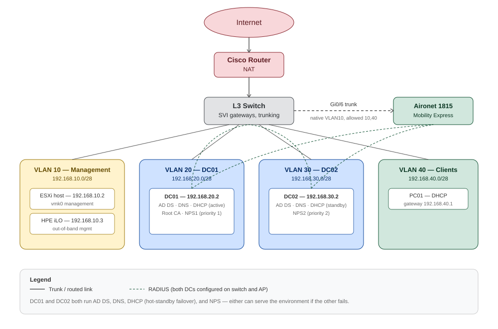

The topology used in the lab separates management, server, and client traffic into VLANs.

## VLAN Design

| VLAN | Purpose | Subnet | Main Systems |
|---|---|---|---|
| VLAN 10 | Management | `192.168.10.0/28` | ESXi host, HPE iLO |
| VLAN 20 | DC01 | `192.168.20.0/28` | DC01 |
| VLAN 30 | DC02 | `192.168.30.0/28` | DC02 |
| VLAN 40 | Clients | `192.168.40.0/28` | PC01 |

## Important Addresses

| System | Address / Role |
|---|---|
| ESXi host | `192.168.10.2` |
| HPE iLO | `192.168.10.3` |
| DC01 | `192.168.20.2` |
| DC02 | `192.168.30.2` |
| PC01 | DHCP in VLAN 40 |
| VLAN 40 gateway | `192.168.40.1` |

The topology also shows a Layer-3 switch providing SVI gateways and trunking, a Cisco router providing upstream NAT, and an Aironet 1815 Mobility Express AP for later AAA / 802.1X work.

---

# Part 1 — ESXi and Windows Server Infrastructure

## 3. Download the ESXi Installer

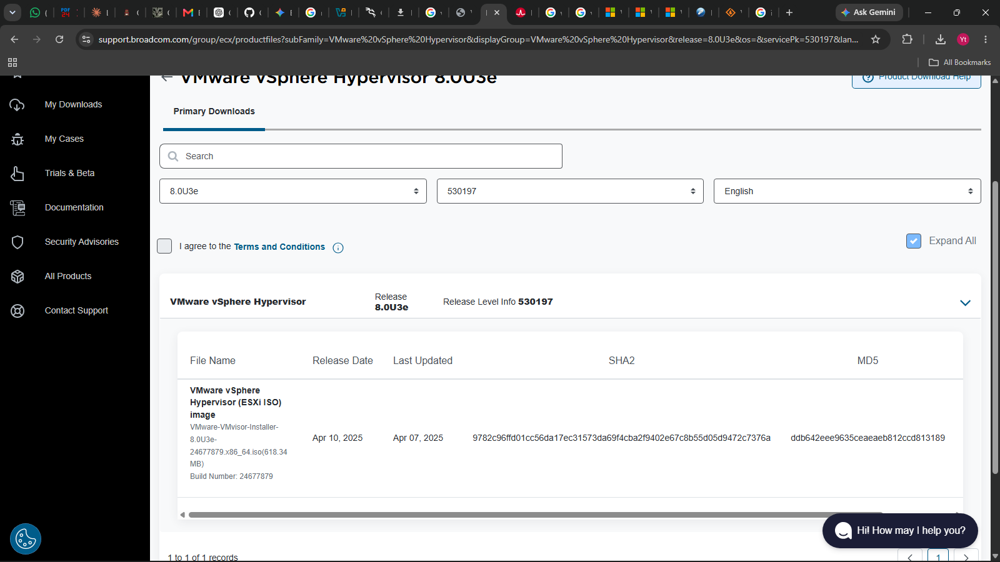

The ESXi installer was downloaded as the hypervisor platform for the Windows Server virtual machines.

### Learning point

The hypervisor provides the compute, memory, storage, and virtual networking environment used by both domain controllers.

---

## 4. Verify the ESXi Host Configuration

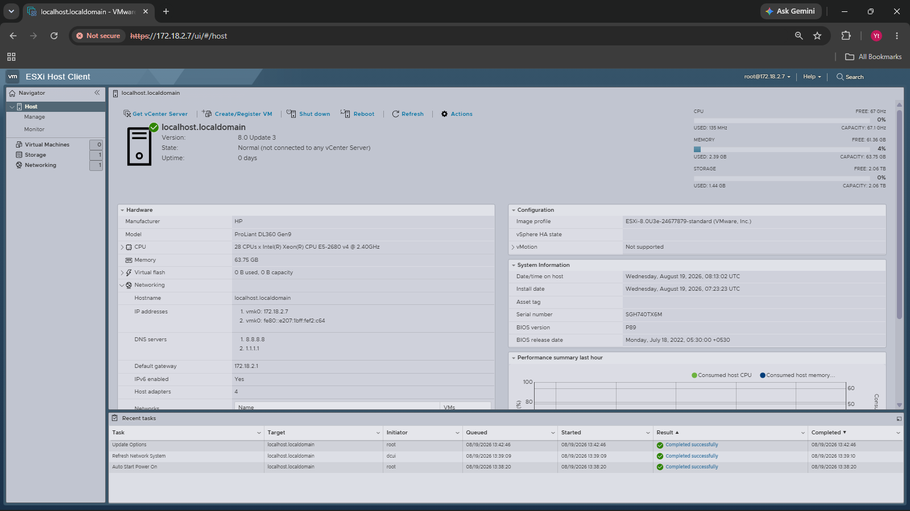

The host configuration was checked before creating the server VMs.

Important management addressing for the lab is located in VLAN 10.

---

## 5. Upload the Windows Server ISO

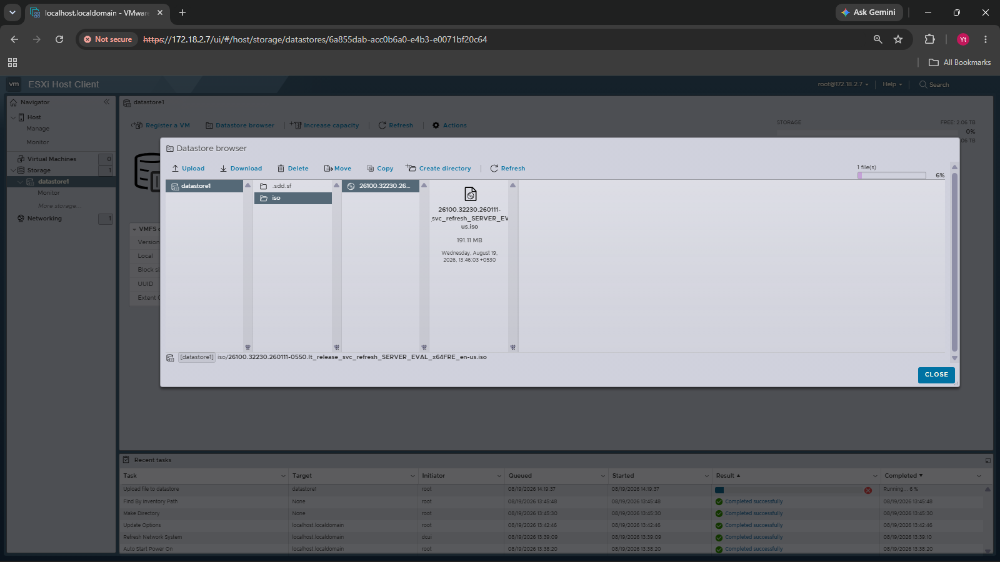

The Windows Server installation ISO was uploaded to the ESXi datastore.

This allows ESXi to attach the ISO to the virtual machine as installation media.

---

## 6. Create the Windows Server VM

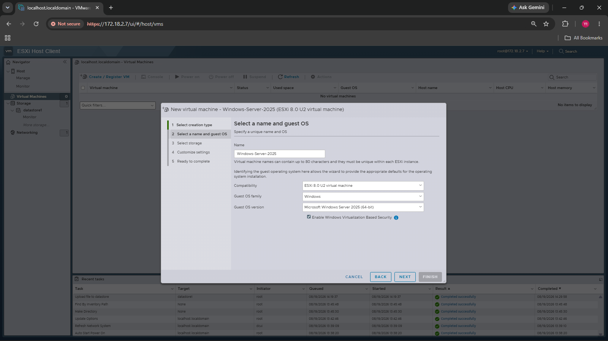

The VM was created with the Windows Server guest operating-system type selected.

---

## 7. Configure VM Hardware

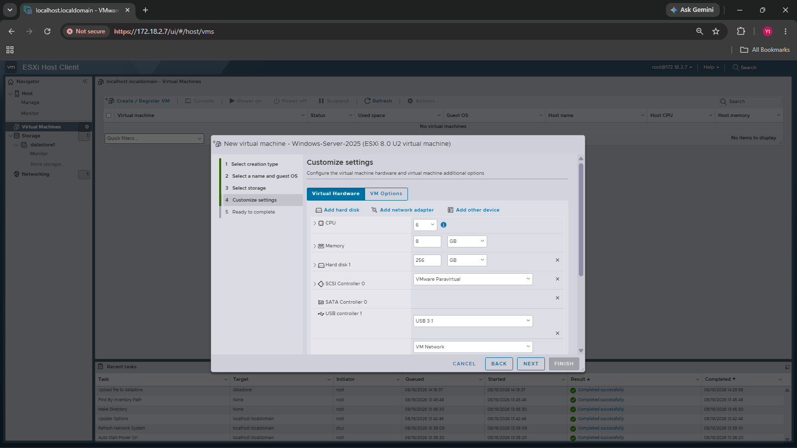

CPU, memory, disk, network adapter, and installation media were configured before deployment.

### Why this matters

A domain controller needs sufficient resources and correct virtual networking. A VM with incorrect VLAN/port-group assignment can appear healthy locally while being unreachable from the rest of the network.

---

## 8. Review the VM Configuration

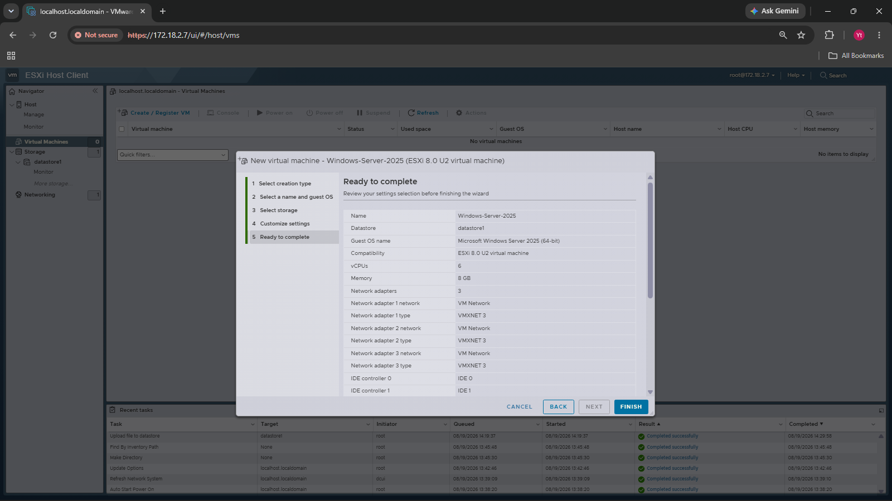

The final VM settings were reviewed before creation.

---

## 9. Verify the Created VM

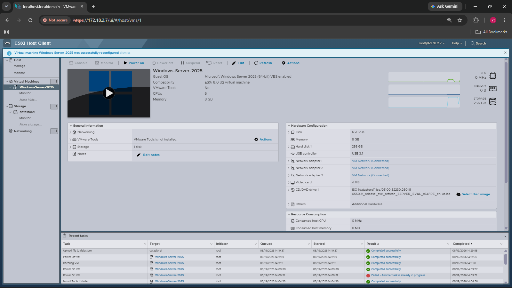

The Windows Server VM appeared successfully in the ESXi inventory.

---

## 10. Install Windows Server

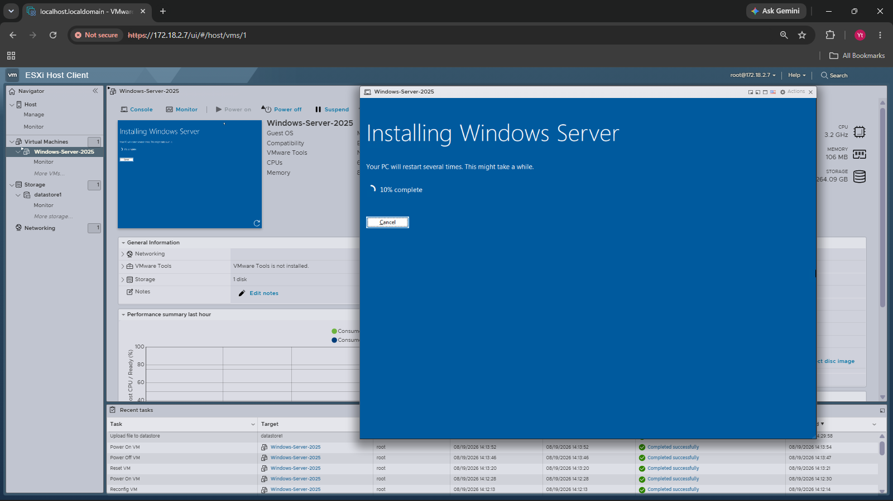

Windows Server was installed inside the VM.

---

## 11. Verify Windows Server Installation

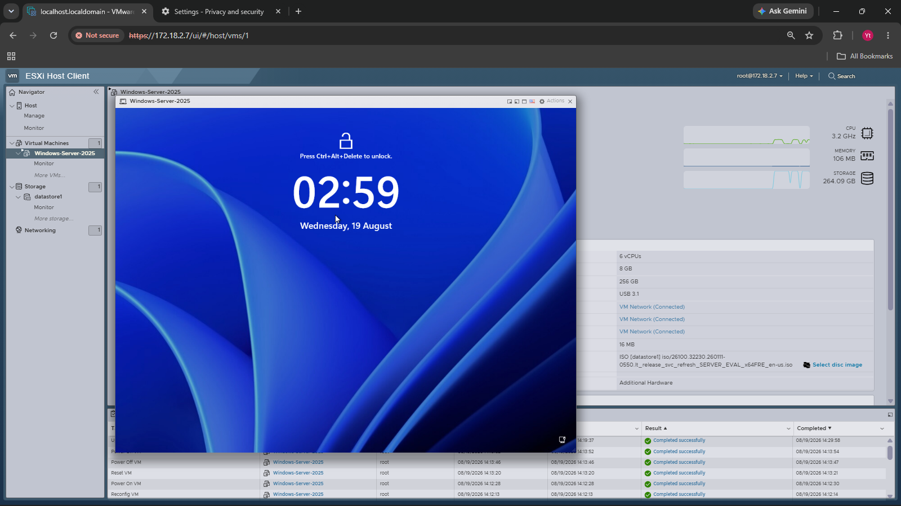

This confirms that the operating system deployment completed successfully.

---

## 12. Check Datastore Capacity

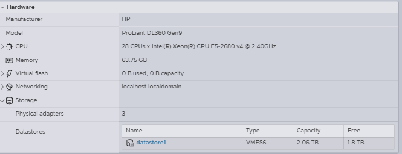

The datastore was checked to confirm storage capacity for the lab VMs.

### Learning point

Storage capacity should be checked before adding additional domain controllers because insufficient datastore space can affect VM creation, snapshots, and operation.

---

## 13. Access the ESXi Host Client

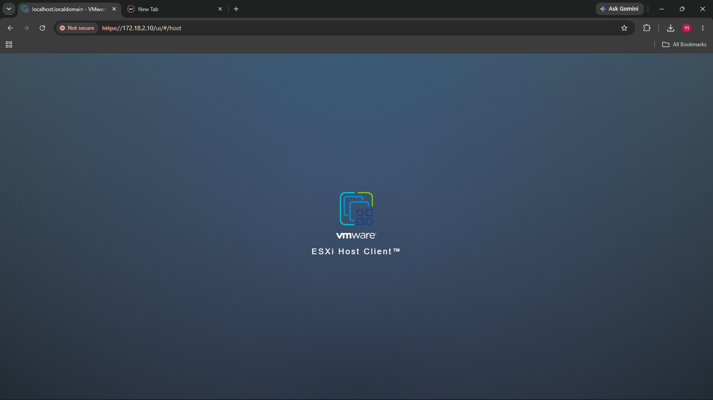

The ESXi Host Client was used for VM, networking, and storage administration.

---

# Part 2 — VLAN, Routing and Trunk Verification

## 14. Test Client-to-Gateway Connectivity

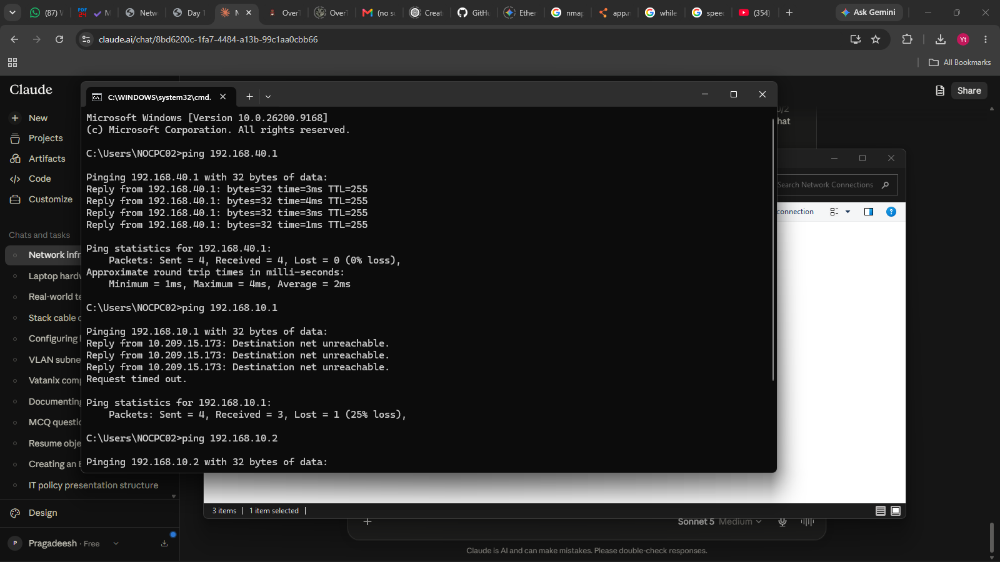

Connectivity to VLAN gateways was tested before building higher-level Windows services.

### Troubleshooting principle

Always verify the lower layers first:

```text
Physical / VM NIC
      ↓
VLAN
      ↓
Gateway
      ↓
Routing
      ↓
DNS / AD / DHCP
```

If basic IP connectivity fails, Active Directory troubleshooting should not begin yet.

---

## 15. Verify Switch VLAN Gateways

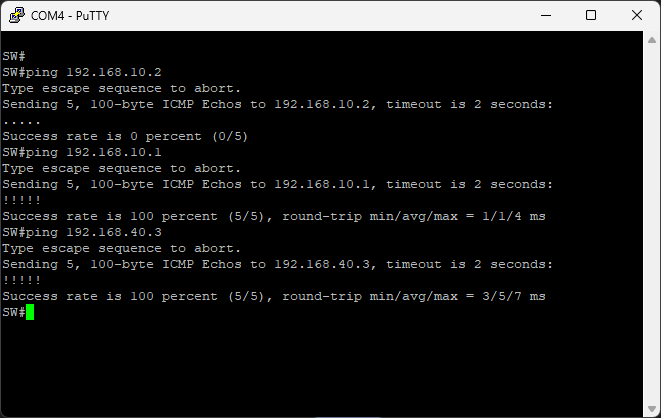

The Layer-3 switch was tested to confirm VLAN gateway reachability.

---

## 16. Verify ESXi Trunk VLANs

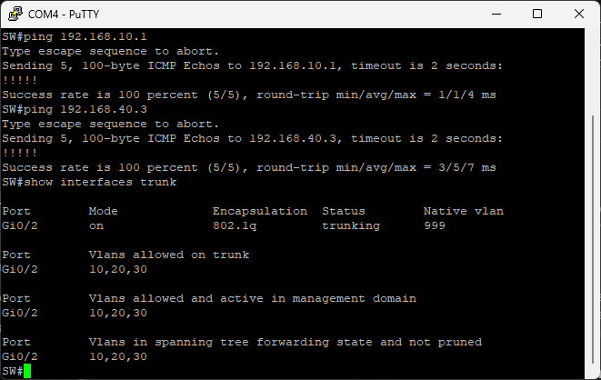

The ESXi uplink/trunk was checked for the required VLANs.

### Why trunking matters

DC01 and DC02 run as VMs, but they still need to communicate through their assigned VLANs.

The physical switch trunk and ESXi port groups must agree on VLAN IDs.

---

## 17. Inspect NAT Statistics

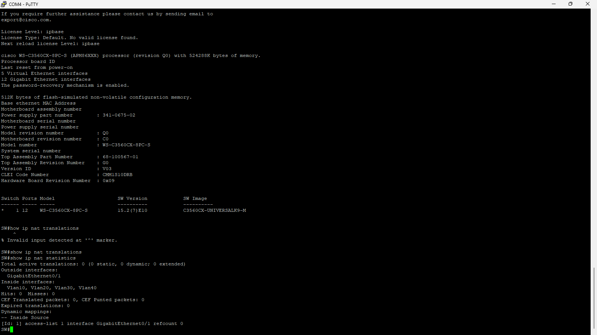

Existing/legacy NAT information was reviewed during connectivity troubleshooting.

This screenshot is part of the environment validation history and shows that Internet/routing behavior was checked before continuing.

---

## 18. Inspect Existing NAT ACL Configuration

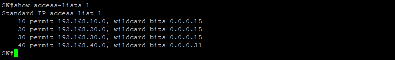

The existing NAT ACL related to VLAN 40 was reviewed.

### Learning point

Old or legacy routing/NAT configuration can affect a new lab. Existing configuration should be inspected instead of assuming the network is clean.

---

# Part 3 — DC01 Baseline

## 19. Verify DC01 Server Configuration

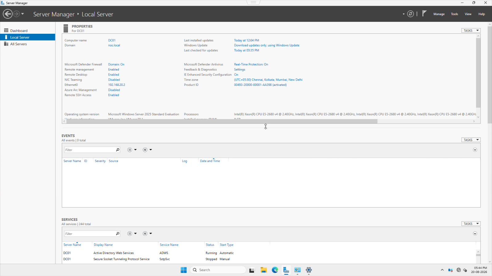

Server Manager confirms the first domain controller:

```text
Computer name : DC01
Domain        : noc.local
IPv4 address  : 192.168.20.2
OS            : Windows Server 2025
```

DC01 is the original domain controller and provides AD DS, DNS, and DHCP services in this lab.

---

## 20. Verify the Reverse Lookup Zone

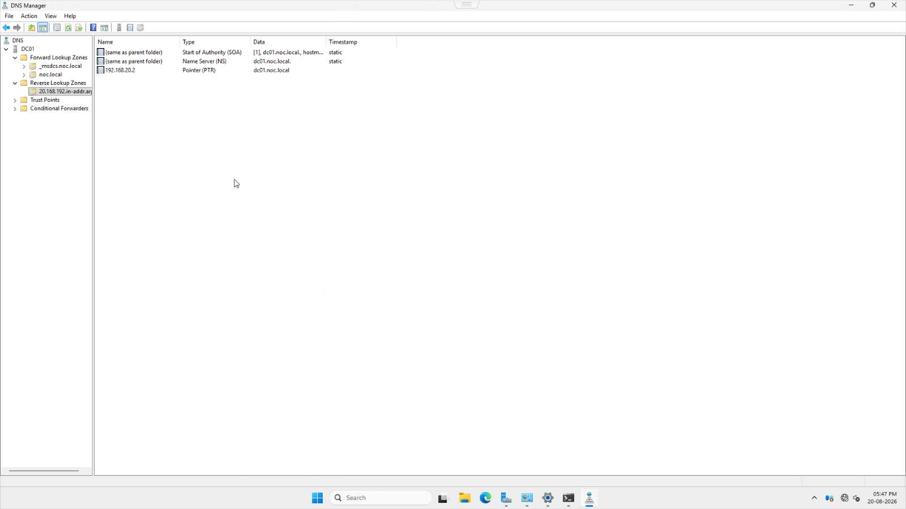

The DNS reverse lookup configuration on DC01 was reviewed.

### Why reverse DNS matters

Reverse lookup zones map IP addresses back to hostnames through PTR records.

Reverse DNS is useful for:

- Troubleshooting.
- Server validation.
- Service logging.
- Replication and DNS health checks.

---

## 21. Verify DNS Lookup from DC01

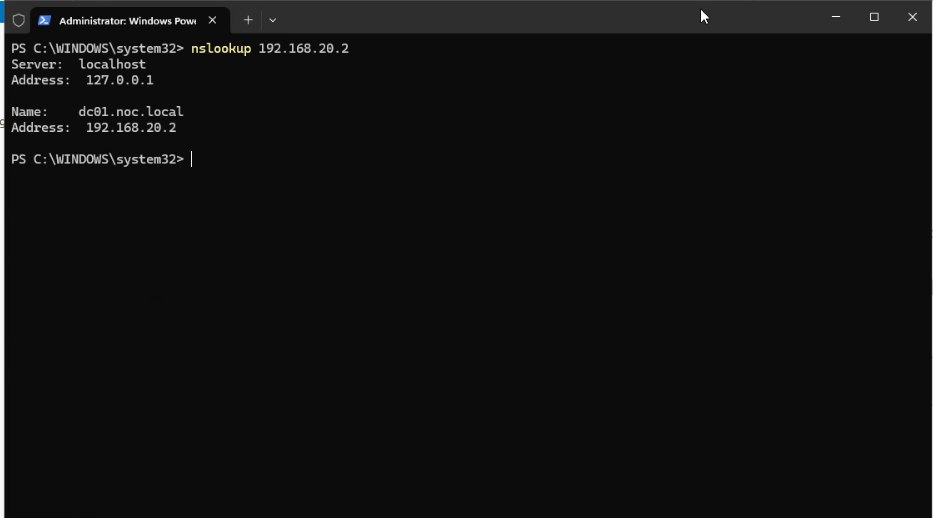

DNS lookup testing was performed to verify that DC01 could resolve names correctly before introducing DC02.

---

# Part 4 — DC01 and DC02 Static Addressing

## 22. Configure DC02 Static IP and DNS

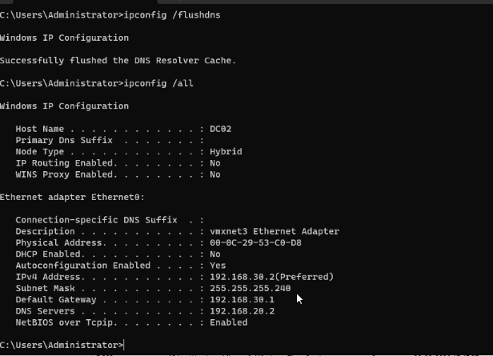

DC02 was configured with its static server address in VLAN 30.

The topology identifies DC02 as:

```text
DC02 = 192.168.30.2
```

A domain controller should use a predictable static address because clients and other servers depend on DNS and AD services.

---

## 23. Verify DC01 Static IP and DNS

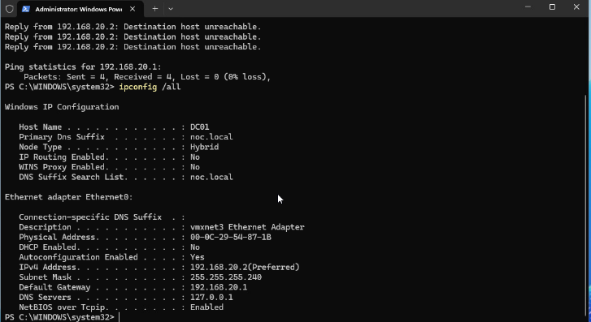

DC01 addressing was also verified.

The intended server addresses are:

```text
DC01 = 192.168.20.2
DC02 = 192.168.30.2
```

---

## 24. Check DC01 Routing Table

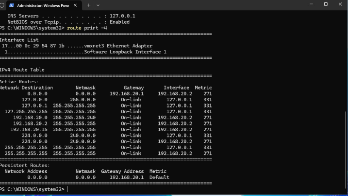

The IP routing table was checked to verify the server had a valid path to other VLANs and networks.

---

## 25. Verify Internet Reachability from VLAN 20

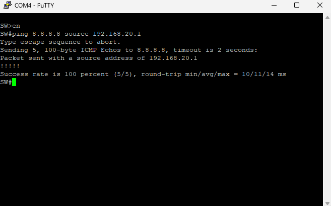

The network path from VLAN 20 toward the upstream network was tested.

---

# Part 5 — ESXi VLAN Port Groups

## 26. Review Existing ESXi Port Groups

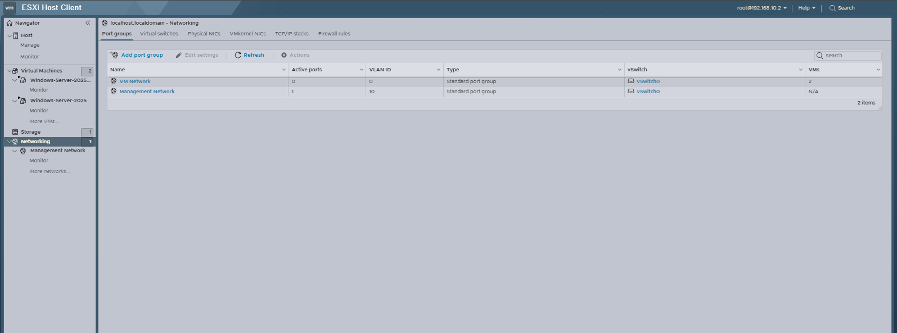

Existing virtual port groups were reviewed before adding the new server VLAN.

---

## 27. Verify Management VLAN Topology

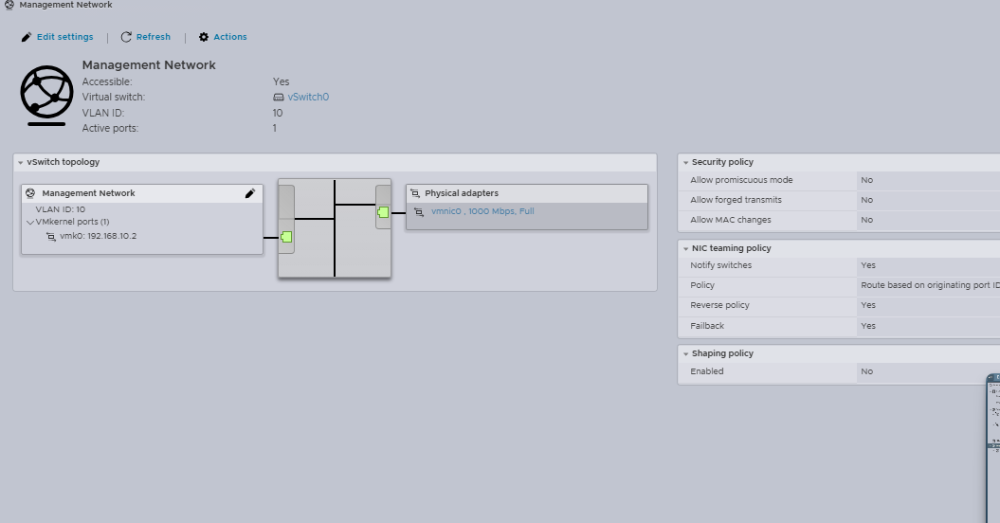

The management network design places the ESXi host in VLAN 10.

---

## 28. Create the VLAN 20 Port Group for DC01

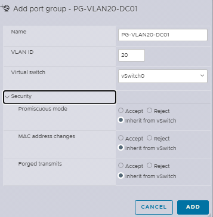

A dedicated ESXi port group was created for the server VLAN.

### Learning point

Virtual machines participate in VLANs through ESXi port-group configuration.

A correct physical switch trunk is not enough if the VM is connected to the wrong ESXi network.

---

# Part 6 — Add DC02 as an Additional Domain Controller

## 29. Add DC02 to the Existing Domain

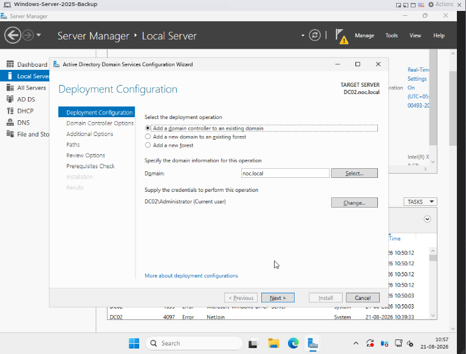

The AD DS Configuration Wizard shows:

```text
Add a domain controller to an existing domain
Domain: noc.local
Target server: DC02.noc.local
```

This is the foundation of Active Directory redundancy.

DC02 is not created as a separate domain; it becomes another domain controller for the same `noc.local` domain.

---

## 30. Configure Domain Controller Options

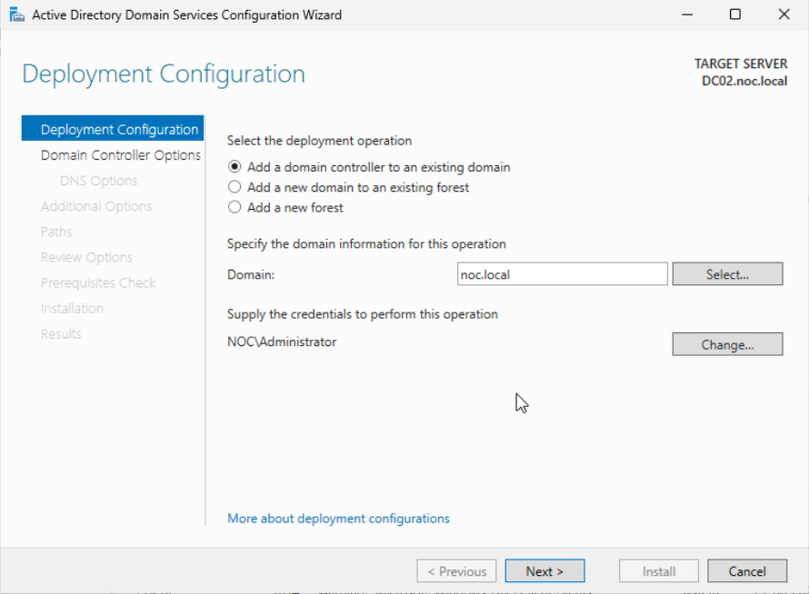

The domain-controller deployment settings were configured.

---

## 31. Configure DNS Options

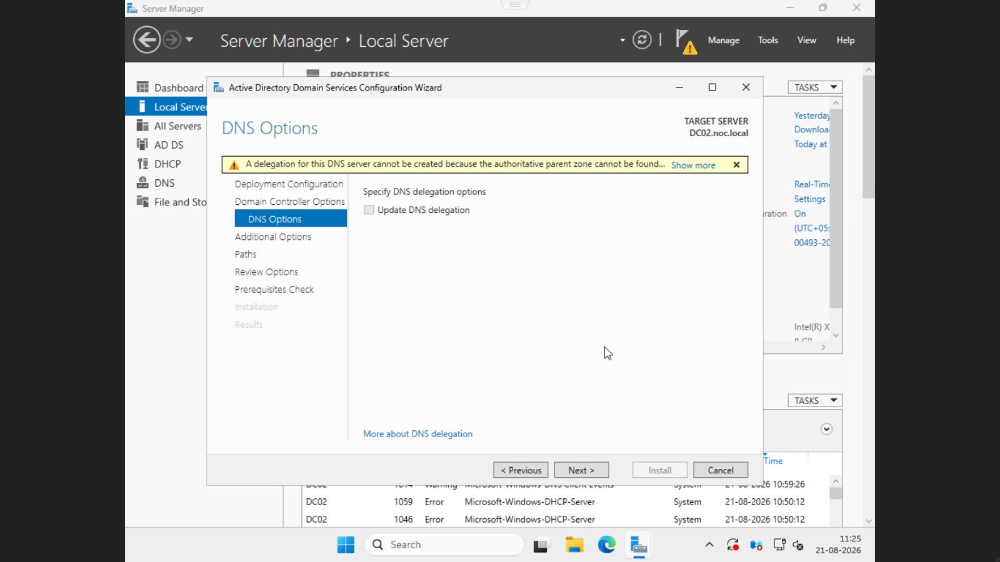

DNS-related deployment options were reviewed because DC02 is intended to operate as a second DNS server.

---

## 32. Configure Additional AD DS Options

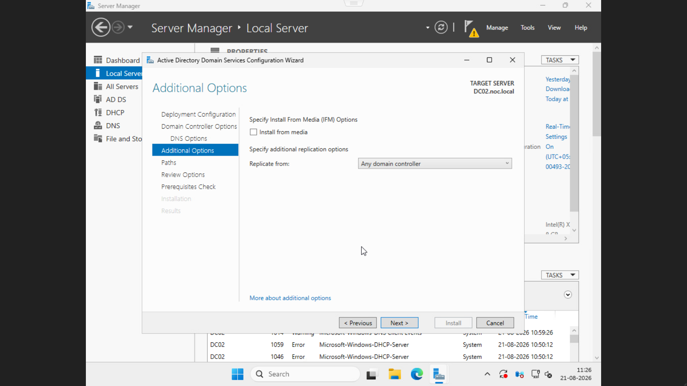

Additional replication/source settings were reviewed in the promotion wizard.

---

## 33. Select DC01 as the Replication Source

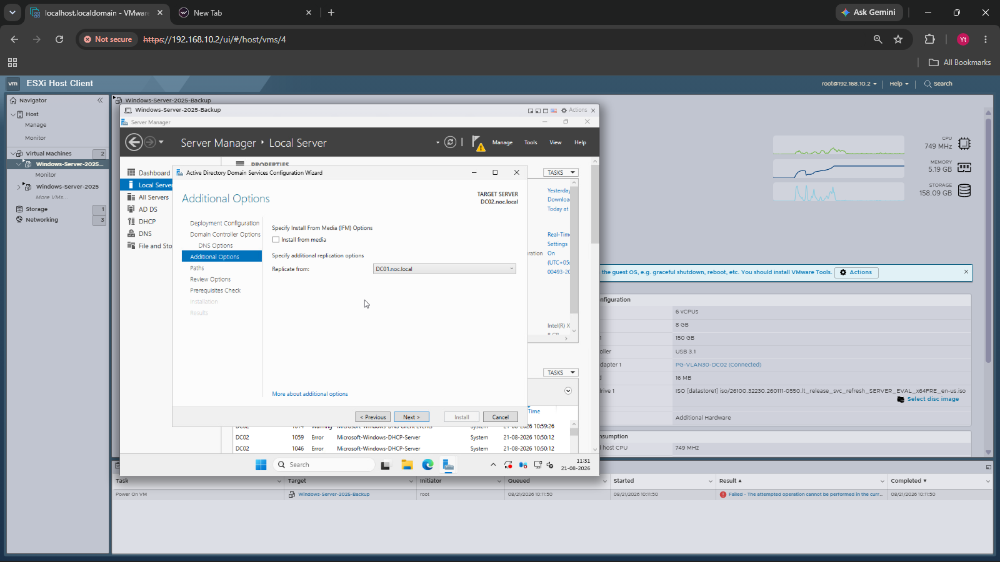

DC01 was selected as the initial replication source for DC02.

### What this means

When DC02 is promoted, it receives Active Directory information from the existing domain controller.

After successful promotion, both servers participate in multi-master AD replication.

---

# Part 7 — DHCP Scope Configuration for VLAN 40

## 34. Configure DHCP Option 003 — Default Gateway

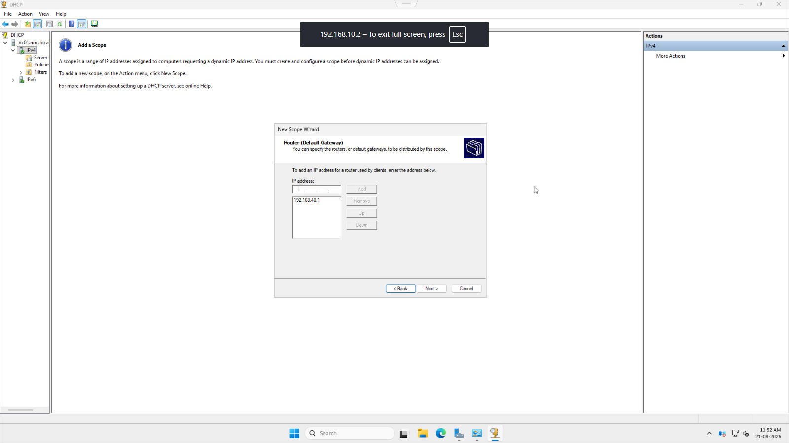

The client scope was configured with:

```text
Router / Default Gateway = 192.168.40.1
```

This allows VLAN 40 clients to reach destinations outside their local subnet.

---

## 35. Configure DHCP Options 006 and 015

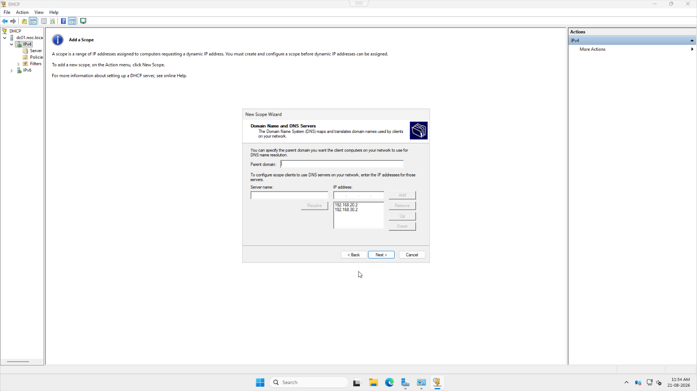

The client scope was configured with both DNS servers:

```text
192.168.20.2
192.168.30.2
```

These correspond to DC01 and DC02.

### Why two DNS servers are important

If DC01 is unavailable, the client already knows the address of DC02.

This is one of the most important elements of the redundancy design.

The scope also includes the DNS domain/suffix for `noc.local`.

---

## 36. Skip WINS Configuration

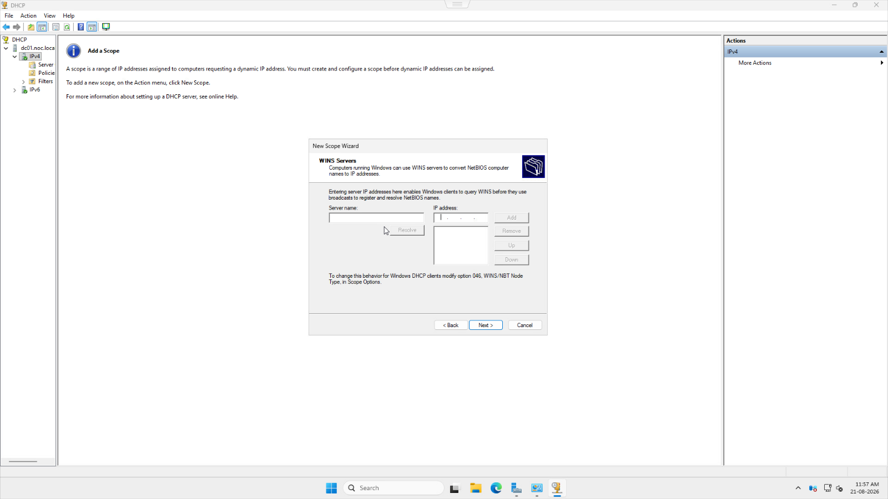

WINS configuration was skipped because the lab uses DNS/Active Directory name resolution.

---

# Part 8 — Verify Active Directory Redundancy

## 37. Verify Both DCs in Active Directory Sites and Services

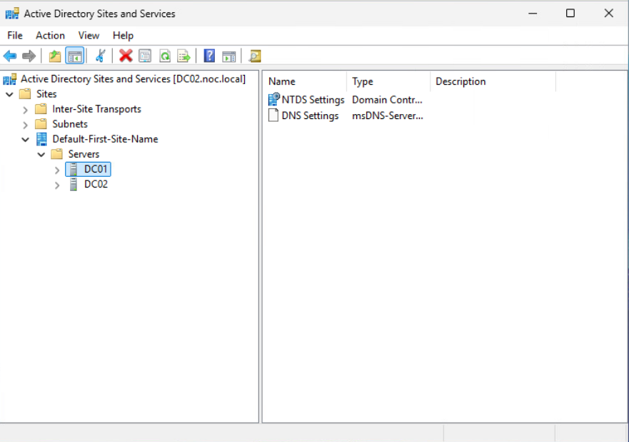

Both domain controllers were verified in Active Directory Sites and Services.

This confirms that DC02 has been promoted and participates in the AD topology.

---

## 38. Verify Both DCs in Active Directory Users and Computers

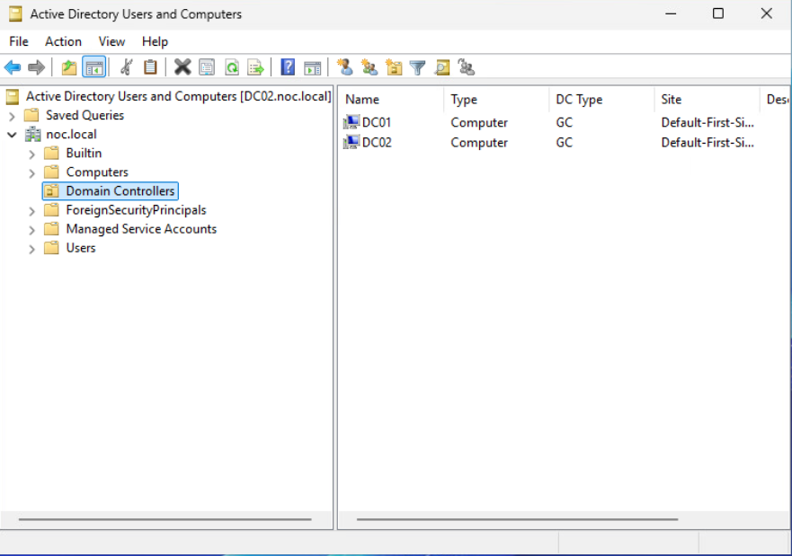

The Domain Controllers OU was checked to verify both DC01 and DC02.

---

# Part 9 — Configure DHCP Hot-Standby Failover

## 39. Create the DHCP Failover Relationship

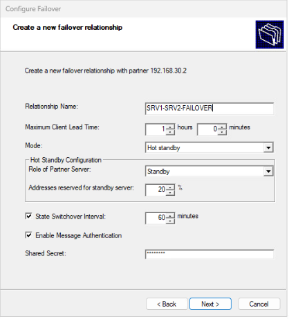

The failover relationship was configured with:

```text
Relationship Name        : SRV1-SRV2-FAILOVER
Partner Server           : 192.168.30.2
Mode                     : Hot standby
Partner Role             : Standby
Addresses for Standby    : 20%
State Switchover Interval: 60 minutes
Maximum Client Lead Time : 1 hour
Message Authentication   : Enabled
```

### What Hot Standby means

In Hot Standby mode:

- One DHCP server normally services the scope.
- The second server remains ready to take over.
- A percentage of addresses is reserved for the standby server.
- The servers exchange state information through the failover relationship.

This design focuses on availability rather than load sharing.

---

## 40. Review the DHCP Failover Configuration

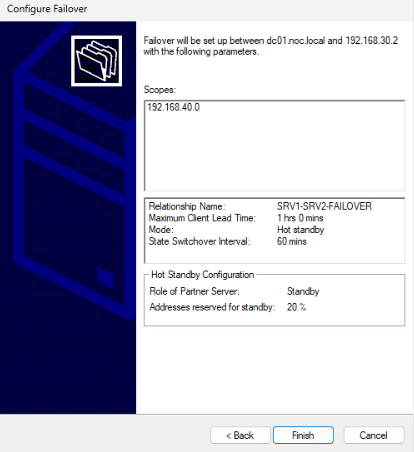

The summary confirms:

```text
Scope            : 192.168.40.0
Mode             : Hot standby
MCLT             : 1 hour
Switchover       : 60 minutes
Standby reserve  : 20%
```

---

## 41. Complete DHCP Failover Configuration

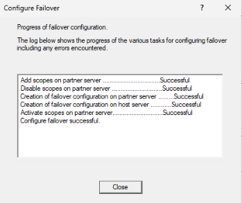

The failover configuration completed successfully.

---

## 42. Verify Normal Failover State

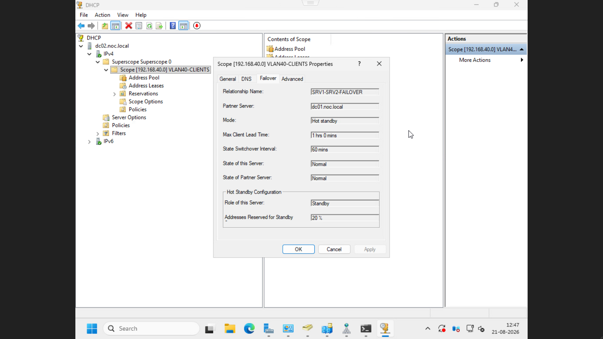

The failover status shows:

```text
Relationship : SRV1-SRV2-FAILOVER
Partner      : dc01.noc.local
Mode         : Hot standby
This server  : Normal
Partner      : Normal
Role         : Standby
Reserve      : 20%
```

This screenshot is evidence that the two DHCP servers recognized the same relationship and were in a healthy state.

---

# Part 10 — Client Verification

## 43. Verify DHCP Lease, Gateway and DNS

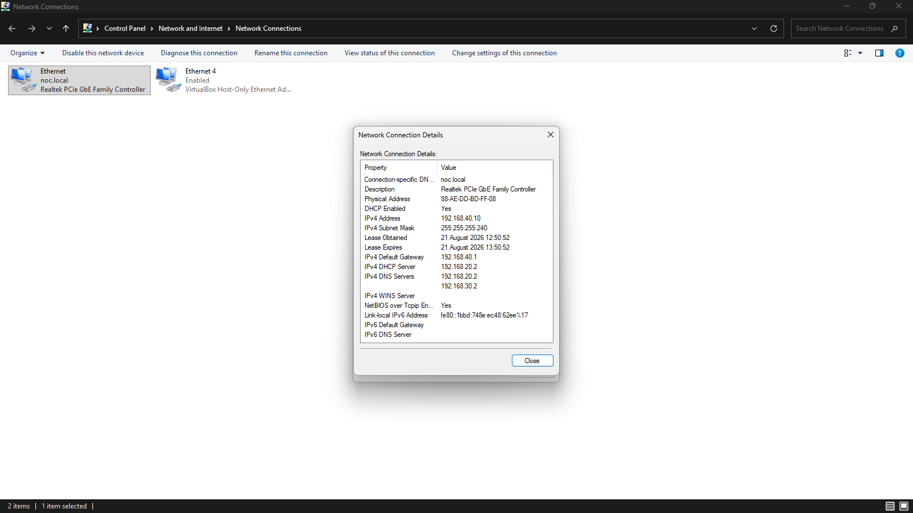

PC01 was checked after obtaining a DHCP lease.

The client configuration is expected to include:

```text
VLAN 40 address
Gateway : 192.168.40.1
DNS     : 192.168.20.2 and 192.168.30.2
```

---

## 44. Test DNS and Route Path from PC01

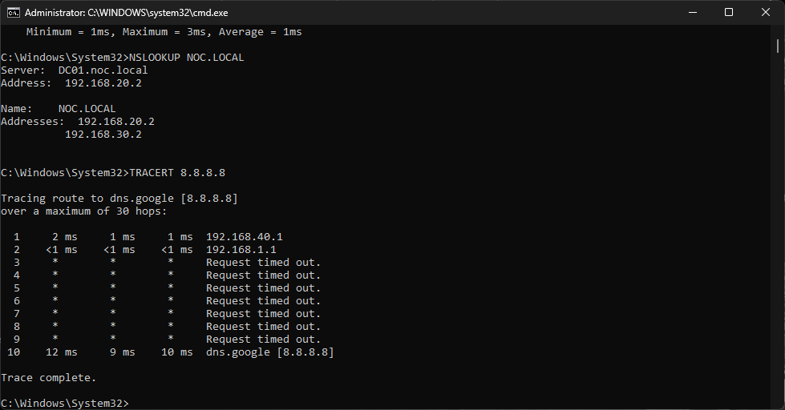

DNS resolution and routed connectivity were tested from the client.

This validates more than DHCP alone: the assigned network information must also be usable.

---

## 45. Verify PC01 in Active Directory

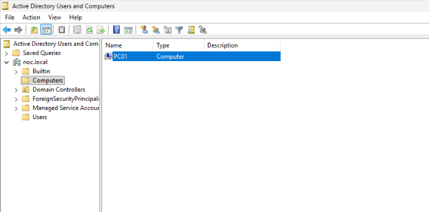

PC01 was verified as a domain computer in Active Directory Users and Computers.

---

## 46. Inspect the Full PC01 Configuration

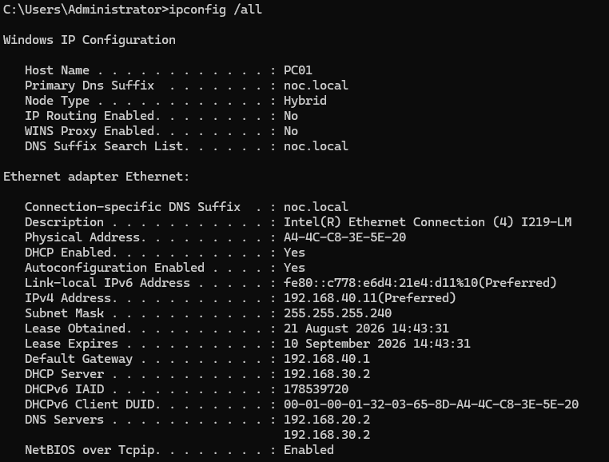

The screenshot shows:

```text
Host Name       : PC01
Primary DNS     : noc.local
IPv4 Address    : 192.168.40.11
Subnet Mask     : 255.255.255.240
Default Gateway : 192.168.40.1
DHCP Server     : 192.168.30.2
DNS Servers     : 192.168.20.2
                  192.168.30.2
```

### What this proves

The client received a VLAN 40 address and had both DNS servers configured.

The screenshot also shows DC02 (`192.168.30.2`) serving the DHCP lease at that moment.

---

## 47. Renew the DHCP Lease


The client lease was renewed to verify continued DHCP operation.

---

# Part 11 — DHCP Failover Test

## 48. Stop and Restart the DHCP Service

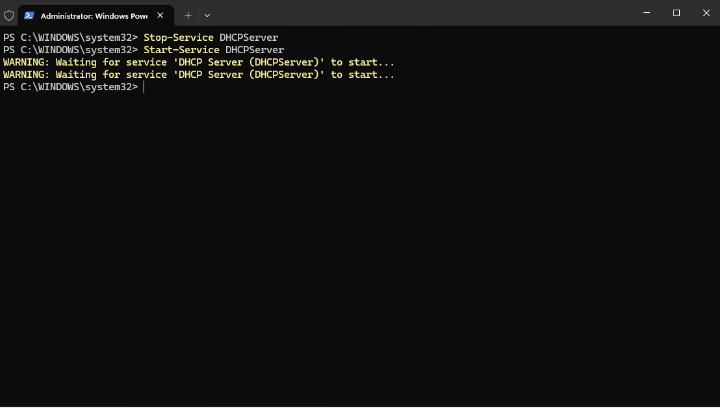

A DHCP service stop/restart test was performed.

### Why this matters

A failover relationship should be tested rather than trusted only because the configuration wizard completed.

The practical goal is to confirm that lease service remains available when one DHCP service is unavailable.

---

# Part 12 — AD, DNS, SYSVOL and Replication Validation

## 49. Validate DC Discovery, Group Policy and SYSVOL

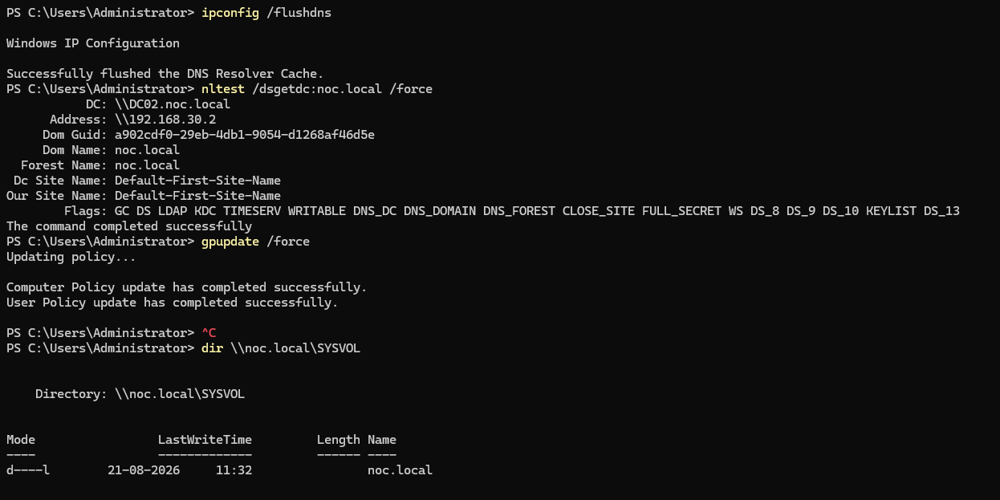

The screenshot documents several important checks:

```powershell
ipconfig /flushdns
nltest /dsgetdc:noc.local /force
gpupdate /force
dir \\noc.local\SYSVOL
```

The DC discovery command returned:

```text
DC       : \\DC02.noc.local
Address  : \\192.168.30.2
```

Group Policy update completed successfully, and the `\\noc.local\SYSVOL` path was accessible.

### Why these checks are valuable

Together they verify:

- Domain controller discovery.
- DNS-based AD location.
- Group Policy processing.
- SYSVOL availability.

---

## 50. Capture the Replication Failure

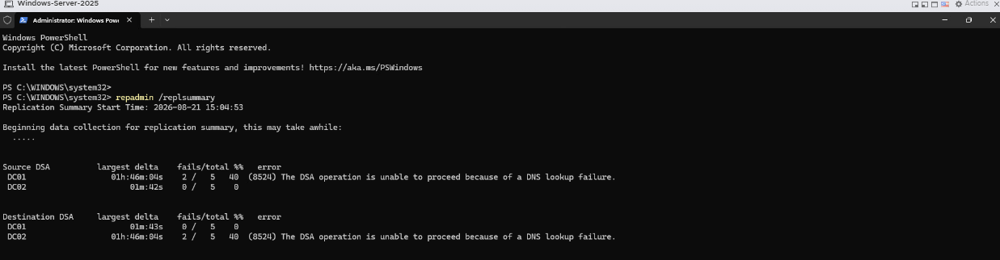

`repadmin /replsummary` revealed a replication problem.

The visible error is:

```text
(8524) The DSA operation is unable to proceed because of a DNS lookup failure.
```

### Why this screenshot is important

This is valuable troubleshooting evidence.

The lab did not only show a final working state; it captured a real failure condition and then corrected it.

---

# Part 13 — ESXi and AD Infrastructure Review

## 51. Verify Both Server VMs

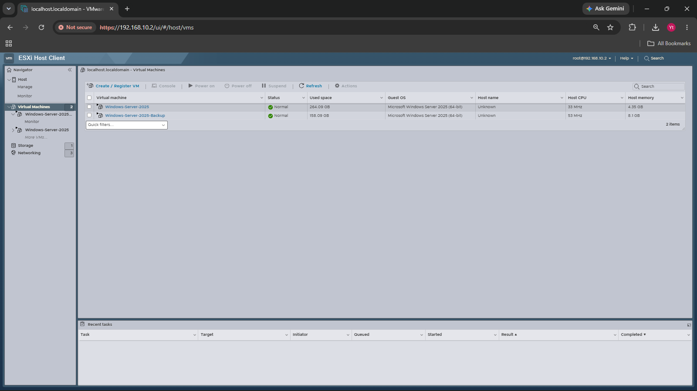

The ESXi Host Client was used to confirm the two Windows Server VMs used by the redundant AD design.

---

## 52. Verify Final VLAN Port Groups

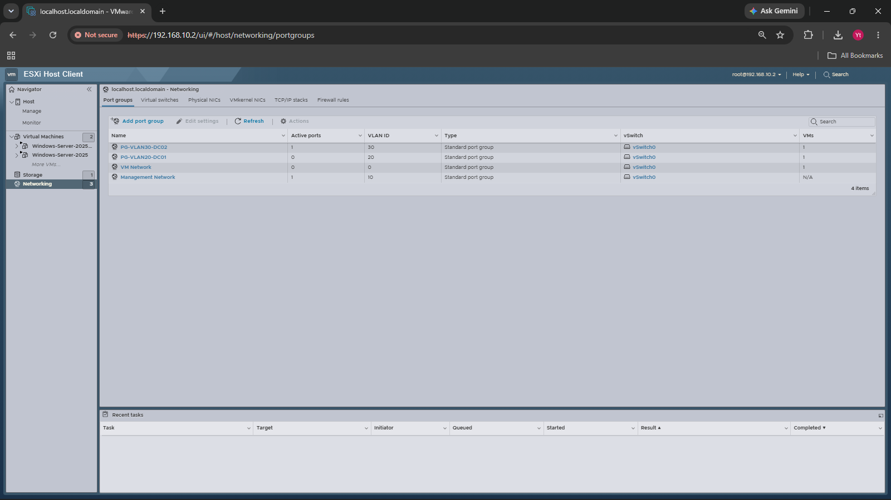

The final virtual-network layout was reviewed to confirm the required server VLAN port groups.

---

# Part 14 — Fix DNS / Replication and Re-Test

## 53. Verify Replication After the Reverse-Zone Fix

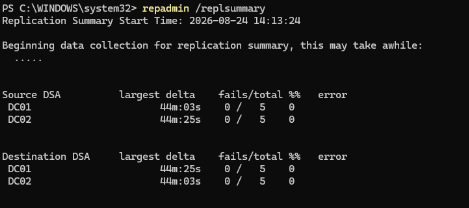

After correcting the DNS/reverse-zone issue, `repadmin /replsummary` showed:

```text
Fails / Total = 0 / 5
Error %       = 0
```

for both DC01 and DC02.

### What this proves

The earlier DNS-related AD replication failure was resolved.

This directly demonstrates the connection between Active Directory replication and healthy DNS configuration.

---

## 54. Verify Reverse Lookup Zones on DC02

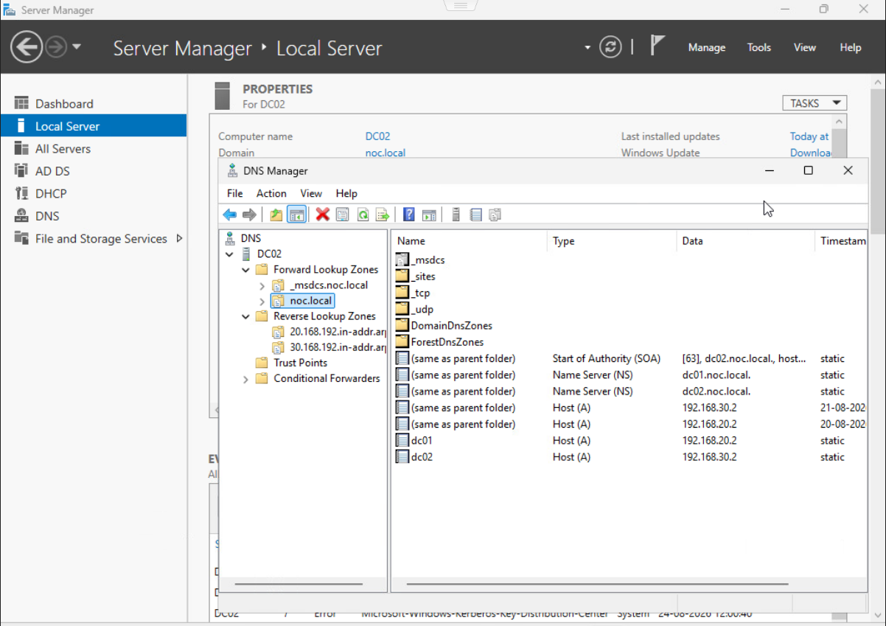

Reverse lookup zones for the DC VLANs were checked on DC02.

This is part of the DNS correction that supported healthy AD replication.

---

## 55. Run DNS Server Tests

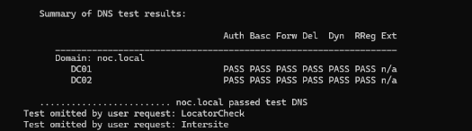

The DNS test summary shows both servers passing the displayed checks:

```text
DC01 : PASS
DC02 : PASS
```

### Learning point

A DNS service can appear to be running while still having configuration problems.

Health tests provide stronger evidence than simply checking the service state.

---

## 56. Verify Client DC Discovery, GPUpdate and SYSVOL

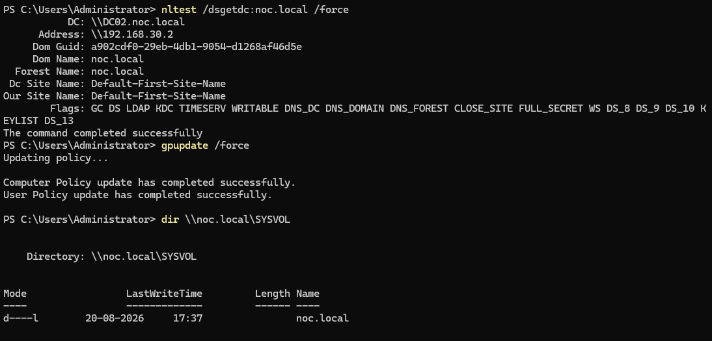

The client was used to re-test:

- Domain controller discovery.
- Group Policy.
- SYSVOL.

This validates the service from the consumer side rather than only from the servers.

---

## 57. Run a Second Replication Check

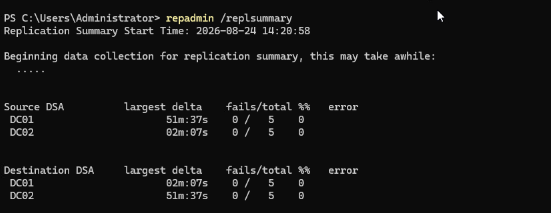

Replication was checked again after the corrective work.

Repeated verification is useful because a one-time successful test does not prove the problem is permanently resolved.

---

# Part 15 — DHCP Service and Lease Re-Verification

## 58. Restart DHCP and Check Authorization

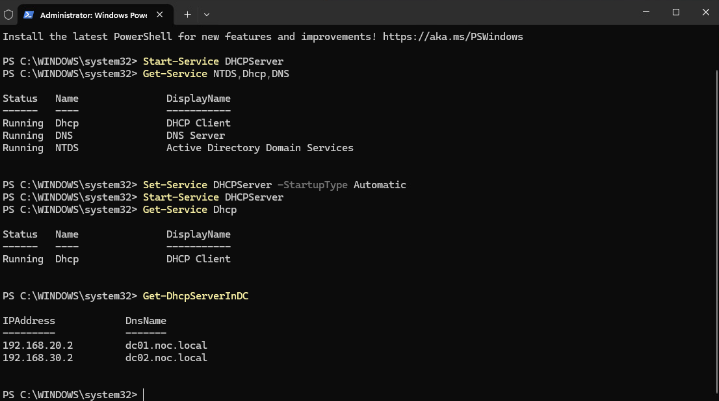

The DHCP service was restarted and the server authorization state was checked.

### Why authorization matters

In an Active Directory environment, an unauthorized DHCP server should not serve normal domain clients.

This protects the network from rogue DHCP servers.

---

## 59. Verify the Client Lease After the Fix

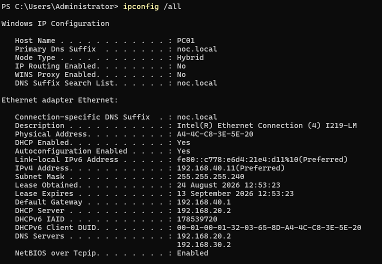

PC01 was checked again after the troubleshooting and service validation.

This confirms that the client still received usable DHCP configuration.

---

## 60. Test DNS with `Resolve-DnsName`

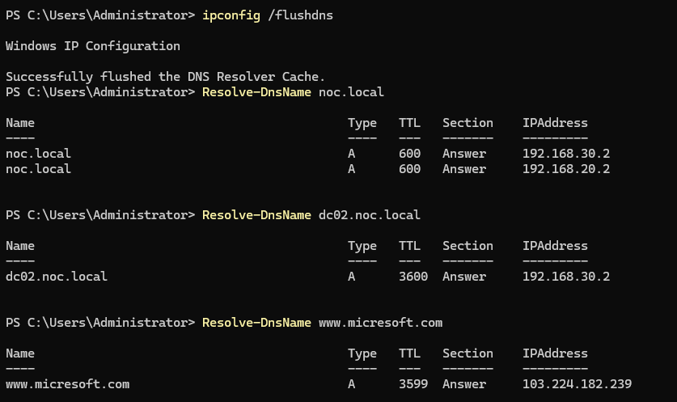

`Resolve-DnsName` testing was used to verify name resolution from the client.

This provides a direct PowerShell-based DNS test in addition to earlier lookup checks.

---

# Part 16 — Final DC01 Outage / Redundancy Test

## 61. Power Off DC01

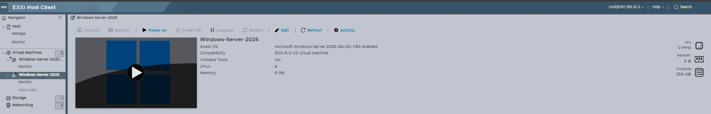

The primary/original DC01 VM was intentionally powered off from the ESXi Host Client.

This creates a real service-outage condition rather than a simulated configuration check.

---

## 62. Verify DC01 Is Unreachable

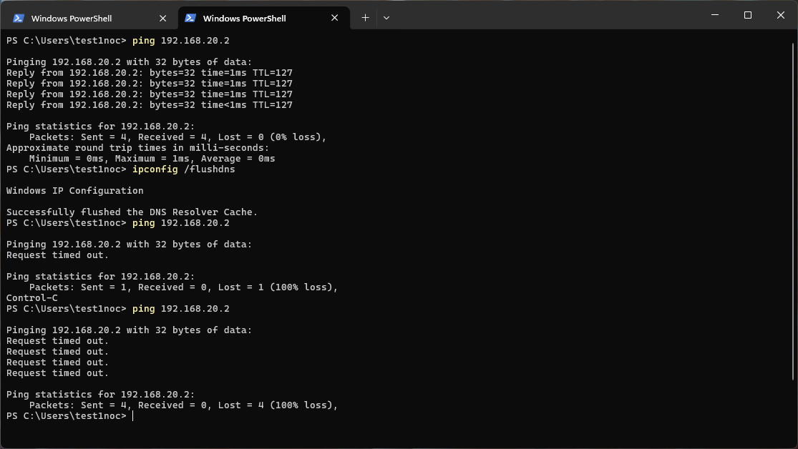

The client verified that DC01 was no longer reachable during the outage.

### Why this step matters

It proves the failover test is genuine.

If DC01 were still reachable, continued DNS operation would not prove redundancy.

---

## 63. Verify DNS Resolution Through DC02 During the DC01 Outage


After clearing the client DNS cache, name resolution was tested while DC01 was down.

The screenshot shows:

```powershell
Clear-DnsClientCache
Resolve-DnsName noc.local
Resolve-DnsName dc02.noc.local
nslookup noc.local 192.168.30.2
```

The client successfully queried DC02 at:

```text
192.168.30.2
```

and resolved domain-related records.

### Final redundancy result

```text
DC01       : Offline
DC02       : Online
Client DNS : Still working
```

**DNS redundancy test: PASS**

---

# DHCP Failover Design Summary

The DHCP client scope uses:

```text
Network           : 192.168.40.0/28
Gateway           : 192.168.40.1
Primary DNS       : 192.168.20.2
Secondary DNS     : 192.168.30.2
Failover Mode     : Hot Standby
Standby Reserve   : 20%
MCLT              : 1 hour
Switchover        : 60 minutes
Authentication    : Enabled
```

The relationship name is:

```text
SRV1-SRV2-FAILOVER
```

---

# Active Directory and DNS Redundancy Logic

The lab demonstrates the following service model:

```text
                   noc.local
                       │
          ┌────────────┴────────────┐
          │                         │
       DC01                       DC02
  192.168.20.2               192.168.30.2
    AD DS                       AD DS
     DNS                         DNS
    DHCP                        DHCP
     │                           │
     └──── AD / DNS / DHCP ─────┘
            redundancy
                 │
              PC01
        192.168.40.0/28
```

If one server becomes unavailable, the second server is designed to continue providing critical infrastructure services.

---

# Important Commands Used / Verified

## Active Directory

```powershell
nltest /dsgetdc:noc.local /force
repadmin /replsummary
```

## Group Policy and SYSVOL

```powershell
gpupdate /force
dir \\noc.local\SYSVOL
```

## DNS

```powershell
ipconfig /flushdns
Resolve-DnsName noc.local
Resolve-DnsName dc02.noc.local
nslookup noc.local 192.168.30.2
```

## DHCP / Client Verification

```cmd
ipconfig /all
ipconfig /release
ipconfig /renew
```

---

# Troubleshooting Case Study — DNS Causing AD Replication Failure

One of the most useful parts of this lab was the replication issue.

## Symptom

`repadmin /replsummary` reported:

```text
8524 — The DSA operation is unable to proceed because of a DNS lookup failure.
```

## Investigation

The lab then checked:

- DNS server configuration.
- Reverse lookup zones.
- Domain controller records.
- Client/DC name resolution.
- Replication status.

## Correction

The reverse-DNS configuration was corrected and then re-tested.

## Result

The later `repadmin /replsummary` showed:

```text
0 failures
0% error
```

for both domain controllers.

### What I learned

Active Directory relies heavily on DNS.

A server can be reachable by IP while AD replication still fails because AD must locate services and domain controllers correctly through DNS.

---

# Verification Matrix

| Check | Evidence | Result |
|---|---|---|
| ESXi host available | Host Client screenshots | PASS |
| Windows Server VMs created | ESXi VM screenshots | PASS |
| VLAN connectivity | Gateway/trunk tests | PASS |
| DC01 configured | Server Manager / IP screenshots | PASS |
| DC02 configured | Static IP / promotion screenshots | PASS |
| DC02 added to `noc.local` | AD DS wizard | PASS |
| Both DCs visible in AD | AD Sites + ADUC | PASS |
| DHCP scope gateway | Option 003 = `192.168.40.1` | PASS |
| Redundant DNS distributed | Options include `.20.2` and `.30.2` | PASS |
| DHCP failover configured | Hot Standby relationship | PASS |
| DHCP relationship healthy | Normal / Normal state | PASS |
| PC01 receives DHCP | `192.168.40.11/28` shown | PASS |
| PC01 has both DNS servers | `.20.2` + `.30.2` | PASS |
| Domain client in AD | PC01 in ADUC | PASS |
| DC discovery | `nltest` returns DC02 | PASS |
| SYSVOL accessible | `\\noc.local\SYSVOL` | PASS |
| Initial AD replication | DNS failure captured | FAIL — identified |
| Replication after fix | `0/5` failures | PASS |
| DNS server tests | DC01/DC02 PASS | PASS |
| DHCP service re-check | Restart / authorization check | PASS |
| DC01 outage created | DC01 VM powered off | PASS |
| DC01 unavailable | Client cannot reach DC01 | PASS |
| DNS during DC01 outage | DC02 resolves names | PASS |

---

# Key Learning Outcomes

### 1. Redundancy must exist at more than one layer

Having two domain controllers is not enough by itself.

Clients must also be configured to use both DNS servers, and DHCP must be designed to survive a server failure.

---

### 2. DNS is a core dependency of Active Directory

The lab captured a real AD replication failure caused by DNS lookup problems.

Correcting DNS restored healthy replication.

---

### 3. DHCP failover should be tested

The Hot Standby relationship was configured, checked in the Normal state, and followed by DHCP service tests and client lease verification.

---

### 4. Virtual networking is part of server troubleshooting

AD and DHCP can fail even when Windows configuration is correct if the ESXi port group, VLAN ID, or physical trunk is wrong.

---

### 5. Reverse DNS is useful in infrastructure health

Reverse lookup zones were part of the replication troubleshooting process.

The lab demonstrated why DNS should be treated as infrastructure, not only as a basic hostname service.

---

### 6. Client-side verification is essential

The environment was repeatedly tested from PC01 using:

- `ipconfig`
- DNS lookups
- `nltest`
- Group Policy
- SYSVOL
- traceroute/connectivity checks

This proves that the services are usable by the endpoint, not only that server consoles look correct.

---

### 7. A failover test must create a real failure

DC01 was actually powered off.

The client then confirmed:

- DC01 was unreachable.
- DC02 was still reachable.
- DNS resolution continued.

This is stronger evidence of redundancy than simply showing both DCs online.

---

# Evidence Sequence

| Screenshot | Purpose |
|---|---|
| 001 | Overall network topology |
| 002–012 | ESXi and Windows Server VM deployment |
| 013–017 | VLAN, routing, trunk and NAT verification |
| 018–020 | DC01 and DNS baseline |
| 021–024 | DC addressing and routing |
| 025–027 | ESXi port-group configuration |
| 028–032 | DC02 promotion into `noc.local` |
| 033–035 | DHCP scope options |
| 036–037 | Two-DC AD verification |
| 038–041 | DHCP Hot Standby configuration |
| 042–047 | Client and DHCP failover testing |
| 048–049 | AD/DNS/SYSVOL validation and replication failure |
| 050–051 | Final ESXi infrastructure review |
| 052–056 | Replication/DNS correction and re-test |
| 057–059 | DHCP and client DNS re-validation |
| 060–062 | Final DC01 outage / DNS failover proof |

---

# Conclusion

This lab successfully built and validated the redundancy foundation for the larger **AD Infrastructure Failover & AAA Lab**.

The final design contains:

- Two Windows Server 2025 domain controllers.
- Redundant Active Directory Domain Services.
- Two DNS servers.
- DHCP Hot Standby failover.
- VLAN-based server/client separation.
- ESXi virtual networking.
- Client-side validation.
- Replication troubleshooting.
- A real DC01 outage test.

The strongest result is the final failover test:

```text
DC01 powered off
      ↓
DC01 becomes unreachable
      ↓
PC01 uses DC02
      ↓
noc.local still resolves
```

This provides practical evidence that the environment was designed and tested for **service continuity**, not simply configured for redundancy on paper.

The lab also demonstrated a real troubleshooting cycle:

```text
Detect replication failure
        ↓
Identify DNS lookup problem
        ↓
Correct DNS / reverse-zone configuration
        ↓
Re-run replication tests
        ↓
0 failures
```

The next parts of the larger project can build on this redundant AD/DNS/DHCP foundation to provide **NPS/RADIUS, certificate services, network-device AAA, Wi-Fi 802.1X, and EAP-TLS certificate authentication**.
