# Lab 02 — NPS, Certificate Services, AAA, SSH and Wi-Fi 802.1X

## Overview

This lab builds the **AAA and enterprise authentication layer** on top of the redundant Active Directory, DNS, and DHCP foundation created in Lab 01.

The environment uses **Windows Network Policy Server (NPS)** as the RADIUS service, **Active Directory** as the identity source, **Active Directory Certificate Services (AD CS)** for server certificates, a **Cisco switch** for SSH device administration, and a **Cisco Aironet 1815 Mobility Express access point** for WPA2-Enterprise / 802.1X wireless authentication.

The screenshots document two major AAA use cases:

1. **Cisco switch administrative SSH authentication through RADIUS**
2. **Enterprise Wi-Fi authentication through NPS/RADIUS using PEAP**

The lab also includes failover testing by stopping the NPS/IAS service on DC01 and proving that authentication continues through DC02.

This README is intentionally detailed because the screenshots are retained as **proof of practical learning, testing, failover, and troubleshooting**.

---

# 1. Lab Objectives

The main objectives were to:

- Create an Active Directory group for network administrators.
- Configure DC01 and DC02 as NPS/RADIUS servers.
- Register the Cisco switch as a RADIUS client on both NPS servers.
- Build an NPS network policy for switch administrator access.
- Return Cisco privilege level 15 using a vendor-specific attribute.
- Configure AAA and SSH on the Cisco switch.
- Verify AD-based SSH login.
- Test RADIUS failover from DC01 to DC02.
- Verify NPS Event ID 6272 for successful authentication.
- Add the Cisco Aironet access point as a RADIUS client.
- Configure the AP uplink as a VLAN trunk.
- Use AD CS to issue NPS server certificates.
- Verify the NPS certificate template and EKUs.
- Create a wireless NPS policy.
- Configure PEAP authentication.
- Configure the Mobility Express WLAN for WPA2-Enterprise.
- Test successful and failed wireless authentications.
- Verify certificate trust prompts.
- Confirm authenticated wireless clients on the AP.
- Test wireless RADIUS failover to DC02.
- Verify the final VLAN 40 wireless client IP configuration.
- Test wrong SSH credentials and observe RADIUS rejection.
- Regenerate the switch RSA key at 2048 bits.

---

# 2. Authentication Architecture

The lab combines Active Directory, NPS, certificates, a Cisco switch, and a Cisco access point.

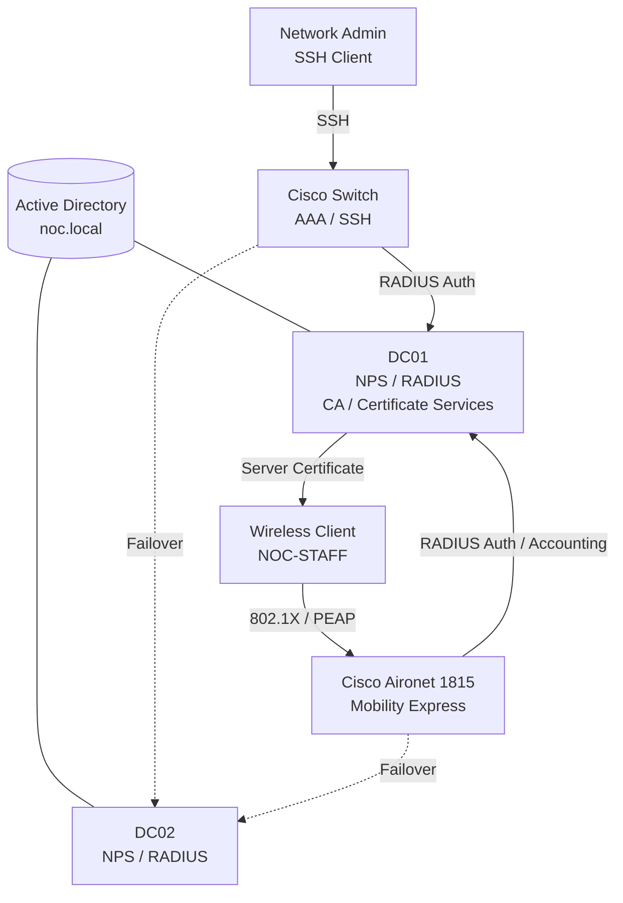
```mermaid
flowchart TD
    AD[(Active Directory<br/>noc.local)]
    DC01[DC01<br/>NPS / RADIUS<br/>CA / Certificate Services]
    DC02[DC02<br/>NPS / RADIUS]
    SW[Cisco Switch<br/>AAA / SSH]
    AP[Cisco Aironet 1815<br/>Mobility Express]
    ADMIN[Network Admin<br/>SSH Client]
    WIFI[Wireless Client<br/>NOC-STAFF]

    AD --- DC01
    AD --- DC02

    ADMIN -->|SSH| SW
    SW -->|RADIUS Auth| DC01
    SW -. Failover .-> DC02

    WIFI -->|802.1X / PEAP| AP
    AP -->|RADIUS Auth / Accounting| DC01
    AP -. Failover .-> DC02

    DC01 -->|Server Certificate| WIFI
```

---

# 3. Main Components

| Component | Function |
|---|---|
| Active Directory | User/group identity source |
| DC01 | Primary NPS/RADIUS server in normal operation |
| DC02 | Secondary NPS/RADIUS server used for failover |
| NPS | RADIUS authentication/authorization service |
| AD CS | Issues server certificates used by NPS/PEAP |
| Cisco switch | SSH AAA client |
| Cisco Aironet 1815 Mobility Express | Enterprise WLAN authenticator |
| `NOC_Network_Admins` | AD group used for switch-admin policy |
| `NOC-STAFF` | Enterprise Wi-Fi SSID |
| Event Viewer | Authentication success/failure verification |

---

# Part 1 — Active Directory Group for Network Administration

## 4. Create / Verify the Network Administrator Group

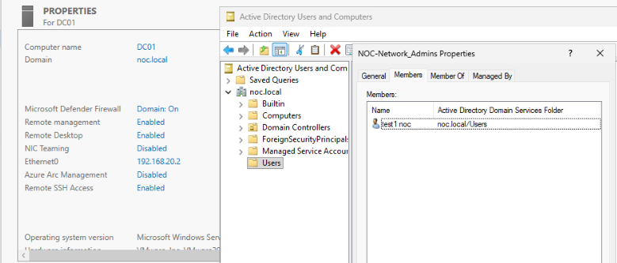

The first screenshot shows the Active Directory group used to control which accounts are allowed to administer the Cisco switch.

The group shown is:

```text
NOC_Network_Admins
```

### Why use an AD group?

Instead of configuring individual usernames directly on every network device, administrative access can be controlled centrally through group membership.

The authorization model becomes:

```text
User account
   ↓
Member of NOC_Network_Admins
   ↓
NPS policy matches
   ↓
RADIUS Access-Accept
   ↓
Cisco privilege 15
```

### Learning point

This separates **identity management** from **network-device configuration**. Administrators can add or remove access by changing AD group membership rather than editing the switch every time.

---

# Part 2 — Configure the Cisco Switch as an NPS RADIUS Client

## 5. Add the Switch to NPS on DC01

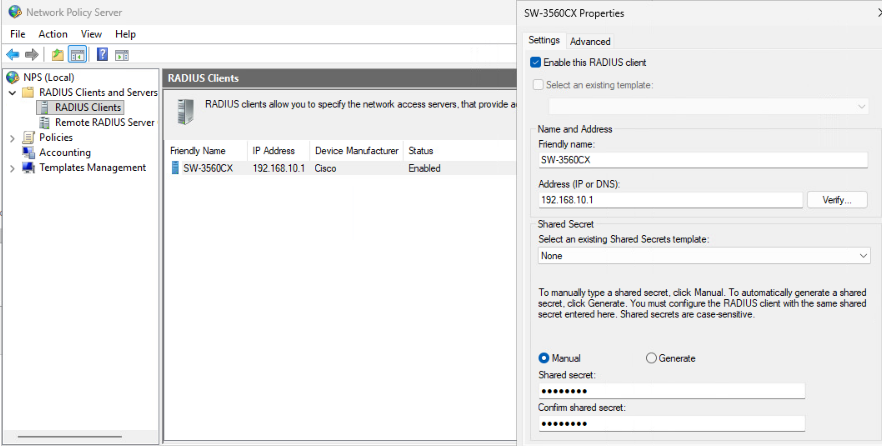

The Cisco switch was added as a RADIUS client on DC01.

The RADIUS client definition includes:

- Friendly name.
- Switch IP address.
- Shared secret.
- RADIUS client enablement.

### Why a shared secret is required

The RADIUS shared secret allows the NPS server and the network device to authenticate RADIUS messages between each other.

The same secret must match on:

```text
Cisco switch
and
NPS RADIUS client definition
```

A mismatch causes authentication failure even if the user password is correct.

---

## 6. Configure the Same RADIUS Client on DC02

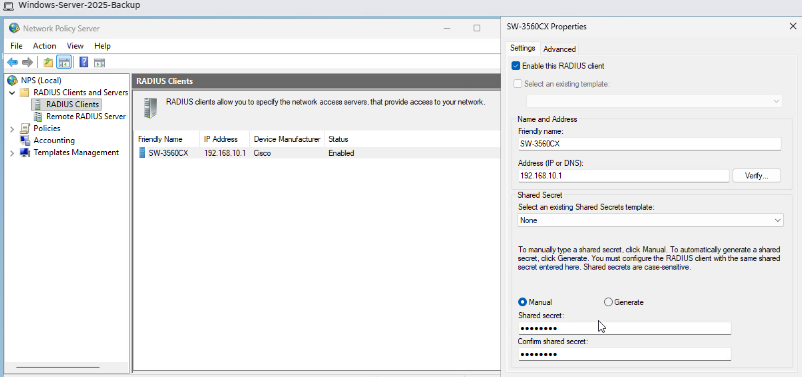

The same switch was configured as a RADIUS client on DC02.

### Why parity matters

Failover works only if both NPS servers understand the requesting device.

DC02 needs the same essential RADIUS-client information as DC01:

- Client IP.
- Shared secret.
- Correct RADIUS settings.

If DC01 fails but DC02 does not recognize the switch as a valid RADIUS client, SSH failover will not work.

---

# Part 3 — Create the Switch Administrator NPS Policy

## 7. Switch Administrator Policy Overview

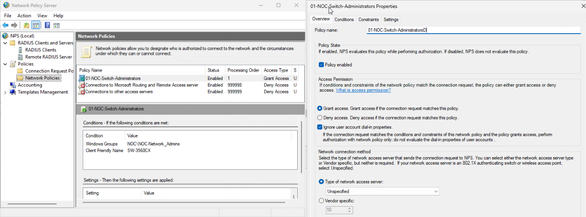

A dedicated NPS Network Policy was created for switch administrative authentication.

The policy is designed to authorize only the intended administrative accounts.

---

## 8. Policy Conditions

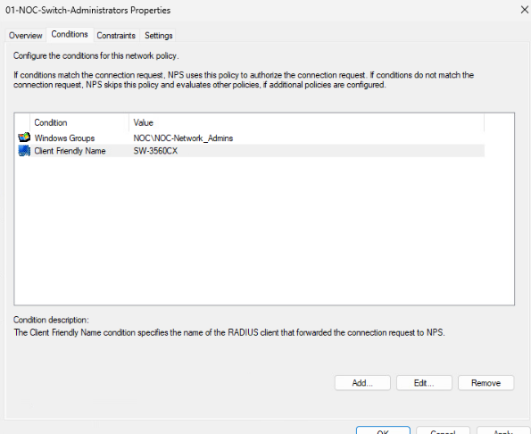

The policy conditions include the AD Windows group:

```text
NOC_Network_Admins
```

### What this means

NPS evaluates the incoming authentication request and checks whether the user belongs to the authorized administrative group.

If the user is not in the correct group, the policy should not grant the same administrative access.

---

## 9. Standard RADIUS Attribute — Service-Type Login

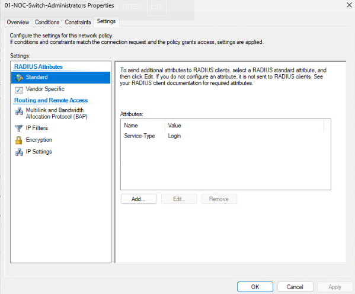

The policy includes a standard RADIUS attribute for login service.

This helps describe the type of access being authorized.

---

## 10. Cisco Vendor-Specific Attribute — Privilege Level 15

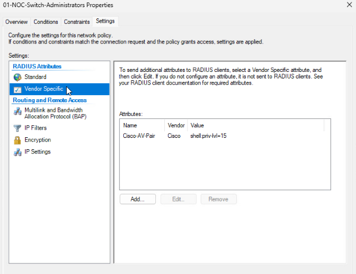

The NPS policy includes a Cisco vendor-specific attribute:

```text
Cisco-AV-Pair
shell:priv-lvl=15
```

### Why this matters

Authentication answers:

```text
Who are you?
```

Authorization answers:

```text
What level of access should you receive?
```

The Cisco AVPair tells the switch that a successfully authorized user should receive Cisco IOS privilege level 15.

This is a strong example of centralized AAA:

```text
Authentication  → AD credentials
Authorization   → NPS policy + Cisco AVPair
Accounting/logs → NPS / Windows events
```

---

# Part 4 — Configure AAA and SSH on the Cisco Switch

## 11. Verify the Switch AAA / RADIUS / SSH Configuration

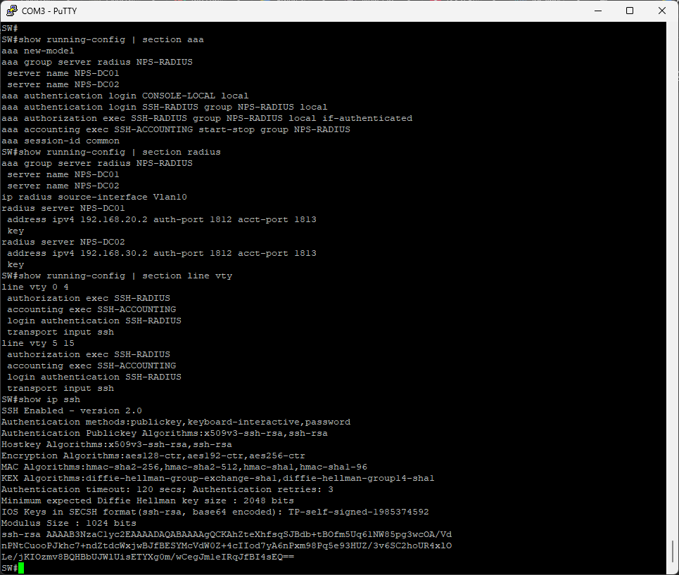

The Cisco running configuration shows the AAA, RADIUS, and SSH-related configuration.

Important concepts represented in this configuration include:

```text
aaa new-model
RADIUS server definitions
AAA authentication
AAA authorization
VTY / SSH login
Domain / RSA configuration
```

### Why `aaa new-model` matters

Cisco AAA features are enabled through the AAA model.

Once AAA is enabled, login behavior should be carefully tested to avoid accidentally locking out administrative access.

---

## 12. Verify the RADIUS Server Baseline

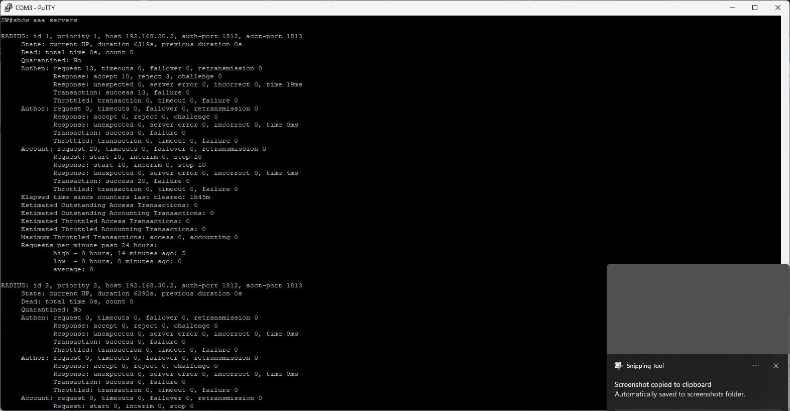

The switch was checked to confirm the configured RADIUS servers before failover testing.

### Learning point

Before creating a failure scenario, capture the healthy baseline.

This makes it easier to compare:

```text
Normal state
vs
Failover state
```

---

# Part 5 — Verify AD-Based SSH Authentication

## 13. Successful SSH Login with Privilege 15

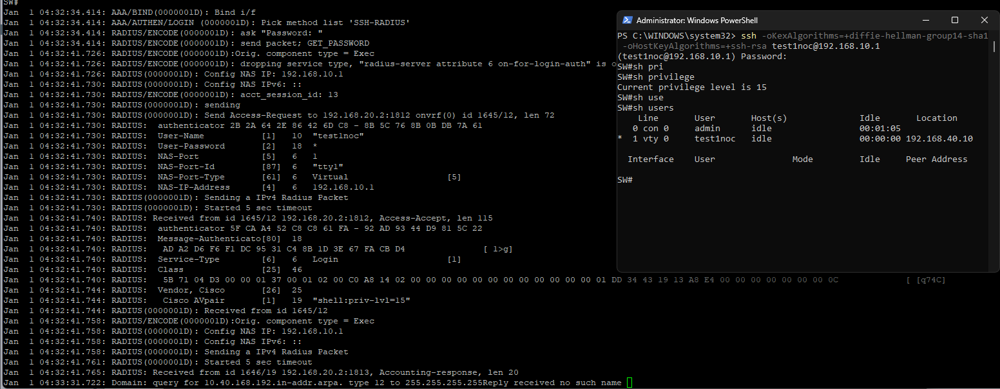

The screenshot shows an SSH session authenticating with an Active Directory account through RADIUS.

The successful user receives administrative access consistent with the policy.

### What this proves

The complete authentication path is working:

```text
SSH client
   ↓
Cisco switch
   ↓ RADIUS
NPS
   ↓
Active Directory
   ↓
Access-Accept + privilege authorization
   ↓
Cisco privilege 15
```

This is stronger evidence than simply showing configuration lines because it demonstrates actual authentication.

---

# Part 6 — Test NPS Failover for SSH

## 14. Verify the IAS / NPS Service Is Running

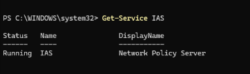

Windows NPS runs under the service name:

```text
IAS
```

The baseline check shows the service in a running state.

---

## 15. Stop IAS on DC01

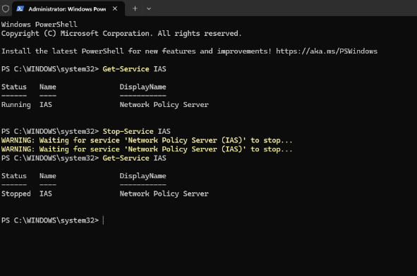

The IAS service was intentionally stopped on DC01.

This creates a real authentication-server failure.

### Why this is a better test than only checking configuration

A redundant RADIUS design should be validated by actually making the primary server unavailable.

---

## 16. Verify SSH Authentication Fails Over to DC02

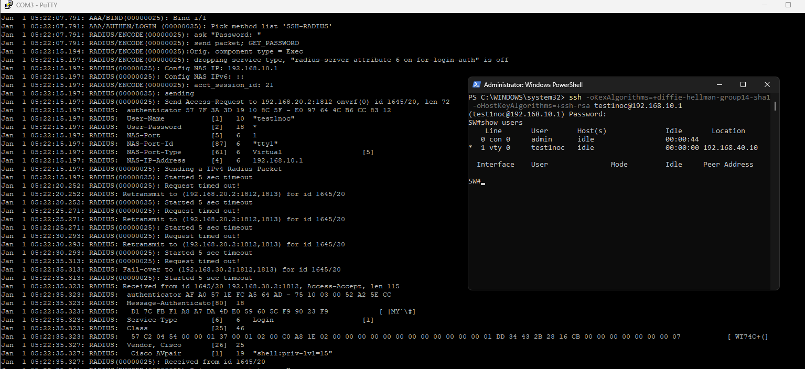

The switch debug/output shows authentication continuing through the secondary RADIUS server.

The key result is:

```text
Access-Accept
```

from the failover path.

### Failover sequence

```text
DC01 NPS unavailable
       ↓
Switch cannot use primary RADIUS
       ↓
Switch tries secondary RADIUS
       ↓
DC02 processes AD authentication
       ↓
Access-Accept
       ↓
SSH login still works
```

**SSH RADIUS failover result: PASS**

---

## 17. Verify the Authentication on DC02 with Event ID 6272

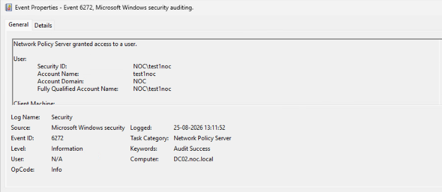

DC02 Event Viewer records:

```text
Event ID 6272
Network Policy Server granted access to a user
```

### Why this screenshot is important

The switch-side result shows successful authentication.

The Windows event on DC02 independently confirms that **DC02** handled the request.

This provides two-sided proof of failover.

---

## 18. Restore the IAS Service on DC01

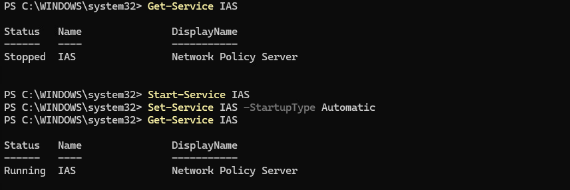

The IAS service was started again and configured for automatic startup.

Useful PowerShell commands shown in this stage include the equivalent concepts of:

```powershell
Start-Service IAS
Set-Service IAS -StartupType Automatic
Get-Service IAS
```

This returns DC01 to normal RADIUS service.

---

# Part 7 — Add the Access Point as a RADIUS Client

## 19. Configure the Access Point RADIUS Client on DC02

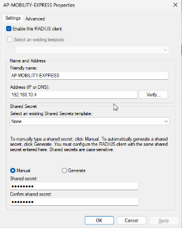

The Aironet access point / controller was added as an NPS RADIUS client.

### Why this is required

For enterprise Wi-Fi authentication, the AP/controller acts as the **RADIUS client / authenticator**.

The wireless user does not send RADIUS directly to NPS.

The logical path is:

```text
Wireless Client
      ↓ 802.1X
Access Point / Controller
      ↓ RADIUS
NPS
      ↓
Active Directory
```

---

# Part 8 — Configure Cisco Aironet Mobility Express

## 20. Mobility Express Console Wizard

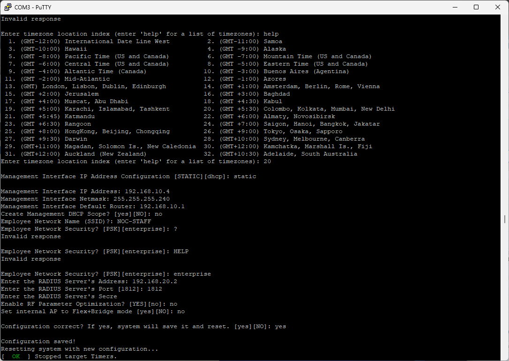

The Cisco Aironet 1815 Mobility Express setup wizard was used to initialize the wireless environment.

This screenshot provides evidence of the controller/AP setup stage before enterprise authentication was configured.

---

## 21. Verify the Switch Trunk to the Access Point

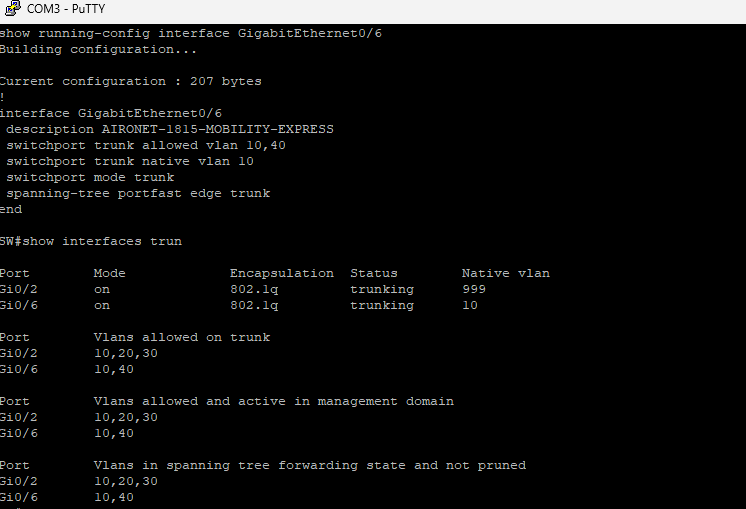

The switch interface connected to the AP was configured/verified as a trunk.

The screenshot shows the AP-facing switch port and allowed VLAN information.

### Why a trunk is needed

The AP must carry:

- Management traffic.
- Wireless client VLAN traffic.

A trunk allows multiple VLANs to traverse a single physical Ethernet link.

---

# Part 9 — Certificate Services for NPS / PEAP

## 22. Verify Issued NPS Certificates

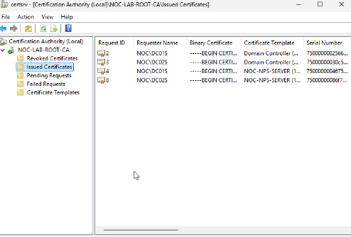

The Certification Authority console shows NPS server certificates issued for the lab servers.

### Why NPS needs a server certificate

PEAP uses TLS to create a protected tunnel before user credentials are exchanged.

The NPS server presents a certificate so the client can verify the identity of the authentication server.

Without proper certificate trust, users may receive warnings or authentication may fail depending on client settings.

---

## 23. Verify the NPS Server Certificate Template EKUs

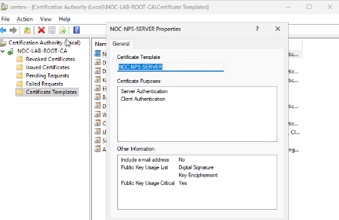

The certificate template shows Enhanced Key Usage suitable for server authentication.

The screenshot indicates:

```text
Server Authentication
Client Authentication
```

### Learning point

A certificate's purpose is not determined only by its name.

The EKUs define what the certificate is allowed to be used for.

For NPS/PEAP, server-authentication capability is especially important.

---

# Part 10 — Create the Wireless Connection Request Policy

## 24. Wireless Connection Request Policy

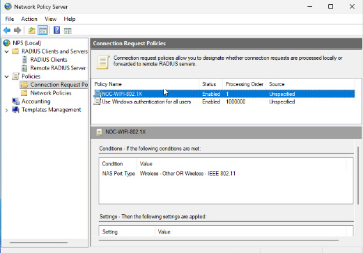

A dedicated connection request policy was created for wireless RADIUS traffic.

The visible condition includes NAS Port Type for wireless 802.11 traffic.

### Why connection request policies matter

Connection Request Policies determine how incoming RADIUS requests are handled before the final Network Policy decision.

They help separate different RADIUS use cases such as:

```text
Network-device SSH AAA
vs
Wireless 802.1X
```

---

# Part 11 — Create the Wireless Network Policy

## 25. Wireless Policy Overview

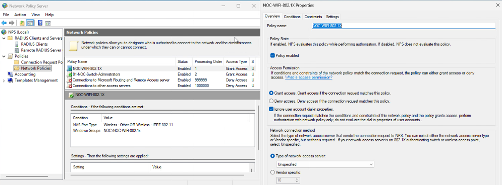

A dedicated wireless NPS Network Policy was created.

This separates wireless access rules from the earlier switch-administration policy.

---

## 26. Wireless Policy Conditions

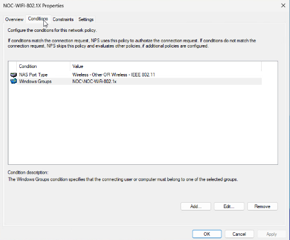

The policy conditions include Windows group and/or wireless NAS-type criteria shown in the screenshot.

### Why conditions matter

NPS evaluates conditions to decide whether a request belongs to a policy.

Good policy design prevents unrelated RADIUS requests from matching the wrong authorization rule.

---

## 27. Configure PEAP Authentication

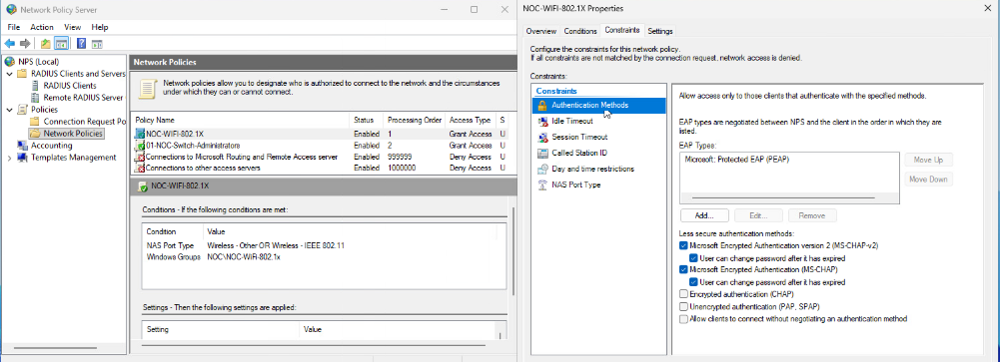

The wireless policy constraints show PEAP as the permitted authentication method.

PEAP provides a TLS-protected tunnel and then authenticates the user within that tunnel.

### Simplified PEAP flow

```text
Wireless client connects
        ↓
NPS presents server certificate
        ↓
TLS tunnel established
        ↓
User credentials authenticated inside tunnel
        ↓
NPS returns Access-Accept or Access-Reject
```

---

## 28. Configure Wireless RADIUS Attributes

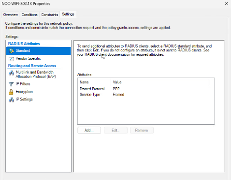

The policy includes RADIUS settings such as framed/service-related attributes.

This demonstrates that NPS can return additional authorization information along with the authentication decision.

---

# Part 12 — Verify Wireless Authentication Events

## 29. Successful Wireless Authentication — Event ID 6272

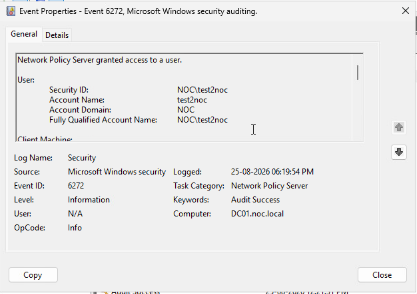

The screenshot shows:

```text
Event ID 6272
Network Policy Server granted access to a user
```

for the wireless account shown in the event.

### What this proves

The wireless authentication request reached NPS, matched an allowed policy, and was granted access.

---

## 30. Denied Wireless Authentication — Event ID 6273

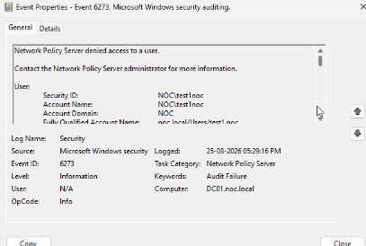

The screenshot shows:

```text
Event ID 6273
Network Policy Server denied access to a user
```

### Why denied events are useful

A successful lab should also understand failure behavior.

Event 6273 provides evidence that NPS is enforcing policy rather than accepting every authentication request.

---

# Part 13 — Configure Redundant RADIUS Servers on the AP

## 31. Configure Authentication and Accounting Servers

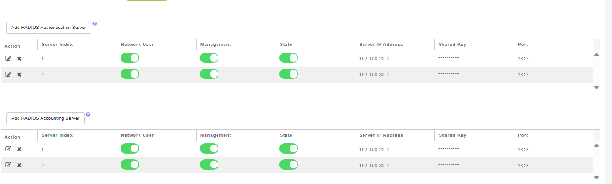

The Mobility Express controller was configured with both RADIUS servers.

This provides authentication redundancy similar to the Cisco switch configuration.

### Design principle

For redundancy, the authenticator should know both servers:

```text
Primary NPS   → DC01
Secondary NPS → DC02
```

The screenshot also shows authentication/accounting server entries, demonstrating centralized AAA integration.

---

## 32. Configure WPA2-Enterprise on the WLAN

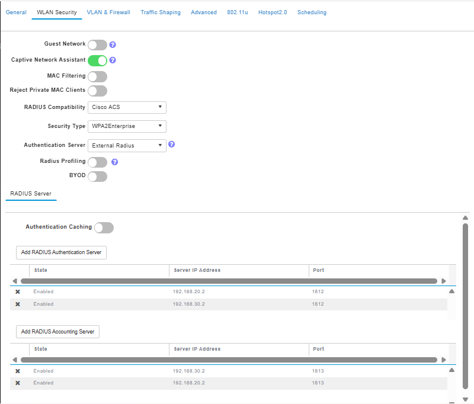

The WLAN security configuration uses enterprise authentication with the configured RADIUS servers.

### Difference from WPA2-Personal

WPA2-Personal uses one shared Wi-Fi password.

WPA2-Enterprise uses individual identity authentication through 802.1X/RADIUS.

That means:

```text
User A has their own AD credentials
User B has their own AD credentials
```

rather than everyone sharing one PSK.

---

# Part 14 — Connect a Windows Client to the Enterprise SSID

## 33. Connect to `NOC-STAFF` with AD Credentials

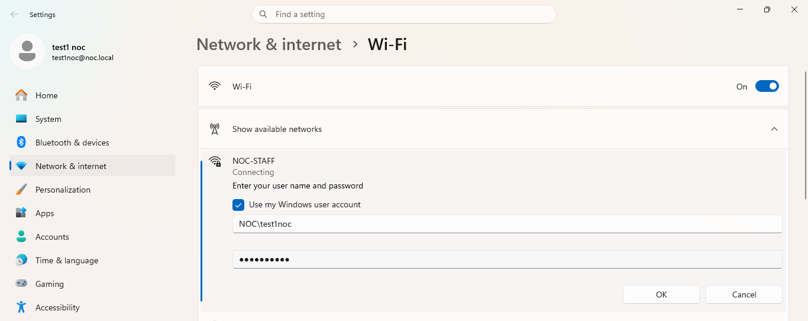

The Windows client connects to:

```text
SSID: NOC-STAFF
```

and is prompted for enterprise credentials.

### Authentication path

```text
Windows client
      ↓
NOC-STAFF SSID
      ↓
Aironet / Mobility Express
      ↓ RADIUS
NPS
      ↓
Active Directory
```

---

## 34. Client Certificate Trust Prompt

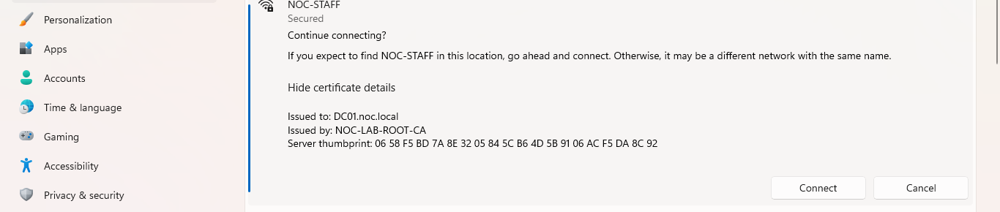

The client is shown a server-certificate trust prompt during the enterprise Wi-Fi connection.

### What this means

The client is validating the certificate presented by the NPS server during PEAP.

This screenshot is important because it demonstrates that certificate trust is an actual part of the 802.1X authentication process.

### Security lesson

Users should not blindly accept unknown authentication-server certificates in production.

A properly managed enterprise environment distributes trusted CA certificates and configures expected RADIUS server names through policy.

---

# Part 15 — Verify Wireless Clients in Mobility Express

## 35. Network Summary with Active Clients

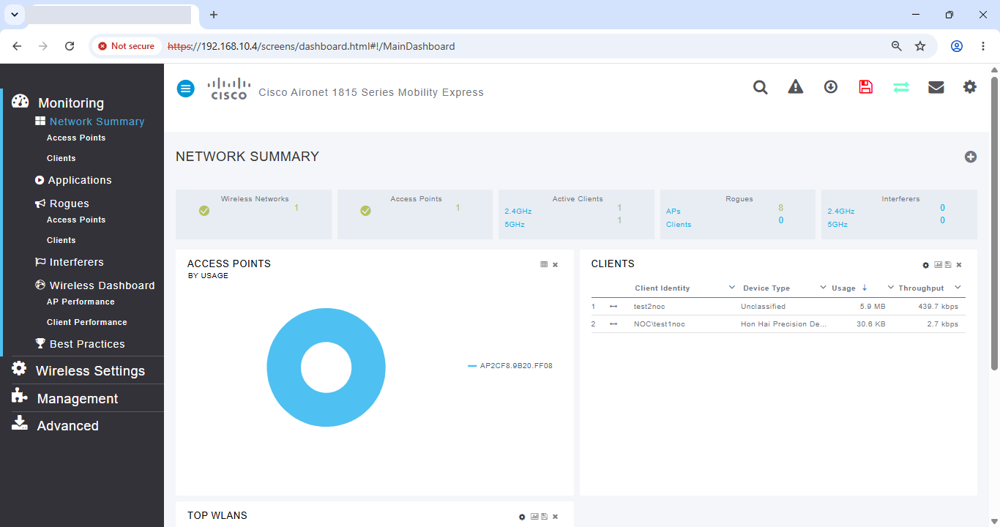

The Mobility Express dashboard shows active wireless client information.

This provides controller-side evidence that clients successfully joined the WLAN.

---

## 36. Review the `NOC-STAFF` WLAN Profile

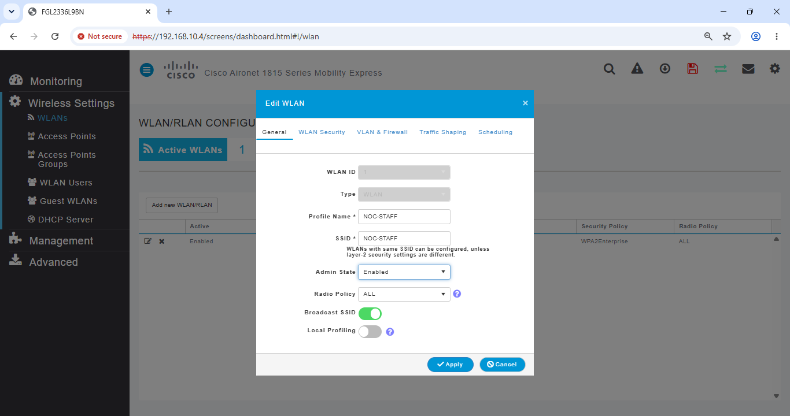

The WLAN profile was reviewed/edited to verify enterprise security and VLAN-related settings.

---

## 37. Verify `test1noc` Client Session


The AP client view shows the authenticated client online.

This proves that successful NPS authentication results in a real wireless session visible at the controller.

---

## 38. Stop IAS on DC01 for Wireless Failover


The NPS/IAS service on DC01 was stopped again, this time to test **wireless RADIUS failover**.

This creates a failure of the primary authentication server while the WLAN remains active.

---

## 39. Verify `test2noc` Online

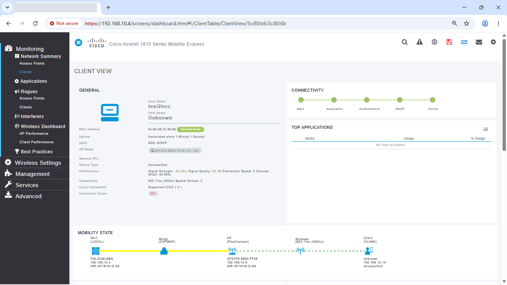

The client is shown online in Mobility Express.

This is client/controller-side evidence of successful wireless authentication.

---

## 40. Verify DC02 Handled the Authentication


The Event ID 6272 record on DC02 confirms that the secondary NPS server authenticated the user during the failover test.

### Wireless failover proof

```text
DC01 IAS = Stopped
       ↓
AP tries RADIUS
       ↓
DC01 unavailable
       ↓
AP sends authentication to DC02
       ↓
DC02 returns Access-Accept
       ↓
Client joins WLAN
```

**Wireless RADIUS failover result: PASS**

---

## 41. Verify All AP Client Sessions

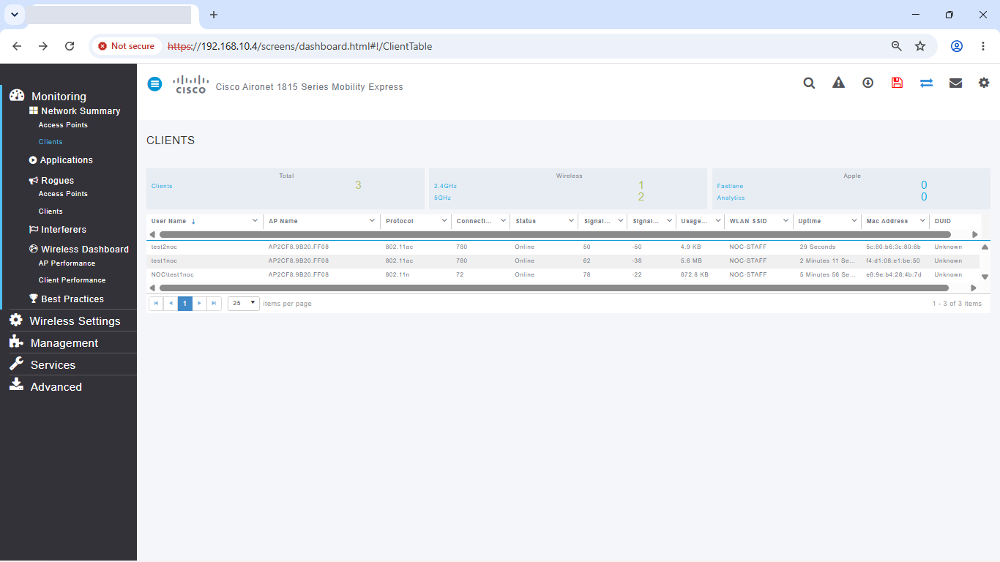

The AP client table shows the active sessions during the testing process.

---

## 42. Verify Event 6272 for `test2noc`

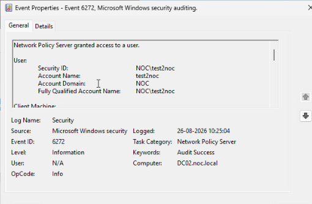

Another Event ID 6272 entry confirms successful access for the wireless account.

---

## 43. Verify the Post-Failover Client View

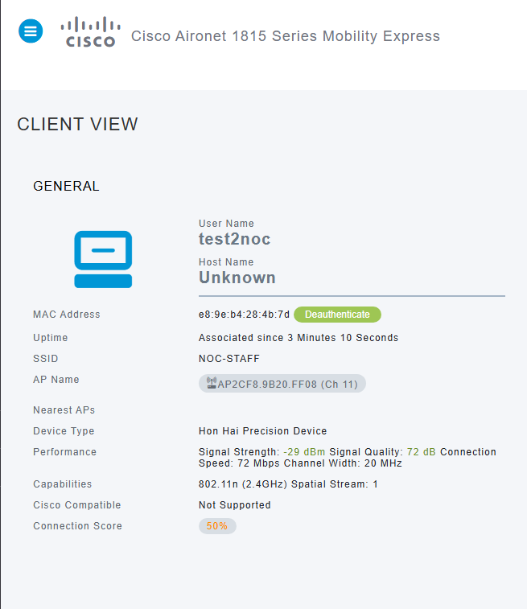

The Mobility Express client view confirms the wireless session after failover.

---

## 44. Re-Test with DC01 IAS Stopped

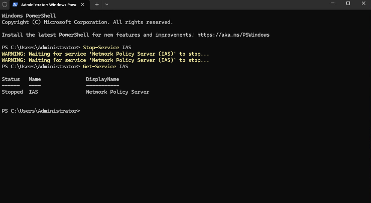

The IAS service remained/stayed stopped during further validation.

Repeated testing helps prove that authentication continuity was not a one-time result.

---

## 45. Confirm Authentication Server = DC02

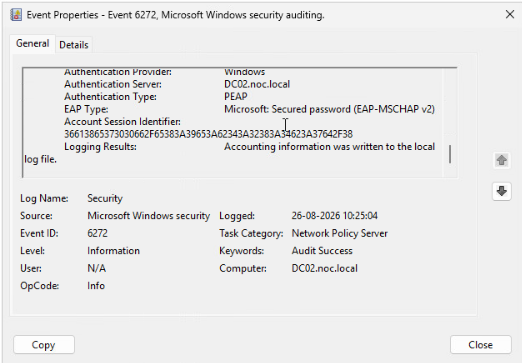

The NPS event again identifies DC02 as the server processing the request.

---

# Part 16 — SSH Security and Negative Testing

## 46. Regenerate the Switch RSA Key at 2048 Bits

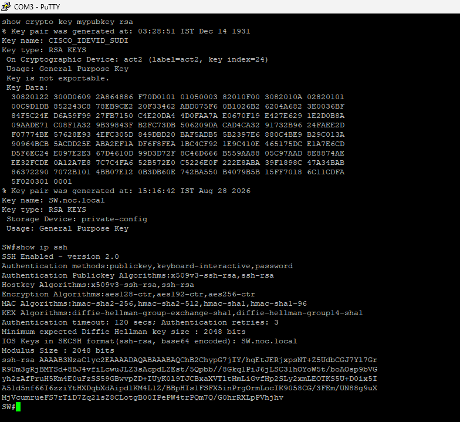

The Cisco switch RSA key was regenerated with a 2048-bit key.

### Why RSA keys matter

SSH uses asymmetric cryptography for secure session establishment.

Replacing weaker/old keys with an appropriate key size strengthens the SSH management plane.

---

## 47. Verify Another Successful DC02 Event


The Event ID 6272 record provides continued evidence that authentication through DC02 is working during the failover condition.

---

## 48. Test Wrong SSH Credentials

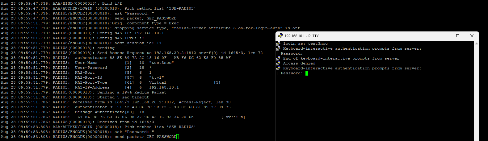

A negative authentication test was performed using incorrect credentials.

The RADIUS path returned a rejection instead of allowing access.

### Why negative testing is important

A security configuration is not fully validated by proving that valid users can log in.

It should also prove that invalid credentials are denied.

Expected logic:

```text
Correct AD credentials + authorized group
        → Access-Accept

Wrong credentials
        → Access-Reject
```

---

# Part 17 — Final Wireless VLAN 40 Validation

## 49. Verify the AP Client View on VLAN 40

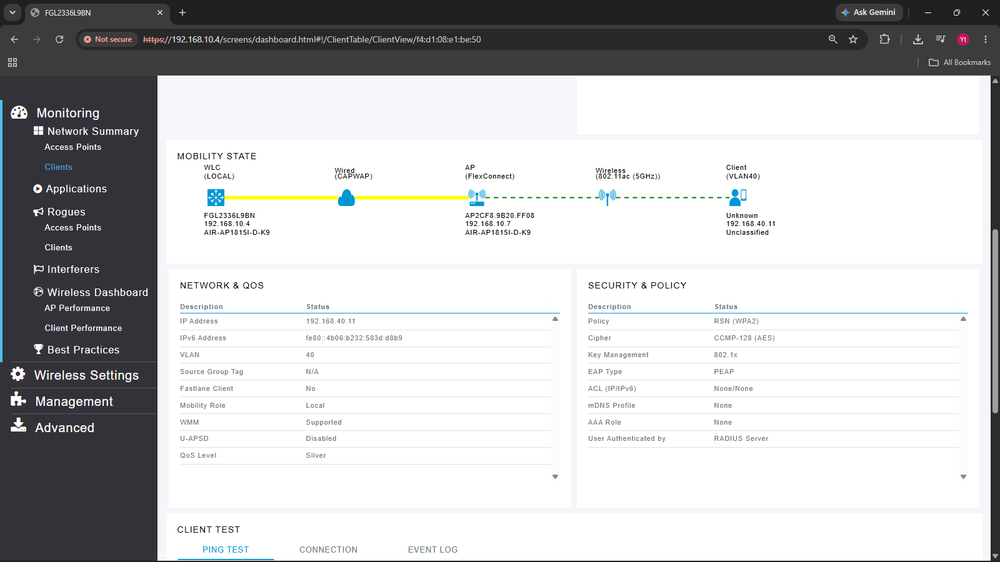

The Mobility Express client view shows the authenticated client associated with the enterprise WLAN and VLAN-related connection state.

This is part of the final WLAN validation.

---

## 50. Verify Post-Failover Client State


The authenticated client remains visible in the AP client view after failover testing.

---

## 51. Verify Windows Client IP Configuration on VLAN 40

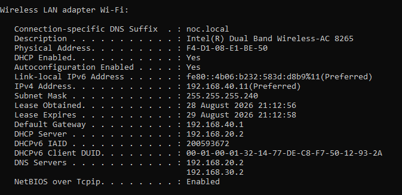

The final Windows client IP configuration shows the wireless interface receiving:

```text
IPv4 Address    : 192.168.40.11
Subnet Mask     : 255.255.255.240
Default Gateway : 192.168.40.1
DHCP Server     : 192.168.20.2
DNS Servers     : 192.168.20.2
                  192.168.30.2
```

### What this proves

The final enterprise Wi-Fi path is working end-to-end:

```text
Wireless authentication
        ↓
RADIUS / NPS
        ↓
Active Directory authorization
        ↓
Client admitted to WLAN
        ↓
VLAN 40 connectivity
        ↓
DHCP lease received
        ↓
Gateway + redundant DNS configured
```

This connects Lab 02 directly back to the redundant DHCP/DNS infrastructure from Lab 01.

---

# 4. AAA Concepts Demonstrated

## Authentication

Authentication verifies identity.

Examples in this lab:

```text
AD username/password for SSH
AD username/password for Wi-Fi
```

---

## Authorization

Authorization determines what an authenticated identity is allowed to do.

Example:

```text
NOC_Network_Admins
        ↓
NPS policy
        ↓
Cisco AVPair
        ↓
privilege level 15
```

---

## Accounting / Auditing

The screenshots show RADIUS-related event logging and AP accounting-server configuration.

Windows Event Viewer provides evidence such as:

```text
6272 = Network Policy Server granted access
6273 = Network Policy Server denied access
```

These logs are useful for security auditing and troubleshooting.

---

# 5. RADIUS Redundancy Design

The authentication design uses two NPS servers.

```text
                 Network Device / AP
                         │
             ┌───────────┴───────────┐
             │                       │
           DC01                    DC02
       Primary RADIUS          Secondary RADIUS
             │                       │
             └──────── AD ───────────┘
```

The lab proved failover in **two separate AAA use cases**:

| Service | Primary Failure | Secondary Result |
|---|---|---|
| Cisco SSH AAA | DC01 IAS stopped | DC02 returned Access-Accept |
| Wi-Fi 802.1X | DC01 IAS stopped | DC02 Event 6272 + client online |

---

# 6. Certificate / PEAP Authentication Logic

The PEAP process demonstrated in this lab is approximately:

```text
Client joins NOC-STAFF
        ↓
802.1X authentication begins
        ↓
AP forwards RADIUS request
        ↓
NPS presents server certificate
        ↓
Client validates certificate / trust
        ↓
PEAP TLS tunnel established
        ↓
User credentials authenticated
        ↓
NPS evaluates wireless policy
        ↓
Access-Accept
        ↓
Client joins WLAN
        ↓
VLAN 40 DHCP address obtained
```

---

# 7. Troubleshooting Method Learned

A useful AAA troubleshooting order from this lab is:

## Switch SSH AAA

1. Verify IP connectivity to both NPS servers.
2. Verify the switch exists as a RADIUS client on both DCs.
3. Verify the shared secret matches.
4. Verify `aaa new-model`.
5. Verify RADIUS server configuration.
6. Verify authentication and authorization method lists.
7. Verify the user is in `NOC_Network_Admins`.
8. Verify NPS policy conditions.
9. Verify Cisco AVPair `shell:priv-lvl=15`.
10. Check switch debug / RADIUS status.
11. Check NPS Event Viewer.

## Wireless 802.1X

1. Verify AP switch port/trunk.
2. Verify the AP is a RADIUS client.
3. Verify both RADIUS servers are configured on Mobility Express.
4. Verify SSID enterprise security.
5. Verify NPS connection request policy.
6. Verify wireless Network Policy.
7. Verify PEAP configuration.
8. Verify NPS server certificate.
9. Verify client trusts the CA/server certificate.
10. Check Event ID 6272/6273.
11. Check AP client table.
12. Verify client DHCP/VLAN configuration.

---

# 8. Useful Verification Commands

## Windows / NPS

```powershell
Get-Service IAS
Stop-Service IAS
Start-Service IAS
Set-Service IAS -StartupType Automatic
```

## Cisco Switch

Useful AAA / SSH verification commands include:

```text
show running-config
show aaa servers
show users
show ip ssh
show crypto key mypubkey rsa
```

For troubleshooting, RADIUS debug output can help verify whether the switch receives:

```text
Access-Accept
Access-Reject
Timeout
```

---

# 9. Event IDs Used

| Event ID | Meaning in This Lab |
|---|---|
| `6272` | NPS granted access |
| `6273` | NPS denied access |

These events provide server-side confirmation of the result of each RADIUS authentication request.

---

# 10. Verification Matrix

| Test | Evidence | Result |
|---|---|---|
| AD network-admin group | Group membership screenshot | PASS |
| Switch RADIUS client on DC01 | NPS client definition | PASS |
| Switch RADIUS client on DC02 | NPS parity screenshot | PASS |
| Switch admin NPS policy | Conditions + settings | PASS |
| Cisco privilege 15 authorization | Cisco AVPair | PASS |
| AAA/SSH switch config | Running configuration | PASS |
| AD-based SSH login | Successful SSH session | PASS |
| IAS baseline | Service running | PASS |
| DC01 NPS failure | IAS stopped | PASS |
| SSH failover | DC02 Access-Accept | PASS |
| Failover corroboration | DC02 Event 6272 | PASS |
| AP RADIUS client | NPS client definition | PASS |
| AP trunk | Gi0/6 trunk verification | PASS |
| NPS certificates | CA issued certificates | PASS |
| Certificate EKUs | NPS template evidence | PASS |
| Wireless CRP | Policy configured | PASS |
| Wireless Network Policy | Conditions + PEAP | PASS |
| Wireless grant | Event 6272 | PASS |
| Wireless denial | Event 6273 | PASS |
| Dual RADIUS on AP | Both servers configured | PASS |
| WPA2-Enterprise | WLAN security screenshot | PASS |
| Client enterprise login | AD credential prompt | PASS |
| Certificate verification | Server trust prompt | PASS |
| Wireless client online | Mobility Express client table | PASS |
| DC01 wireless failover | IAS stopped | PASS |
| DC02 wireless authentication | Event 6272 on DC02 | PASS |
| Wrong SSH credential rejection | Access-Reject | PASS |
| SSH RSA key | 2048-bit RSA generated | PASS |
| Final VLAN 40 client connectivity | `192.168.40.11/28` | PASS |

---

# 11. Evidence Map

| Screenshot | Purpose |
|---|---|
| 001 | AD network administrators group |
| 002–003 | Switch RADIUS client on DC01/DC02 |
| 004–007 | Switch administrator NPS policy |
| 008–010 | Switch AAA/SSH configuration and successful login |
| 011–015 | SSH RADIUS failover DC01 → DC02 |
| 016–018 | AP RADIUS client, Mobility Express setup, trunk |
| 019–020 | NPS certificates and certificate template |
| 021–025 | Wireless NPS policy and PEAP |
| 026–027 | Wireless Access-Accept / Access-Reject events |
| 028–033 | Mobility Express RADIUS/WLAN/client configuration |
| 034–040 | Wireless failover and authentication verification |
| 038 | Switch RSA key regeneration |
| 039 | Wrong SSH credentials / RADIUS rejection |
| 041 | Final VLAN 40 wireless client IP configuration |

---

# 12. Key Learning Outcomes

### 1. Active Directory can centralize network-device administration

The Cisco switch no longer depends only on separate local administrator accounts.

Network-admin authorization can be controlled through AD group membership and NPS policy.

---

### 2. Authentication and authorization are different

A user can successfully prove their identity, but authorization still determines the access level.

The Cisco AVPair demonstrates this clearly by returning privilege level 15 only through the correct NPS policy.

---

### 3. RADIUS redundancy must be configured on both ends

Having two NPS servers is not sufficient by itself.

The switch and AP must know about both servers, and both NPS servers must know the RADIUS clients.

---

### 4. Failover should be tested by creating a real service failure

Stopping the IAS service on DC01 proved that SSH and wireless authentication could continue through DC02.

---

### 5. Event Viewer is strong AAA evidence

Event ID 6272 and 6273 show exactly whether NPS granted or denied authentication.

This is more useful than relying only on the end-user result.

---

### 6. Enterprise Wi-Fi depends on multiple systems

A successful 802.1X Wi-Fi connection requires:

```text
Wireless client
AP / controller
Switch VLAN/trunk
RADIUS / NPS
Active Directory
Certificate trust
DHCP
DNS
```

A failure in any one layer can prevent the user from connecting.

---

### 7. Certificates are part of PEAP security

The certificate trust prompt demonstrated that the client validates the NPS server's identity during the protected authentication exchange.

---

### 8. Negative testing is part of security validation

The lab captured:

- Valid authentication.
- Denied wireless authentication.
- Wrong SSH credentials / RADIUS Access-Reject.

A secure AAA design must reject invalid authentication attempts, not merely accept valid ones.

---

### 9. Lab 01 and Lab 02 are connected

The final wireless client received VLAN 40 DHCP and redundant DNS information from the infrastructure established in Lab 01.

That proves the labs form one integrated enterprise environment rather than isolated exercises.

---

# Conclusion

This lab successfully added centralized **AAA, RADIUS, certificate-based server trust, SSH authentication, and enterprise Wi-Fi authentication** to the redundant Active Directory infrastructure created in Lab 01.

Two major services were validated:

```text
Cisco SSH administration
        +
WPA2-Enterprise / 802.1X Wi-Fi
```

Both use Active Directory identities through NPS/RADIUS.

The strongest evidence in the lab is the repeated failover testing:

```text
DC01 IAS stopped
        ↓
Primary RADIUS unavailable
        ↓
Switch / AP uses DC02
        ↓
DC02 records Event 6272
        ↓
Authentication continues
```

The final environment demonstrates practical understanding of:

**Active Directory groups, NPS, RADIUS clients, Network Policies, Cisco AAA, SSH, privilege authorization, AD CS, certificates, PEAP, WPA2-Enterprise, 802.1X, Mobility Express, VLAN trunking, authentication logging, RADIUS failover, and end-to-end client verification.**

This lab prepares the environment for the next section of the project: **EAP-TLS certificate authentication**, where client certificates are used instead of password-based PEAP authentication.
