# Lab 03 — EAP-TLS Certificate Authentication

## Overview

This lab extends the enterprise Wi-Fi environment from Lab 02 by replacing password-based wireless authentication with **certificate-based EAP-TLS authentication**.

The goal was to build a more secure 802.1X authentication design where authorized domain computers receive certificates automatically and use those certificates to authenticate to the `NOC-STAFF` WPA2-Enterprise wireless network.

The screenshots in this folder document the complete chain:

- Enterprise Certification Authority verification.
- A dedicated computer-certificate template.
- Certificate enrollment and auto-enrollment permissions.
- Certificate-template publication.
- Group Policy certificate auto-enrollment.
- NPS EAP-TLS Network Policy creation.
- Group Policy deployment of the wireless profile.
- Client-side Group Policy verification.
- Client wireless profile verification.
- Successful WPA2-Enterprise EAP-TLS connection.
- VLAN 40 DHCP addressing.
- Gateway and redundant-DNS validation.
- Negative testing from an unenrolled device that knows the domain but does not possess a valid certificate.

This README is intentionally detailed because it serves as **proof of practical learning and security validation**, not only as a configuration summary.

---

# 1. Lab Objectives

The main objectives were to:

- Verify the internal Enterprise CA.
- Create or use a dedicated computer certificate template for 802.1X.
- Restrict certificate enrollment to an approved AD computer group.
- Enable certificate auto-enrollment through Group Policy.
- Publish the 802.1X certificate template on the CA.
- Configure NPS to use **Microsoft: Smart Card or other certificate (EAP-TLS)**.
- Restrict the EAP-TLS policy to approved computers and wireless requests.
- Deploy the `NOC-STAFF` wireless profile through Group Policy.
- Confirm that the client receives the required policy.
- Verify the client uses EAP-TLS rather than password-based PEAP.
- Confirm successful Wi-Fi connectivity on VLAN 40.
- Verify access to the gateway and both DNS servers.
- Prove that a device without a valid enrolled certificate is denied.

---

# 2. Authentication Architecture

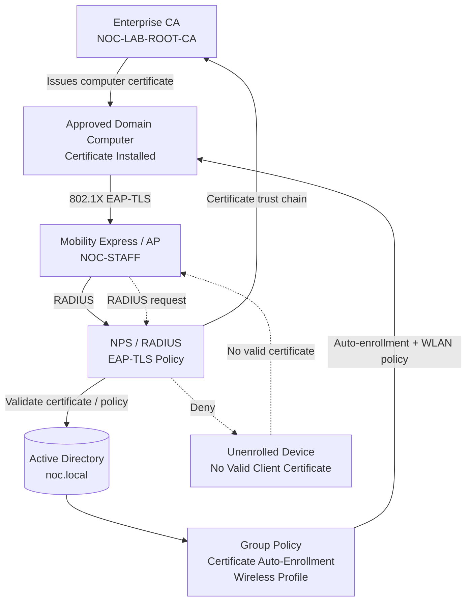

---

# 3. Why EAP-TLS Is Different

Lab 02 used enterprise wireless authentication with PEAP and user credentials.

This lab changes the identity proof to a certificate.

Conceptually:

```text
PEAP / password model
User knows username + password
        ↓
NPS validates credentials

EAP-TLS model
Computer possesses trusted certificate + private key
        ↓
NPS validates certificate and policy
```

The security benefit is that simply knowing a username, password, or domain name is not enough. The endpoint must possess a valid certificate issued by the trusted PKI and allowed by policy.

---

# Part 1 — Verify the Enterprise Certification Authority

## 4. Certification Authority Console

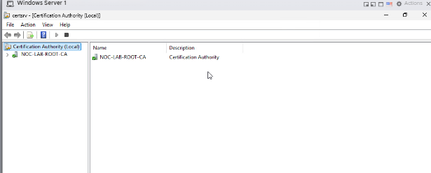

The Certification Authority console shows the enterprise CA:

```text
NOC-LAB-ROOT-CA
```

### Why the CA is required

EAP-TLS depends on PKI.

The CA provides trust by issuing certificates to approved computers. NPS can then validate that a presented client certificate chains back to a trusted CA.

The simplified trust model is:

```text
NOC-LAB-ROOT-CA
        ↓
Client computer certificate
        ↓
Presented during EAP-TLS
        ↓
NPS validates certificate
```

---

# Part 2 — Configure the 802.1X Computer Certificate Template

## 5. Certificate Template Security Permissions

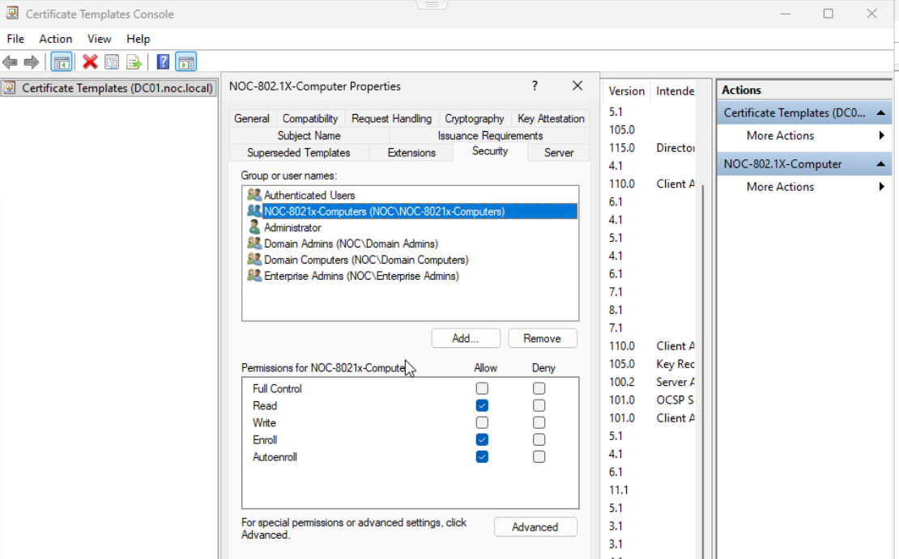

The certificate template shown is:

```text
NOC-802.1X-Computer
```

The selected AD group is:

```text
NOC-8021x-Computers
```

The screenshot shows the group allowed to:

```text
Read
Enroll
Autoenroll
```

### Why this is important

Certificate enrollment should not be open to every device without control.

By assigning enrollment permissions to the dedicated computer group, the environment can restrict which domain computers are allowed to obtain the certificate used for 802.1X authentication.

The authorization logic becomes:

```text
Computer account
      ↓
Member of NOC-8021x-Computers
      ↓
Template permissions allow Enroll / Autoenroll
      ↓
Computer receives certificate
      ↓
Eligible for EAP-TLS authentication
```

### Security lesson

This makes certificate issuance itself part of the access-control design.

A device that is known to the domain but is not enrolled with the required certificate should not automatically gain wireless access.

---

# Part 3 — Publish and Verify the Certificate Template

## 6. Certificate Template Issued on the CA

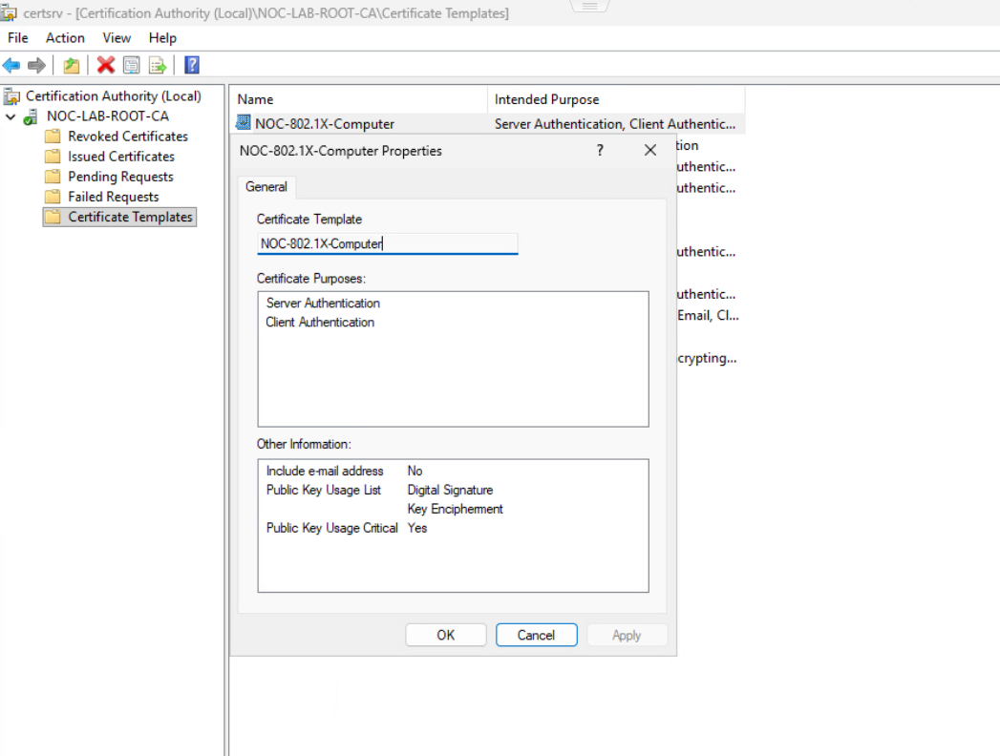

The CA console shows the `NOC-802.1X-Computer` template available on the Certification Authority.

The screenshot also shows certificate-template details including intended purposes / Enhanced Key Usage information.

### Why template publication matters

Creating or modifying a certificate template does not help clients until the CA is configured to issue certificates based on that template.

The flow is:

```text
Create / configure template
        ↓
Set security permissions
        ↓
Publish template on CA
        ↓
Client becomes eligible to enroll
```

---

# Part 4 — Configure Certificate Auto-Enrollment Through Group Policy

## 7. Enable Certificate Auto-Enrollment

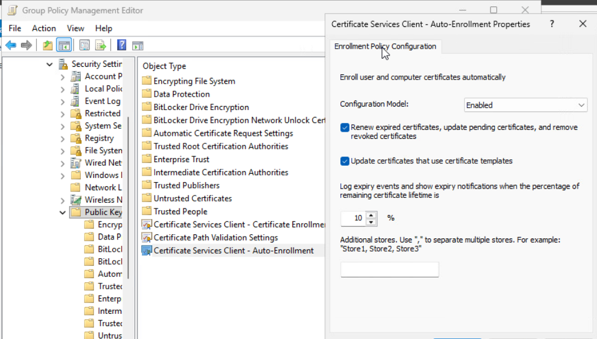

The Group Policy setting:

```text
Certificate Services Client - Auto-Enrollment
```

is shown as:

```text
Configuration Model: Enabled
```

The screenshot also shows options to:

- Renew expired certificates.
- Update pending certificates.
- Remove revoked certificates.
- Update certificates that use certificate templates.

### Why auto-enrollment is useful

Without auto-enrollment, an administrator may need to manually request certificates on every computer.

With Group Policy auto-enrollment:

```text
Computer receives GPO
        ↓
Windows detects eligible template
        ↓
Computer requests certificate
        ↓
Enterprise CA issues certificate
        ↓
Certificate becomes available for 802.1X
```

This is much more scalable for enterprise deployment.

---

# Part 5 — Configure NPS for EAP-TLS

## 8. Select EAP-TLS as the Authentication Method

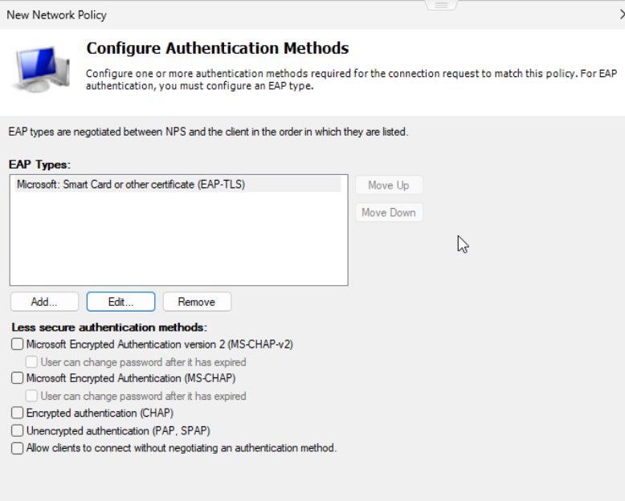

The NPS Network Policy wizard shows:

```text
Microsoft: Smart Card or other certificate (EAP-TLS)
```

as the configured EAP method.

The less-secure authentication methods shown below are not selected in this policy.

### Why this matters

The policy is specifically designed for certificate authentication.

This is different from password-based methods such as MS-CHAPv2.

The client must complete an EAP-TLS exchange using a valid certificate.

---

## 9. Complete the EAP-TLS Wireless Network Policy

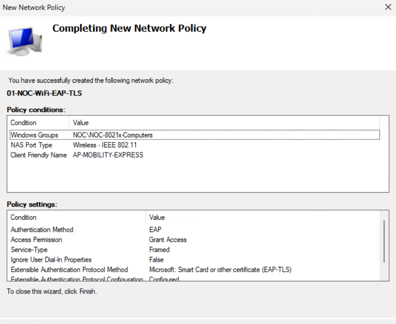

The completed NPS Network Policy is named:

```text
01-NOC-WiFi-EAP-TLS
```

Visible policy conditions include:

```text
Windows Groups : NOC\NOC-8021x-Computers
NAS Port Type  : Wireless - IEEE 802.11
Client Friendly Name : AP-MOBILITY-EXPRESS
```

Visible policy settings include:

```text
Authentication Method : EAP
Access Permission      : Grant Access
Service-Type           : Framed
EAP Method             : Microsoft: Smart Card or other certificate (EAP-TLS)
```

### What this policy does

NPS does not simply accept any certificate from any request.

The request must also match the configured policy conditions.

This combines:

```text
Valid certificate
+
Approved computer group
+
Wireless 802.11 request
+
Expected RADIUS client / AP
```

before access is granted.

---

# Part 6 — Deploy the Enterprise Wireless Profile Through Group Policy

## 10. Group Policy Wireless Profile for `NOC-STAFF`

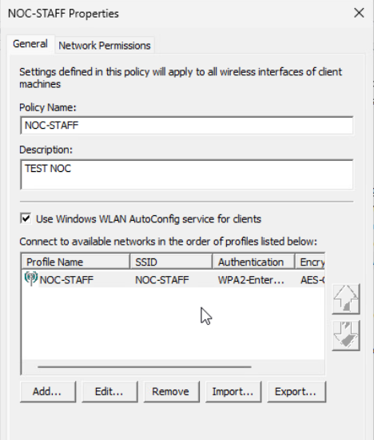

A Windows wireless network policy was created for the enterprise SSID:

```text
NOC-STAFF
```

The profile is deployed through Group Policy.

### Why centrally deploy the WLAN profile?

Manual configuration on every endpoint creates inconsistency.

A domain Wireless Network Policy can standardize:

- SSID.
- WPA2-Enterprise usage.
- 802.1X behavior.
- Authentication method.
- Certificate validation behavior.

This ensures domain clients use the intended enterprise configuration.

---

# Part 7 — Verify Group Policy on the Client

## 11. `gpresult` Verification

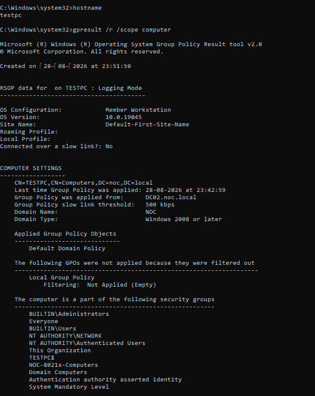

The client ran:

```cmd
hostname
gpresult /r /scope computer
```

The screenshot identifies the client as:

```text
TESTPC
```

and shows Group Policy was applied from:

```text
DC02.noc.local
```

The computer is also shown as a member of:

```text
NOC-8021x-Computers
```

### What this proves

This is an important screenshot because it verifies two prerequisites:

1. The computer is in the AD security group allowed to auto-enroll.
2. Computer Group Policy processing is working.

The client is therefore eligible to receive both certificate and wireless-policy settings.

---

# Part 8 — Verify the Client Uses EAP-TLS

## 12. Windows Wireless Properties

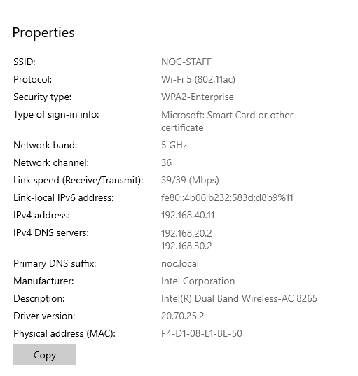

The Windows wireless properties show:

```text
SSID              : NOC-STAFF
Protocol          : Wi-Fi 5 (802.11ac)
Security type     : WPA2-Enterprise
Type of sign-in   : Microsoft: Smart Card or other certificate
Network band      : 5 GHz
Channel           : 36
IPv4 address      : 192.168.40.11
IPv4 DNS servers  : 192.168.20.2
                    192.168.30.2
Primary DNS suffix: noc.local
```

### Why this screenshot is strong evidence

It directly shows the Windows endpoint using:

```text
Microsoft: Smart Card or other certificate
```

rather than a password-based enterprise authentication method.

It also shows that authentication succeeded far enough for the client to receive normal network connectivity.

---

## 13. Verify the WLAN Interface with `netsh`

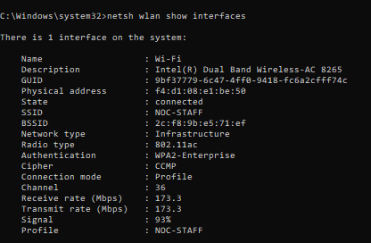

The client ran:

```cmd
netsh wlan show interfaces
```

The output shows the wireless interface connected to:

```text
SSID : NOC-STAFF
State: connected
```

Other visible information includes:

- Radio type.
- Authentication.
- Cipher.
- Channel.
- Receive/transmit rates.
- Signal level.
- Profile name.

### Why CLI verification is useful

The graphical interface gives an easy overview, while `netsh` provides command-line evidence useful for troubleshooting and documentation.

---

# Part 9 — Verify VLAN 40 Addressing After EAP-TLS Authentication

## 14. Client `ipconfig` Verification

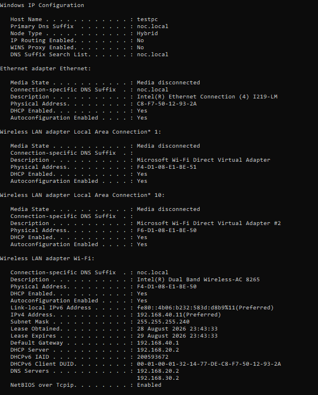

The client IP configuration was checked after the wireless EAP-TLS connection succeeded.

The screenshots show the WLAN client operating in the VLAN 40 client network and using the infrastructure built in Labs 01 and 02.

The visible configuration includes the expected VLAN 40 path, gateway, and DNS settings.

### End-to-end dependency

The successful session proves several systems are working together:

```text
Certificate enrollment
        ↓
Wireless GPO
        ↓
EAP-TLS authentication
        ↓
NPS / RADIUS authorization
        ↓
AP admits client
        ↓
VLAN 40 access
        ↓
DHCP lease
        ↓
DNS configuration
```

---

# Part 10 — Verify Gateway and Redundant DNS

## 15. Ping and `nslookup` Tests

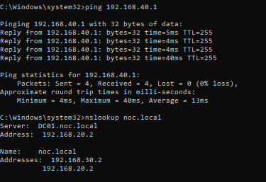

The client tested:

```cmd
ping 192.168.40.1
nslookup noc.local
```

The ping to the VLAN 40 gateway succeeded with no packet loss in the displayed test.

The DNS lookup shows the redundant AD DNS infrastructure:

```text
DC01.noc.local → 192.168.20.2
DC02.noc.local → 192.168.30.2
```

### What this proves

Authentication success alone is not enough.

The endpoint must also have usable Layer-3 and infrastructure services after joining the WLAN.

This screenshot proves:

- VLAN 40 gateway reachability.
- Domain DNS resolution.
- Visibility of both domain-controller DNS servers.

---

# Part 11 — Negative Security Test

## 16. Unenrolled Device Is Denied

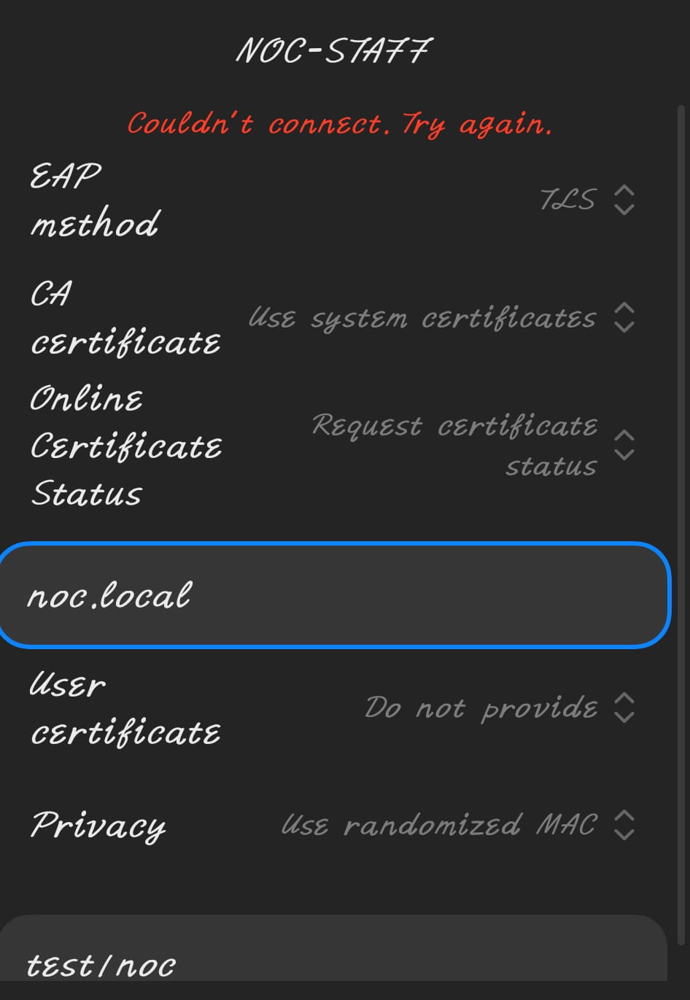

The final screenshot shows a device attempting to connect to:

```text
NOC-STAFF
```

using:

```text
EAP method        : TLS
CA certificate    : Use system certificates
Online certificate: Request certificate
User certificate  : Do not provide
Domain            : noc.local
```

The connection result is:

```text
Couldn't connect. Try again.
```

### Why this is one of the most important screenshots

The device knows the correct domain name and is configured for TLS, but it does not provide the required valid client certificate.

The connection is denied.

This demonstrates the key security property of EAP-TLS:

```text
Knowing the SSID      ≠ enough
Knowing the domain    ≠ enough
Knowing a password    ≠ enough

Valid trusted certificate + private key
        ↓
Required for authentication
```

### Security result

**Unenrolled / no-certificate device: DENIED**

This negative test proves the environment is not simply allowing any device that knows `noc.local`.

---

# 4. EAP-TLS Authentication Flow

The practical authentication sequence is:

```text
1. Domain computer starts / receives Group Policy
                ↓
2. Computer is a member of NOC-8021x-Computers
                ↓
3. Certificate auto-enrollment policy applies
                ↓
4. Computer obtains certificate from NOC-LAB-ROOT-CA
                ↓
5. Wireless GPO configures NOC-STAFF
                ↓
6. Client connects to AP
                ↓
7. AP starts 802.1X authentication
                ↓
8. AP forwards RADIUS request to NPS
                ↓
9. NPS evaluates 01-NOC-WiFi-EAP-TLS
                ↓
10. EAP-TLS validates the client certificate
                ↓
11. NPS verifies policy/group conditions
                ↓
12. Access is granted
                ↓
13. Client joins VLAN 40
                ↓
14. DHCP provides IP/gateway/DNS
```

---

# 5. Certificate Trust Model

The certificate authentication design can be simplified as:

```text
NOC-LAB-ROOT-CA
        │
        ├── Trusted by infrastructure
        │
        └── Issues computer certificate
                  ↓
          Approved domain computer
                  ↓
          Certificate + private key
                  ↓
            EAP-TLS authentication
                  ↓
                 NPS
```

The certificate is not just a text identity. The private key associated with the certificate is also part of proving possession.

---

# 6. Difference Between Lab 02 and Lab 03

| Area | Lab 02 | Lab 03 |
|---|---|---|
| Wireless security | WPA2-Enterprise | WPA2-Enterprise |
| AAA server | NPS / RADIUS | NPS / RADIUS |
| Identity source | Active Directory | AD + PKI policy |
| EAP approach | PEAP | EAP-TLS |
| User password required | Yes in PEAP flow | Not shown as the authentication proof here |
| Client certificate required | No for PEAP user authentication | Yes |
| Certificate auto-enrollment | Not the primary client-auth mechanism | Required |
| Device authorization group | Wireless policy groups | `NOC-8021x-Computers` |
| Negative proof | Access-Reject / Event 6273 | Unenrolled device cannot connect |

### Main progression

Lab 02 proves centralized enterprise authentication.

Lab 03 strengthens that design by requiring trusted machine certificates.

---

# 7. Troubleshooting Method Learned

A useful EAP-TLS troubleshooting order is:

## 1. Verify CA health

Check that the Enterprise CA is available.

## 2. Verify template publication

Confirm `NOC-802.1X-Computer` is issued by the CA.

## 3. Verify template permissions

Check that the intended group has:

```text
Read
Enroll
Autoenroll
```

## 4. Verify computer group membership

Use Active Directory and:

```cmd
gpresult /r /scope computer
```

to verify the computer is a member of `NOC-8021x-Computers`.

## 5. Verify auto-enrollment GPO

Confirm the computer receives certificate auto-enrollment policy.

## 6. Verify wireless GPO

Confirm the `NOC-STAFF` wireless profile is applied.

## 7. Verify NPS policy

Check:

```text
Windows Group
NAS Port Type
Client Friendly Name
EAP method
Access permission
```

## 8. Verify the client authentication method

Windows should show:

```text
Microsoft: Smart Card or other certificate
```

## 9. Verify wireless state

```cmd
netsh wlan show interfaces
```

## 10. Verify post-authentication network access

Check:

```cmd
ipconfig /all
ping 192.168.40.1
nslookup noc.local
```

## 11. Perform negative testing

Try an unenrolled device without a valid client certificate.

Expected:

```text
Connection denied
```

---

# 8. Useful Commands

## Group Policy

```cmd
gpupdate /force
gpresult /r /scope computer
```

## Wireless

```cmd
netsh wlan show interfaces
netsh wlan show profiles
```

## Client Network Verification

```cmd
ipconfig /all
ping 192.168.40.1
nslookup noc.local
```

---

# 9. Verification Matrix

| Test | Evidence | Result |
|---|---|---|
| Enterprise CA available | CA console | PASS |
| 802.1X computer template exists | Certificate Templates console | PASS |
| Approved group has Enroll permission | Template Security tab | PASS |
| Approved group has Autoenroll permission | Template Security tab | PASS |
| Template issued by CA | CA/template screenshot | PASS |
| Auto-enrollment GPO enabled | Group Policy Editor | PASS |
| NPS EAP-TLS method selected | NPS wizard | PASS |
| EAP-TLS Network Policy created | `01-NOC-WiFi-EAP-TLS` | PASS |
| Computer group restricted | `NOC-8021x-Computers` | PASS |
| Wireless request restricted | IEEE 802.11 condition | PASS |
| AP/RADIUS client restricted | `AP-MOBILITY-EXPRESS` | PASS |
| WLAN profile deployed | NOC-STAFF GPO | PASS |
| Client receives computer policy | `gpresult` | PASS |
| Client belongs to 802.1X group | `gpresult` | PASS |
| Client uses certificate sign-in | Windows WLAN properties | PASS |
| Client connected to NOC-STAFF | `netsh wlan show interfaces` | PASS |
| VLAN 40 IP received | `ipconfig` | PASS |
| VLAN 40 gateway reachable | Ping successful | PASS |
| Domain DNS resolves | `nslookup noc.local` | PASS |
| Both DNS servers visible | `.20.2` and `.30.2` | PASS |
| Unenrolled device rejected | Final negative test | PASS |

---

# 10. Evidence Map

| Screenshot | Purpose |
|---|---|
| 001 | Enterprise Certification Authority |
| 002 | Certificate-template enrollment permissions |
| 003 | Template published / certificate-purpose evidence |
| 004 | Certificate auto-enrollment GPO |
| 005 | NPS EAP-TLS method selection |
| 006 | Completed EAP-TLS NPS policy |
| 007 | NOC-STAFF wireless Group Policy |
| 008 | Client computer GPO and group verification |
| 009 | Windows EAP-TLS / certificate sign-in proof |
| 010 | `netsh` wireless connection verification |
| 011 | VLAN 40 IP/DHCP verification |
| 012 | Gateway + redundant DNS validation |
| 013 | Unenrolled/no-certificate device denied |

---

# 11. Key Learning Outcomes

### 1. EAP-TLS authenticates using certificates

The client proves its identity using a trusted certificate and associated private key rather than only a password.

---

### 2. Certificate issuance is part of access control

The `NOC-8021x-Computers` group has controlled Enroll/Autoenroll permissions.

Only eligible computers should receive the certificate required for the Wi-Fi policy.

---

### 3. Group Policy makes certificate deployment scalable

Auto-enrollment removes the need to manually install a client certificate on every approved domain computer.

---

### 4. Wireless configuration can also be centrally managed

The `NOC-STAFF` WLAN profile is delivered through Group Policy, reducing manual endpoint configuration.

---

### 5. NPS combines certificate validation with policy conditions

A valid certificate alone is not the complete policy.

The request is also checked against conditions such as:

- Windows group.
- Wireless NAS port type.
- Expected RADIUS client.

---

### 6. Successful authentication must be followed by network verification

The client was not considered fully successful until it had:

- Connected to the SSID.
- Received a VLAN 40 address.
- Reached the gateway.
- Resolved the domain through DNS.

---

### 7. Negative testing proves the security boundary

The unenrolled device knew the domain and used TLS settings but could not connect because it did not provide the required valid certificate.

This proves the design is enforcing certificate possession.

---

### 8. Lab 03 completes the security progression

The three project stages now form a clear progression:

```text
Lab 01
Infrastructure redundancy
AD + DNS + DHCP failover
        ↓
Lab 02
Centralized AAA
NPS + RADIUS + SSH + PEAP Wi-Fi
        ↓
Lab 03
Certificate-based endpoint authentication
EAP-TLS + PKI + Auto-enrollment
```

---

# Conclusion

This lab successfully implemented and validated **certificate-based EAP-TLS authentication** for the `NOC-STAFF` enterprise wireless network.

The environment uses:

- `NOC-LAB-ROOT-CA` as the enterprise Certificate Authority.
- `NOC-802.1X-Computer` as the computer certificate template.
- `NOC-8021x-Computers` as the approved certificate-enrollment group.
- Group Policy for certificate auto-enrollment.
- Group Policy for the `NOC-STAFF` WLAN profile.
- NPS Network Policy `01-NOC-WiFi-EAP-TLS`.
- `Microsoft: Smart Card or other certificate (EAP-TLS)` as the authentication method.
- VLAN 40 for authenticated wireless client connectivity.
- Redundant AD DNS servers at `192.168.20.2` and `192.168.30.2`.

The strongest evidence is the combination of positive and negative testing:

```text
Approved domain computer
+ correct GPO
+ valid enrolled certificate
        ↓
Connects successfully

Unenrolled device
+ knows noc.local
+ attempts TLS
+ no valid client certificate
        ↓
Denied
```

This demonstrates practical understanding of:

**PKI, Enterprise CA, certificate templates, enrollment permissions, auto-enrollment, Group Policy, NPS, RADIUS, EAP-TLS, WPA2-Enterprise, computer authentication, certificate trust, VLAN access, DHCP/DNS integration, and security validation through negative testing.**
