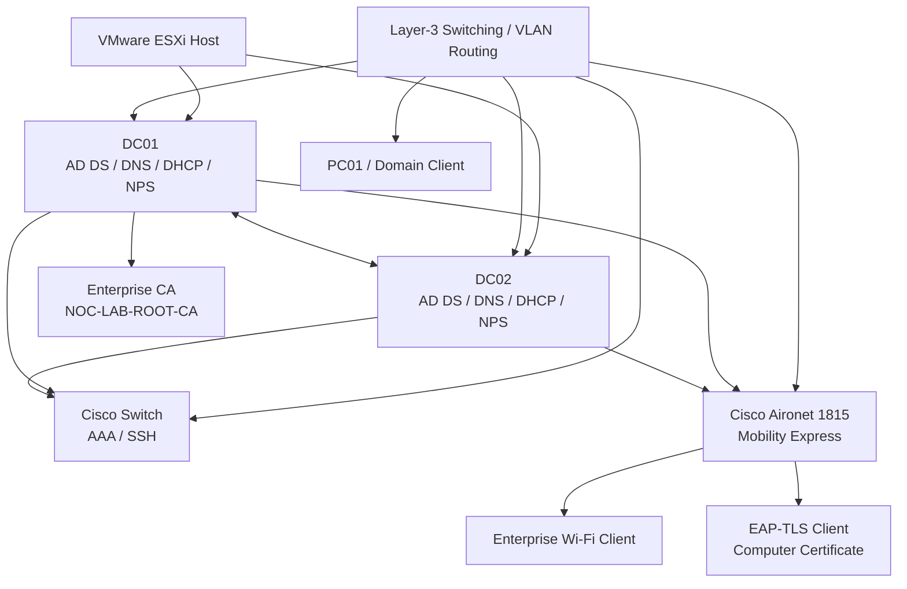

# AD Infrastructure Failover & AAA Lab

## Overview

This project combines three connected enterprise infrastructure labs into one end-to-end environment:

1. **DNS, DHCP Failover and Active Directory Redundancy**
2. **NPS, Certificate Services, AAA, SSH and Wi-Fi 802.1X**
3. **EAP-TLS Certificate Authentication**

The objective was to move beyond a single-server Windows lab and build a more realistic enterprise design with **redundancy, centralized authentication, RADIUS, certificate services, enterprise Wi-Fi, failover testing, and certificate-based endpoint authentication**.

The project starts with a resilient Active Directory foundation using two domain controllers, redundant DNS, and DHCP Hot Standby. On top of that, it adds NPS/RADIUS for centralized network-device and wireless authentication. Finally, it strengthens the wireless security model by introducing PKI and EAP-TLS computer-certificate authentication.

This repository is organized so that each major stage has its own folder, screenshots, and detailed README.

---

# Repository Structure

```text
AD_Infrastructure_Failover_and_AAA_Lab/
│
├── 01_DNS_DHCP_Failover_and_Redundancy/
│   ├── README.md
│   └── Screenshots/
│
├── 02_NPS_Certificate_Services_AAA_SSH_and_WiFi_8021X/
│   ├── README.md
│   └── Screenshots/
│
├── 03_EAP-TLS_Certificate_Authentication/
│   ├── README.md
│   └── Screenshots/
│
└── README.md
```

---

# Project Architecture



---

# Overall Technology Stack

| Layer | Technology |
|---|---|
| Virtualization | VMware ESXi |
| Server OS | Windows Server 2025 |
| Directory Services | Active Directory Domain Services |
| DNS | Redundant AD-integrated DNS |
| DHCP | Windows DHCP Hot Standby |
| AAA | Network Policy Server / RADIUS |
| Certificate Services | Active Directory Certificate Services |
| Network Device Authentication | Cisco AAA / SSH / RADIUS |
| Wireless Authentication | WPA2-Enterprise / 802.1X |
| EAP Method | PEAP and EAP-TLS |
| Wireless Platform | Cisco Aironet 1815 Mobility Express |
| Client VLAN | VLAN 40 |
| Domain | `noc.local` |

---

# Lab 01 — DNS, DHCP Failover and Redundancy

## Purpose

The first lab creates the redundant Windows infrastructure foundation.

The design uses two domain controllers:

```text
DC01 = 192.168.20.2
DC02 = 192.168.30.2
```

and a client network in:

```text
VLAN 40 = 192.168.40.0/28
Gateway = 192.168.40.1
```

The core objectives were to:

- Deploy DC01 and DC02 on VMware ESXi.
- Add DC02 to the existing `noc.local` domain.
- Provide redundant Active Directory and DNS.
- Configure DHCP scope options.
- Configure DHCP Hot Standby failover.
- Verify client DHCP and DNS behavior.
- Troubleshoot a DNS-related AD replication failure.
- Test a real DC01 outage.

---

## Redundant Active Directory

DC02 was added as an additional domain controller in the existing `noc.local` domain.

This created a two-DC environment where directory data and DNS could be replicated between the servers.

The intended design is:

```text
                noc.local
                   │
          ┌────────┴────────┐
          │                 │
        DC01              DC02
   192.168.20.2       192.168.30.2
      AD DS              AD DS
       DNS                DNS
      DHCP               DHCP
```

### Why this matters

A single domain controller creates a single point of failure.

Adding DC02 provides redundancy for:

- Authentication.
- Directory lookups.
- DNS.
- Group Policy-related services.
- DHCP failover support.

---

## DHCP Hot Standby

The DHCP scope for VLAN 40 was configured with:

```text
Scope            : 192.168.40.0/28
Gateway          : 192.168.40.1
Primary DNS      : 192.168.20.2
Secondary DNS    : 192.168.30.2
Failover Mode    : Hot Standby
Standby Reserve  : 20%
MCLT             : 1 hour
Switchover       : 60 minutes
```

The failover relationship was configured as:

```text
SRV1-SRV2-FAILOVER
```

### Why Hot Standby was used

Hot Standby provides service continuity if one DHCP server becomes unavailable.

One server operates as the primary provider while the second remains ready to continue lease service.

---

## Replication Troubleshooting

One of the most important learning points in Lab 01 was a real Active Directory replication issue.

The failure showed:

```text
8524 — The DSA operation is unable to proceed because of a DNS lookup failure.
```

The environment was then checked for:

- DNS records.
- Reverse lookup zones.
- Name resolution.
- Replication status.
- SYSVOL.
- Group Policy processing.

After correcting the DNS / reverse-zone issue, `repadmin /replsummary` returned healthy results with zero failures.

### Key lesson

Active Directory depends heavily on DNS.

A server can be reachable by IP while AD replication still fails because domain-controller location and service discovery rely on DNS.

---

## Final DC01 Outage Test

The strongest redundancy test in Lab 01 was a real DC01 shutdown.

The test sequence was:

```text
DC01 powered off
        ↓
Client confirms DC01 unreachable
        ↓
DNS cache cleared
        ↓
Client queries DC02
        ↓
noc.local resolves successfully
```

This proved that the redundant DNS design continued working when DC01 was offline.

### Lab 01 Result

**PASS — AD/DNS/DHCP redundancy foundation successfully built and tested.**

---

# Lab 02 — NPS, Certificate Services, AAA, SSH and Wi-Fi 802.1X

## Purpose

The second lab adds centralized AAA and enterprise network authentication on top of the redundant AD infrastructure.

Two major use cases were implemented:

1. **Cisco switch administrative SSH authentication through RADIUS**
2. **WPA2-Enterprise Wi-Fi authentication through NPS**

The lab uses:

- Active Directory users and groups.
- NPS on DC01 and DC02.
- Cisco AAA.
- RADIUS.
- Cisco Aironet Mobility Express.
- AD CS certificates.
- PEAP-based enterprise Wi-Fi.

---

## Centralized Network Device AAA

An Active Directory group was used to control administrative access:

```text
NOC_Network_Admins
```

The switch was configured as a RADIUS client on both NPS servers.

The NPS switch-administration policy included:

```text
Windows Group: NOC_Network_Admins
Cisco-AV-Pair: shell:priv-lvl=15
```

### What this demonstrates

The switch no longer needs to depend only on isolated local administrator accounts.

The authentication and authorization flow becomes:

```text
SSH user
   ↓
Cisco switch
   ↓ RADIUS
NPS
   ↓
Active Directory
   ↓
Group check
   ↓
Cisco AVPair
   ↓
Privilege level 15
```

This is centralized AAA.

---

## SSH Authentication Failover

The IAS service on DC01 was intentionally stopped.

The switch then failed over to DC02 and successfully received a RADIUS Access-Accept.

Windows Event Viewer on DC02 recorded:

```text
Event ID 6272
Network Policy Server granted access to a user
```

### Why this is important

This proves the RADIUS design itself is redundant.

The failover test showed:

```text
DC01 NPS unavailable
        ↓
Switch tries DC02
        ↓
DC02 authenticates user
        ↓
SSH login still succeeds
```

### SSH Failover Result

**PASS**

---

## Wireless 802.1X with PEAP

The Aironet 1815 Mobility Express access point was integrated with NPS.

The AP was configured with both RADIUS servers.

The `NOC-STAFF` SSID used WPA2-Enterprise / 802.1X.

The wireless NPS policy used PEAP for secure authentication.

The client connection flow was:

```text
Windows Client
      ↓
NOC-STAFF
      ↓
Mobility Express
      ↓ RADIUS
NPS
      ↓
Active Directory
      ↓
Access-Accept
      ↓
Client joins WLAN
```

The client also received a certificate trust prompt for the NPS server certificate, demonstrating that PEAP relies on server-side TLS trust.

---

## Wireless RADIUS Failover

The IAS service on DC01 was stopped again, this time during wireless authentication.

The AP then used DC02.

DC02 recorded Event ID 6272, and the client remained able to join the enterprise WLAN.

### Wireless Failover Result

**PASS**

---

## Negative Testing

The lab also included negative tests:

```text
Wrong SSH credentials
        → RADIUS Access-Reject

Unauthorized / failed wireless authentication
        → Event ID 6273
```

### Why negative testing matters

A secure AAA design must prove both:

- Valid identities are accepted.
- Invalid identities are rejected.

---

## Final Wireless Client State

The enterprise Wi-Fi client received:

```text
IPv4 Address    : 192.168.40.11
Subnet Mask     : 255.255.255.240
Default Gateway : 192.168.40.1
DNS Servers     : 192.168.20.2
                  192.168.30.2
```

This connects Lab 02 directly to Lab 01 because the wireless client depends on the redundant DHCP/DNS infrastructure built earlier.

### Lab 02 Result

**PASS — centralized AAA, SSH, RADIUS, PEAP Wi-Fi, and RADIUS failover successfully validated.**

---

# Lab 03 — EAP-TLS Certificate Authentication

## Purpose

The third lab strengthens enterprise wireless security by moving from password-based PEAP authentication to certificate-based **EAP-TLS**.

The goal was to require approved domain computers to possess a valid certificate issued by the internal Enterprise CA before they could connect to the enterprise WLAN.

---

## Enterprise PKI

The lab uses:

```text
Enterprise CA:
NOC-LAB-ROOT-CA
```

A dedicated certificate template was configured:

```text
NOC-802.1X-Computer
```

Enrollment permissions were assigned to:

```text
NOC-8021x-Computers
```

The group was allowed:

```text
Read
Enroll
Autoenroll
```

### Security model

```text
Approved domain computer
        ↓
Member of NOC-8021x-Computers
        ↓
Auto-enrollment allowed
        ↓
Computer receives certificate
        ↓
Eligible for EAP-TLS
```

---

## Certificate Auto-Enrollment

Group Policy was configured to automatically enroll approved computers for certificates.

This avoids manually installing certificates on every endpoint.

The process becomes:

```text
Computer receives GPO
        ↓
Windows detects eligible template
        ↓
Computer requests certificate
        ↓
Enterprise CA issues certificate
        ↓
Certificate becomes available for EAP-TLS
```

This is scalable enterprise certificate deployment.

---

## NPS EAP-TLS Policy

The NPS wireless policy was created as:

```text
01-NOC-WiFi-EAP-TLS
```

The authentication method was:

```text
Microsoft: Smart Card or other certificate (EAP-TLS)
```

Policy conditions included:

```text
Windows Group         : NOC\NOC-8021x-Computers
NAS Port Type         : Wireless - IEEE 802.11
Client Friendly Name  : AP-MOBILITY-EXPRESS
```

### What this means

The request must satisfy more than simply presenting a certificate.

The NPS decision also considers:

- Computer group membership.
- Wireless request type.
- Expected AP / RADIUS client.
- Certificate validity.

---

## Wireless GPO Deployment

The `NOC-STAFF` wireless profile was deployed through Group Policy.

The client then verified:

```text
gpresult /r /scope computer
```

and showed:

- Computer policy applied.
- Membership in `NOC-8021x-Computers`.
- Policy processed from the domain.

The client wireless properties showed:

```text
Security type   : WPA2-Enterprise
Type of sign-in : Microsoft: Smart Card or other certificate
```

This is direct proof that EAP-TLS was being used.

---

## Post-Authentication Network Verification

After successful EAP-TLS authentication, the client received VLAN 40 connectivity.

The client verified:

```text
Gateway : 192.168.40.1
DNS     : 192.168.20.2
          192.168.30.2
Domain  : noc.local
```

The client successfully:

- Connected to `NOC-STAFF`.
- Reached the VLAN 40 gateway.
- Resolved `noc.local`.
- Used the redundant DNS servers.

---

## Negative EAP-TLS Test

An unenrolled device attempted to connect using TLS settings but without a valid client certificate.

The connection failed.

### Why this is important

The negative test proves:

```text
Knowing the SSID   ≠ enough
Knowing noc.local  ≠ enough
Using TLS setting  ≠ enough

Valid trusted client certificate + private key
        ↓
Required
```

This demonstrates real certificate-based access control.

### Lab 03 Result

**PASS — EAP-TLS certificate-based wireless authentication successfully enforced.**

---

# Complete Project Flow

The three labs form one connected enterprise progression:

```text
LAB 01
Infrastructure Resiliency
AD + DNS + DHCP Failover
        ↓
LAB 02
Centralized AAA
NPS + RADIUS + SSH + PEAP Wi-Fi
        ↓
LAB 03
Certificate-Based Authentication
PKI + Auto-Enrollment + EAP-TLS
```

---

# End-to-End Authentication and Infrastructure Dependency

A successful enterprise wireless EAP-TLS connection ultimately depends on every layer below it:

```text
Physical / Virtual Infrastructure
        ↓
ESXi
        ↓
VLAN / Routing
        ↓
Active Directory
        ↓
DNS
        ↓
DHCP
        ↓
NPS / RADIUS
        ↓
Certificate Services
        ↓
Group Policy
        ↓
Wireless AP
        ↓
EAP-TLS Client
```

This project demonstrated that enterprise authentication is not a standalone feature.

It depends on a chain of infrastructure services working together correctly.

---

# High Availability Demonstrated

Redundancy was tested in multiple areas.

## DNS

```text
DC01 offline
      ↓
Client uses DC02
      ↓
DNS continues
```

## DHCP

```text
Primary DHCP unavailable
      ↓
Hot Standby relationship
      ↓
Secondary remains available
```

## SSH RADIUS

```text
DC01 IAS stopped
      ↓
Switch uses DC02
      ↓
SSH Access-Accept
```

## Wi-Fi RADIUS

```text
DC01 IAS stopped
      ↓
AP uses DC02
      ↓
Wireless authentication succeeds
```

This demonstrates a consistent design principle:

**Critical services were not only duplicated — failover was actually tested.**

---

# Security Controls Demonstrated

| Security Control | Evidence |
|---|---|
| AD group-based admin access | `NOC_Network_Admins` |
| Centralized RADIUS | NPS on DC01/DC02 |
| Device privilege authorization | `shell:priv-lvl=15` |
| Wrong credential rejection | RADIUS Access-Reject |
| Wireless access rejection | Event ID 6273 |
| PKI trust | `NOC-LAB-ROOT-CA` |
| Certificate enrollment control | `NOC-8021x-Computers` |
| Certificate auto-enrollment | Group Policy |
| EAP-TLS | Smart Card or other certificate |
| Unauthorized device rejection | Unenrolled device denied |

---

# Troubleshooting Lessons Across the Project

## 1. DNS problems can break Active Directory

The replication failure in Lab 01 showed that AD health depends on DNS accuracy.

---

## 2. Redundant services require matching configuration

Two NPS servers are only useful if:

- Both know the RADIUS clients.
- Both have matching policies.
- Network devices know both RADIUS servers.

---

## 3. Always test from the endpoint

Server configuration alone does not prove service usability.

The labs repeatedly used client-side tests such as:

```text
ipconfig
ping
nslookup
gpresult
netsh wlan
SSH login
```

---

## 4. Event logs are critical for AAA troubleshooting

NPS Event IDs:

```text
6272 = Access granted
6273 = Access denied
```

provide direct server-side authentication evidence.

---

## 5. Certificate trust is part of wireless security

PEAP relies on NPS server-certificate trust.

EAP-TLS goes further by requiring a client certificate.

---

## 6. Negative tests are necessary

A security lab is not complete if it only proves valid access.

This project also proved:

- Wrong SSH credentials are rejected.
- Unauthorized wireless authentication is denied.
- An unenrolled device without a valid certificate cannot connect.

---

# Useful Commands Used Across the Project

## Active Directory / Replication

```powershell
nltest /dsgetdc:noc.local /force
repadmin /replsummary
```

## DNS

```powershell
ipconfig /flushdns
Resolve-DnsName noc.local
nslookup noc.local
```

## Group Policy

```cmd
gpupdate /force
gpresult /r
gpresult /r /scope computer
```

## DHCP / Client

```cmd
ipconfig /all
ipconfig /release
ipconfig /renew
```

## NPS

```powershell
Get-Service IAS
Stop-Service IAS
Start-Service IAS
Set-Service IAS -StartupType Automatic
```

## Wireless

```cmd
netsh wlan show interfaces
netsh wlan show profiles
```

## Cisco AAA / SSH

```text
show running-config
show aaa servers
show users
show ip ssh
show crypto key mypubkey rsa
```

---

# Overall Verification Matrix

| Area | Result |
|---|---|
| VMware ESXi environment | PASS |
| DC01 deployment | PASS |
| DC02 promotion | PASS |
| AD replication | PASS after DNS fix |
| Redundant DNS | PASS |
| DHCP Hot Standby | PASS |
| Client VLAN 40 DHCP | PASS |
| SSH AAA through NPS | PASS |
| Cisco privilege 15 authorization | PASS |
| SSH RADIUS failover to DC02 | PASS |
| NPS Event 6272 logging | PASS |
| Wireless PEAP authentication | PASS |
| Wireless Access-Reject testing | PASS |
| Wireless RADIUS failover to DC02 | PASS |
| AD CS certificate infrastructure | PASS |
| Certificate auto-enrollment | PASS |
| EAP-TLS policy | PASS |
| EAP-TLS WLAN connection | PASS |
| Unenrolled device rejection | PASS |

---

# Key Learning Outcomes

### 1. High availability must be tested, not assumed

The project repeatedly created real failure conditions and verified service continuity.

---

### 2. Active Directory is an infrastructure dependency, not only a login service

AD integrates with DNS, Group Policy, RADIUS, certificates, device administration, and enterprise Wi-Fi.

---

### 3. Centralized AAA simplifies access control

AD groups and NPS policies allow administrator access to be controlled centrally instead of managing users independently on every switch or AP.

---

### 4. RADIUS enables common identity across different devices

The same Windows identity platform can authenticate:

- SSH administrators.
- Wireless users.
- Computer certificates.

---

### 5. PKI adds stronger identity assurance

EAP-TLS requires possession of a trusted certificate and private key.

This provides stronger device authentication than relying only on a password.

---

### 6. Group Policy is critical for enterprise-scale automation

Group Policy was used to deploy:

- Certificate auto-enrollment.
- Wireless profile configuration.

This reduces manual endpoint configuration.

---

### 7. Network authentication depends on the full infrastructure stack

Successful EAP-TLS required:

- VLAN connectivity.
- DHCP.
- DNS.
- AD.
- NPS.
- CA.
- GPO.
- AP configuration.

Enterprise networking is therefore a system of dependencies, not isolated technologies.

---

# Final Project Conclusion

The **AD Infrastructure Failover & AAA Lab** successfully demonstrated a complete enterprise-style Windows and network authentication environment.

The project progressed from basic redundancy to centralized AAA and finally to certificate-based authentication.

The final architecture provides:

- Dual Active Directory domain controllers.
- Redundant DNS.
- DHCP Hot Standby failover.
- Centralized NPS/RADIUS.
- Cisco SSH authentication through Active Directory.
- Privilege-level authorization through Cisco AVPair.
- WPA2-Enterprise / 802.1X wireless authentication.
- RADIUS failover between DC01 and DC02.
- Active Directory Certificate Services.
- Automated certificate enrollment.
- EAP-TLS certificate authentication.
- VLAN 40 client integration.
- Positive and negative security testing.

The strongest evidence across the project is that each stage was validated under both **normal operation and failure conditions**.

The project demonstrates practical understanding of:

**Windows Server, Active Directory, DNS, DHCP, failover, VMware ESXi, VLANs, NPS, RADIUS, AAA, SSH, Cisco IOS authorization, AD CS, PKI, Group Policy, WPA2-Enterprise, 802.1X, PEAP, EAP-TLS, Mobility Express, certificate enrollment, authentication logging, and structured enterprise troubleshooting.**
