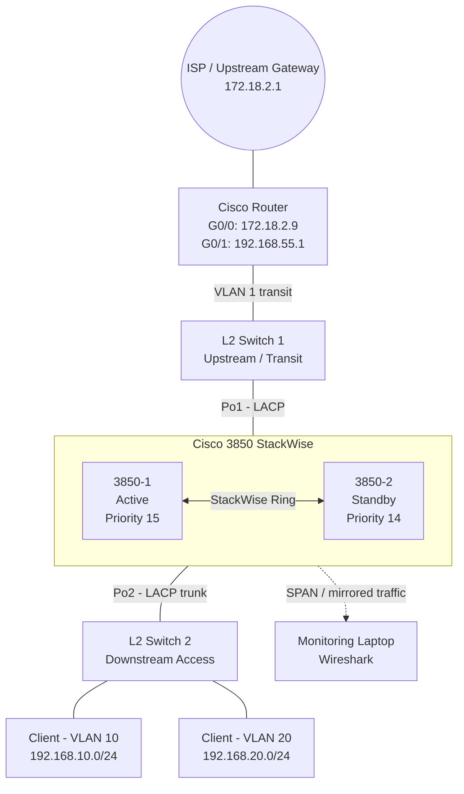

# Cisco Catalyst 3850 StackWise Lab — LACP, Inter-VLAN Routing, Wireshark & Failover Testing

## Overview

This real-device lab demonstrates a two-member **Cisco Catalyst 3850 StackWise** design used as the Layer-3 core/gateway for VLAN 10 and VLAN 20. The stack is connected upstream and downstream through **LACP EtherChannels**, while the edge router provides WAN access and static routes toward the VLAN networks.

The lab also includes practical traffic observation with **Wireshark** and multiple resiliency tests to confirm that traffic continues when individual links, a stack member, a power supply, or one StackWise link fails.

### Main objectives

- Build a two-switch Cisco 3850 StackWise pair.
- Verify Active and Standby stack roles.
- Validate both StackWise ring links.
- Configure/verify LACP EtherChannel uplinks and downlinks.
- Route VLAN 10 and VLAN 20 through the 3850 stack.
- Confirm Internet/DNS access from client systems.
- Observe TLS, download, and streaming traffic in Wireshark.
- Test link, member, PSU, and StackWise-ring failure scenarios.

---

## Equipment

| Device | Purpose |
|---|---|
| 2 × Cisco Catalyst 3850 | StackWise core / Layer-3 gateway |
| Cisco Router | WAN edge, default route, static routes |
| Layer-2 switches | Upstream and downstream access/transit |
| Client PC / Laptop | Connectivity and browser testing |
| Monitoring laptop | Wireshark traffic analysis |
| StackWise cables | Stack data-ring connectivity |
| Ethernet patch cables | Router, switch and client connectivity |

---

## Logical Topology



---

## IP Addressing & Routing

| Network / Role | Address / Route | Purpose |
|---|---|---|
| WAN | `172.18.2.0/24` | Router-to-upstream connectivity |
| Upstream Gateway | `172.18.2.1` | Internet next hop |
| Router G0/0 | `172.18.2.9/24` | WAN interface |
| Transit / Management | `192.168.55.0/24` | Router-to-stack transit |
| Router G0/1 | `192.168.55.1/24` | LAN/transit interface |
| 3850 Stack SVI | `192.168.55.10/24` | Stack transit address |
| VLAN 10 | `192.168.10.0/24` | Client network |
| VLAN 20 | `192.168.20.0/24` | Client network |
| Router static route | `192.168.10.0/24 via 192.168.55.10` | Return route to VLAN 10 |
| Router static route | `192.168.20.0/24 via 192.168.55.10` | Return route to VLAN 20 |
| Router default route | `0.0.0.0/0 via 172.18.2.1` | Internet route |

The router output confirms that both routed VLAN networks are reached through the 3850 stack at `192.168.55.10`.


---

# Part 1 — Building the StackWise Pair

## 1. Physical Stack Cabling

The two Catalyst 3850 switches were connected using StackWise cables to form a redundant ring. Power and console connectivity were also established for initial setup and verification.


### Recommended StackWise ring connection

```text
Switch 1 Stack Port 1  <---->  Switch 2 Stack Port 2
Switch 1 Stack Port 2  <---->  Switch 2 Stack Port 1
```

A complete ring gives two physical paths between stack members and allows the stack to keep operating if one StackWise link is lost.

---

## 2. Verify Stack Ports Before the Ring Forms

Before the second member and both stack links were fully available, the StackWise ports showed a DOWN state.

```text
show switch stack-ports
```


---

## 3. Add the Second 3850 and Verify Stack Ports

After the second switch joined the stack, the console showed the member being added and the StackWise interfaces transitioning to an operational state.

```text
show switch stack-ports
```

Expected healthy result:

```text
Switch#   Port1   Port2
1         OK      OK
2         OK      OK
```


---

## 4. Stack Role Election

The stack performed a role election to decide which member would become Active and which would remain Standby.


The final stack state was:

| Member | Role | Priority | State |
|---|---|---:|---|
| Switch 1 | Active | 15 | Ready |
| Switch 2 | Standby | 14 | Ready |

```text
show switch detail
```


Using different priorities makes the preferred Active member predictable after a reboot or election.

---

## 5. Verify Stack Power

Stack power / PSU status was checked to confirm that the switch members had operational power supplies.

```text
show stack-power
```


---

# Part 2 — LACP EtherChannel Verification

## Baseline Stack and EtherChannel State

The stack was verified with both members in the Ready state and both StackWise ports operational.

Two LACP port-channels were active:

- **Po1** — upstream EtherChannel
- **Po2** — downstream EtherChannel

```text
show switch
show switch stack-ports
show etherchannel summary
```

Observed baseline:

```text
Group  Port-channel  Protocol  Ports
1      Po1(SU)       LACP      Gi1/0/1(P) Gi2/0/1(P)
2      Po2(SU)       LACP      Gi1/0/2(P) Gi2/0/2(P)
```

Where:

- `S` = Layer 2 port-channel
- `U` = in use
- `P` = member bundled in the port-channel


This design provides one physical EtherChannel member from each stack switch. Losing one link or even one stack member therefore does not automatically remove the entire logical port-channel.

---

# Part 3 — Traffic Analysis with Wireshark

The monitoring portion of the lab was used to understand the difference between normal browsing, file downloads, and streaming traffic.

## Scenario 1 — HTTPS Browsing and TLS SNI

### Test websites

The client accessed public HTTPS websites to generate normal browser traffic.


### DNS confirmation

`nslookup` was used to confirm DNS resolution before analyzing the sessions in Wireshark.

```text
nslookup torproject.org
nslookup duckduckgo.com
```


### TLS inspection

Wireshark was then used to inspect TLS handshakes and identify the requested hostname through the Server Name Indication field where visible.


### Learning outcome

Even when application payloads are encrypted by HTTPS, network metadata can still reveal useful operational information such as source/destination IPs, ports, protocol behavior, DNS queries and, depending on protocol/version, TLS hostname information.

---

## Scenario 2 — File Download Traffic

A browser download was used to generate sustained high-volume traffic.


### Capture before download


### Capture during download


### Capture after download


### Conversations statistics

Wireshark **Statistics → Conversations** was used to identify the flows that transferred the largest amount of data.


The same view was also checked using bitrate to identify the most active high-throughput conversation.


### I/O Graph

The I/O graph clearly shows the download as a strong traffic spike compared with the low-volume baseline.


### Learning outcome

A file download generally creates a more obvious sustained throughput pattern than light web browsing, making it easy to recognize through byte counters, conversation statistics, and I/O graphs.

---

## Scenario 3 — Video Streaming Traffic

A YouTube video was played to create a streaming workload.


The I/O graph showed multiple bursts rather than one continuous flat transfer. This behavior is typical of buffered streaming: the client downloads chunks, fills the playback buffer, pauses briefly, and then requests more data.


---

# Part 4 — High Availability / Failover Tests

The most important part of this lab was confirming that the stack and EtherChannels could tolerate common infrastructure failures.

## Test 1 — Po1 Member Failure

### Baseline

Both Po1 and Po2 started in the `SU` state with all LACP members bundled.


### Failure

One physical member of Po1 was disconnected/shut down.

The logical Port-channel remained operational because the second physical LACP member was still forwarding.


A continuous ping recorded only a very small interruption during reconvergence.


**Result:** PASS — Po1 remained available after loss of one member link.

---

## Test 2 — Po2 Member Failure

### Baseline


### Failure

One Po2 member was taken down while a continuous ping was running.


**Result:** PASS — traffic recovered through the remaining Po2 member with only a brief interruption.

---

## Test 3 — Active Stack Member Power-Off

The Active 3850 was powered off while traffic was continuously monitored.

The Standby member assumed the stack control role and forwarding continued.


**Result:** PASS — the stack survived loss of the Active member and the captured test showed continuous reachability.

---

## Test 4 — Power Supply Fault

A PSU failure/removal scenario was tested while connectivity was monitored.


**Result:** PASS — the switch remained operational using the available power source and connectivity stayed available during the test.

---

## Test 5 — StackWise Ring Link Failure

One StackWise ring connection was removed while the stack was operational.

```text
show switch stack-ports
```

The stack continued operating through the remaining StackWise path.


**Result:** PASS — the stack remained functional with a single StackWise link failure.

> A broken ring reduces redundancy. Restore the failed StackWise cable as soon as possible so that the stack returns to a fully redundant ring.

---

# Useful Verification Commands

```text
show switch
show switch detail
show switch stack-ports
show stack-power
show etherchannel summary
show interfaces port-channel 1
show interfaces port-channel 2
show interfaces trunk
show vlan brief
show ip interface brief
show ip route
show mac address-table
show spanning-tree
show cdp neighbors
show logging
```

For continuous reachability testing from a Windows client:

```powershell
ping <destination-ip> -t
```

For DNS verification:

```powershell
nslookup torproject.org
nslookup duckduckgo.com
```

---

# Test Summary

| Test | Expected Behavior | Observed Result |
|---|---|---|
| Stack formation | Two 3850s become one logical stack | PASS |
| Stack role election | One Active, one Standby | PASS |
| StackWise ring | Both ports on both members show OK | PASS |
| Po1 baseline | LACP members bundled | PASS |
| Po2 baseline | LACP members bundled | PASS |
| Po1 one-member failure | Po1 remains operational | PASS |
| Po2 one-member failure | Po2 remains operational | PASS |
| Active stack member power-off | Standby continues stack operation | PASS |
| PSU failure | Device stays powered through remaining supply | PASS |
| One StackWise link failure | Stack continues over remaining path | PASS |
| DNS resolution | Public domains resolve correctly | PASS |
| HTTPS browsing | Client reaches public websites | PASS |
| Wireshark download analysis | Large transfer clearly visible | PASS |
| Streaming analysis | Buffered burst pattern visible | PASS |

---

# Key Learning Outcomes

1. **StackWise provides switch-level resiliency.** Two physical switches operate as one logical stack with Active/Standby control-plane roles.
2. **A complete StackWise ring is important.** Losing one ring link does not necessarily stop the stack, but it removes path redundancy.
3. **LACP protects against individual link failure.** When one member of a port-channel fails, the remaining member can continue forwarding.
4. **Distributing EtherChannel links across stack members improves resiliency.** A complete switch failure does not automatically remove the full uplink/downlink.
5. **Static return routes are required on the edge router.** The router must know how to reach VLAN 10 and VLAN 20 through the stack.
6. **Wireshark is useful for more than packet-by-packet inspection.** Conversation tables and I/O graphs provide clear visibility into throughput patterns and application behavior.
7. **Traffic patterns differ by application.** Browsing is relatively light and bursty, downloads show larger sustained transfers, and video streaming typically shows repeated buffered bursts.
8. **High availability must be tested, not only configured.** Continuous ping during physical failure tests gives practical evidence of convergence and service continuity.

---

# Conclusion

This lab successfully demonstrated a resilient Cisco Catalyst 3850 StackWise deployment with LACP EtherChannels, Layer-3 routing, Internet connectivity, Wireshark monitoring, and real physical failover testing.

The most valuable part of the exercise was validating the design under failure conditions. Individual EtherChannel links, an Active stack member, a power source, and one StackWise ring link could be removed while the remaining infrastructure continued to provide connectivity. The lab therefore combines **switching, routing, link aggregation, high availability, troubleshooting, and packet analysis** in one practical enterprise-style exercise.
