# Endian Firewall Community Lab — Installation, Network Zones, Firewall Rules, Web Filtering & Logs

## Overview

This lab documents the installation and practical configuration of **Endian Firewall Community (EFW) 3.3.2** on physical hardware.

The goal was to build a working firewall environment from the beginning, configure the internal **GREEN** network and external **RED** uplink, verify client connectivity, create firewall rules, configure the HTTP proxy and web-filtering profiles, apply an access policy, and finally verify traffic through the live and firewall logs.

The screenshots in this repository are retained as **proof of practical learning**. They show the complete workflow from physical cabling and installation through policy creation, client testing, web filtering, and traffic monitoring.

---

# Main Learning Objectives

- Install Endian Firewall Community Edition on a physical system.
- Understand the purpose of Endian network zones.
- Configure the **GREEN** internal network.
- Configure the **RED** Internet/uplink network.
- Use DHCP for the RED uplink.
- Access the Endian web-management interface.
- Verify system and interface status from the dashboard.
- Configure outgoing firewall rules.
- Test firewall behavior from a client.
- Configure the HTTP proxy.
- Create a web-filter profile.
- Configure blocked categories and custom blacklist entries.
- Create an HTTP proxy access policy.
- Verify the active access policy.
- Use live logs and firewall logs for troubleshooting.
- Understand how policy configuration and logging work together.

---

# Lab Topology

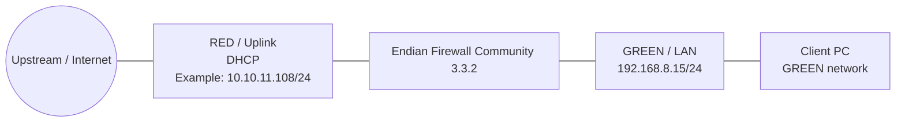
```mermaid
flowchart LR
    INTERNET((Upstream / Internet))
    RED[RED / Uplink<br/>DHCP<br/>Example: 10.10.11.108/24]
    EFW[Endian Firewall Community 3.3.2]
    GREEN[GREEN / LAN<br/>192.168.8.15/24]
    CLIENT[Client PC<br/>GREEN network]

    INTERNET --- RED
    RED --- EFW
    EFW --- GREEN
    GREEN --- CLIENT
```

---

# Network Zones Used

Endian Firewall uses color-coded security zones.

| Zone | Purpose in this Lab |
|---|---|
| **GREEN** | Trusted internal LAN |
| **RED** | External / Internet-facing uplink |
| ORANGE | Optional DMZ zone; not used as the primary focus here |
| BLUE | Optional wireless/less-trusted zone; not used as the primary focus here |

The lab mainly uses **GREEN ↔ RED** traffic.

---

# Addressing Observed in the Lab

| Interface / Role | Addressing |
|---|---|
| GREEN management interface | `192.168.8.15/24` |
| Endian Web GUI | `https://192.168.8.15:10443` |
| RED / main uplink | DHCP |
| Example RED address after configuration | `10.10.11.108/24` |

> The RED address was learned dynamically in the lab, so it may change if the upstream DHCP server gives a different lease.

---

# Part 1 — Physical Setup

## 1. Firewall Hardware and Cabling

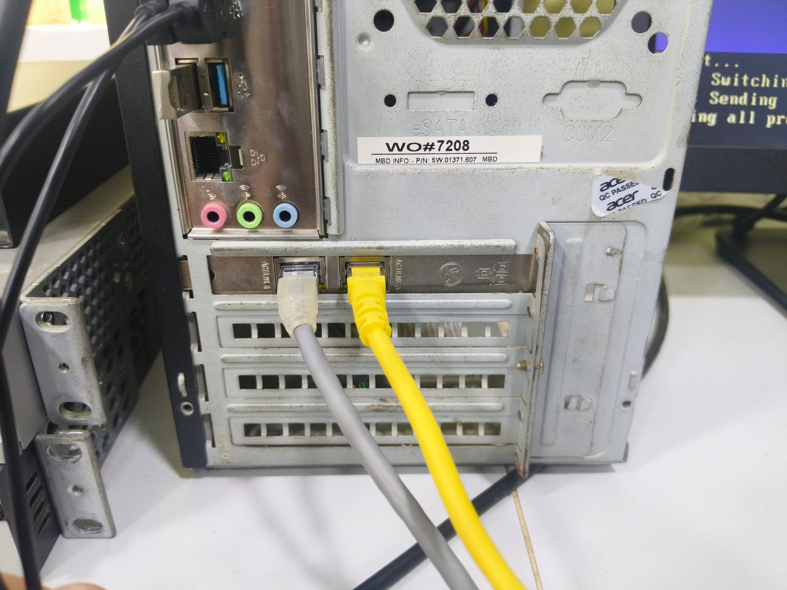

The physical system was prepared with multiple network interfaces.

The Ethernet connections are important because Endian separates networks by security zone. One interface is used for the trusted internal side and another for the external/uplink side.

### What this proves

This screenshot provides evidence that the lab was performed on real hardware rather than only as a virtual firewall exercise.

### Learning point

Before firewall configuration begins, the administrator should identify:

- Which NIC connects to the internal LAN.
- Which NIC connects to the upstream/Internet network.
- Which physical cable corresponds to each Endian interface.

Incorrect interface assignment can make an otherwise correct firewall configuration unusable.

---

# Part 2 — Install Endian Firewall Community

## 2. Select the Installer Language

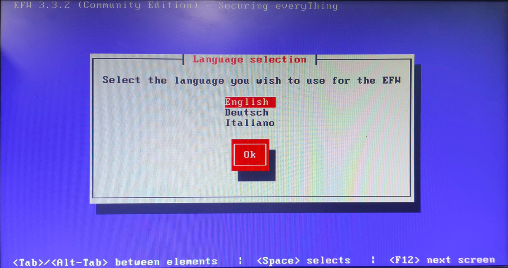

The Endian Firewall installer was started and the installation language was selected.

The screenshot identifies the software as:

```text
EFW 3.3.2 Community Edition
```

---

## 3. Start the Installation

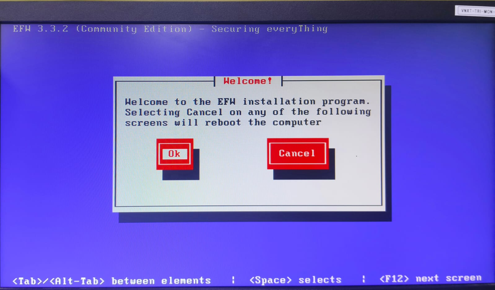

The installer displayed the welcome screen before beginning the disk and system configuration process.

This is the point where the installation process is confirmed before changes are made to the system.

---

## 4. Detect the Installation Disk

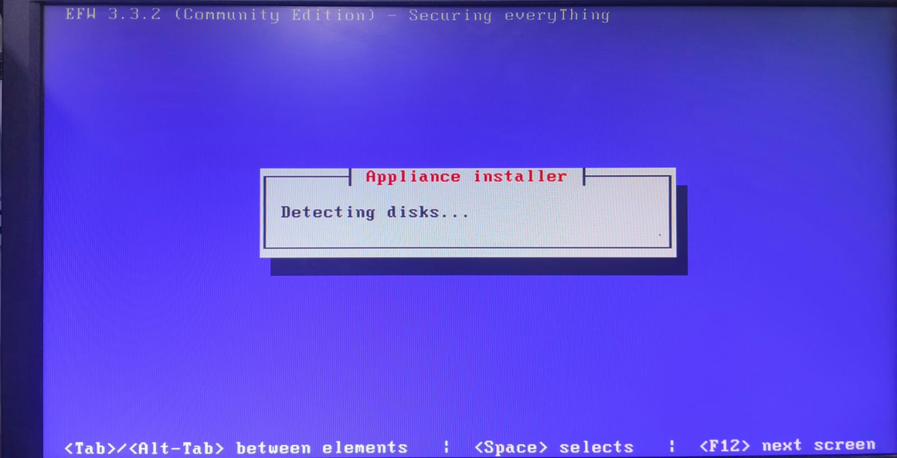

The installer scanned the system for available storage devices.

### Why this step matters

Endian must identify a valid disk before it can create the partitions required for the firewall operating system.

---

## 5. Confirm Disk Erasure Warning

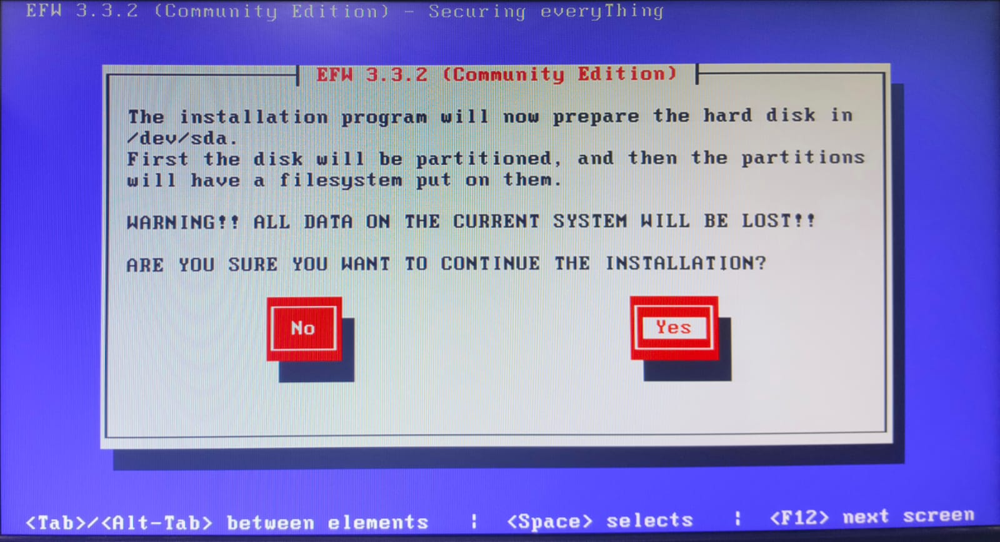

The installer displayed a warning that the selected disk would be prepared for Endian and existing data would be removed.

### Practical lesson

Firewall appliance installation can overwrite the complete disk.

Before confirming a disk operation on a real device, always verify:

```text
Correct physical server
Correct target disk
No required data remains on the disk
```

---

## 6. Disk Partitioning

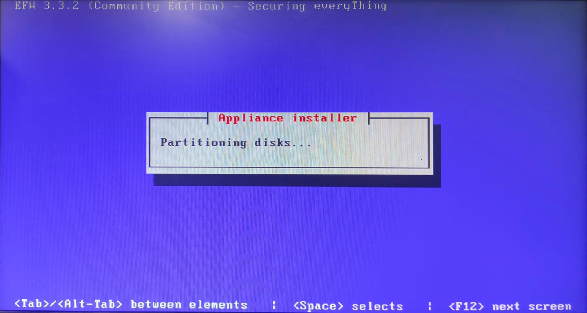

The installer created the required disk partitions and file systems.

At this stage, the appliance storage is being prepared for the Endian operating system.

---

# Part 3 — Configure the GREEN Management Network

## 7. Configure the GREEN Interface Address

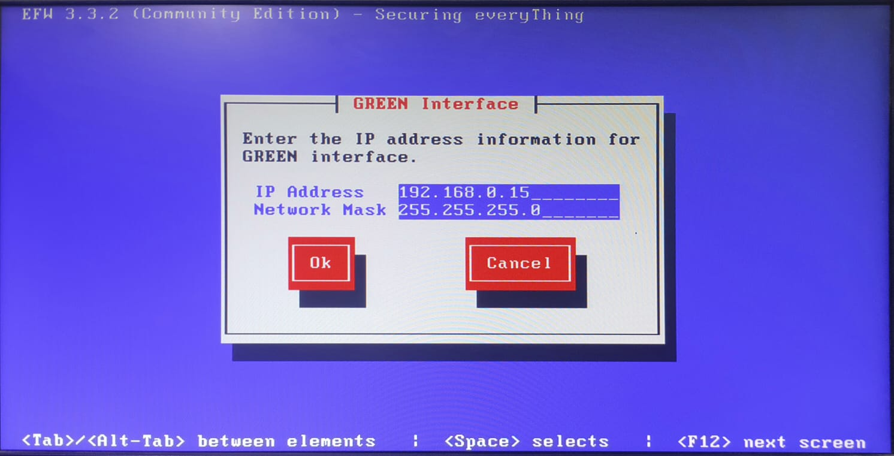

The GREEN interface was configured with:

```text
IP Address   : 192.168.8.15
Network Mask : 255.255.255.0
```

Therefore:

```text
GREEN network = 192.168.8.0/24
```

### What is the GREEN zone?

GREEN represents the trusted internal network.

In this lab it is also used to access the Endian management interface.

### Why the firewall needs a static GREEN address

The administrator and LAN clients need a predictable gateway/management address.

Using a fixed GREEN address makes it possible to consistently access:

```text
https://192.168.8.15:10443
```

---

## 8. Run Post-Installation Procedures

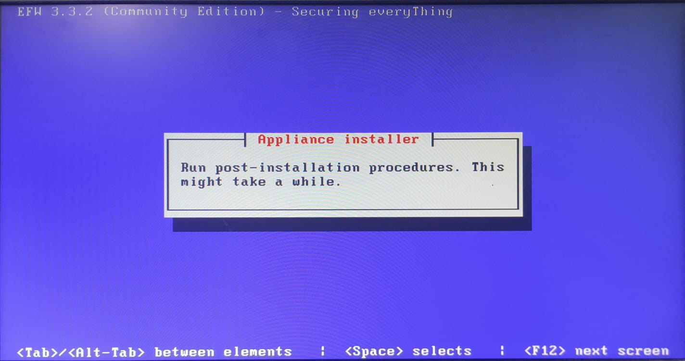

After the base operating system was installed, Endian ran the remaining post-installation tasks.

These procedures finalize the appliance configuration before first boot.

---

## 9. Serial Console Option

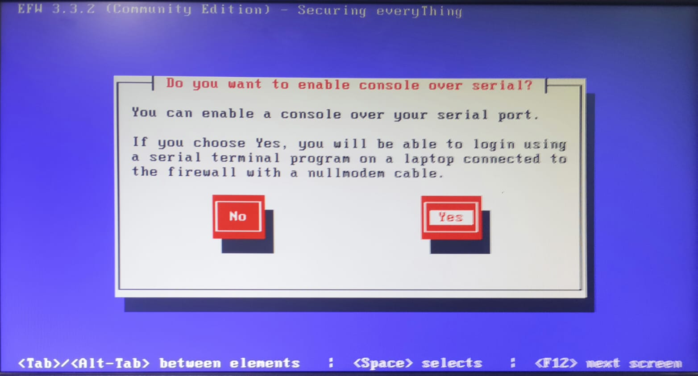

The installer asked whether a console should also be available over the serial interface.

### Why serial console access can be useful

A serial console provides an alternative management method when:

- The web GUI is unreachable.
- The network configuration is incorrect.
- Remote troubleshooting is required.
- A display/keyboard is not available.

---

## 10. Installation Completed

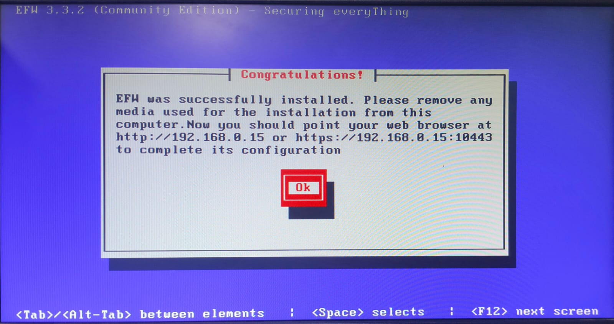

The installer confirmed that Endian Firewall was successfully installed.

The screen also displays the management URL:

```text
https://192.168.8.15
```

and the secure web-management port:

```text
10443
```

The practical GUI URL used in the later screenshots is:

```text
https://192.168.8.15:10443
```

---

# Part 4 — First Boot and Console Network Configuration

## 11. First Boot Console

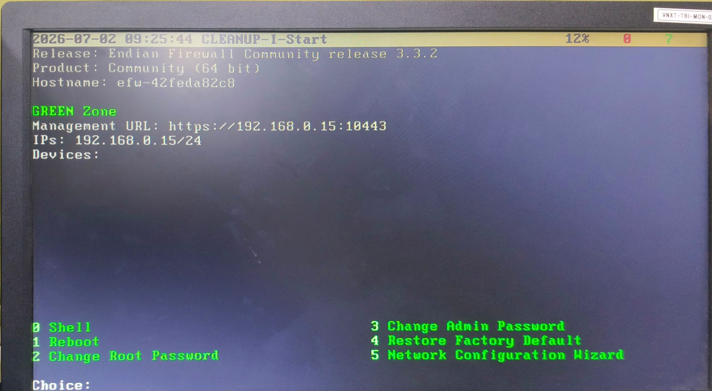

After installation, the console menu was displayed.

Visible options include functions such as:

```text
Shell
Reboot
Change Root Password
Change Admin Password
Restore Factory Default
Network Configuration Wizard
```

### Why the console menu matters

If the browser GUI is unavailable, the local console provides a recovery and configuration path.

---

## 12. Run the Network Configuration Wizard

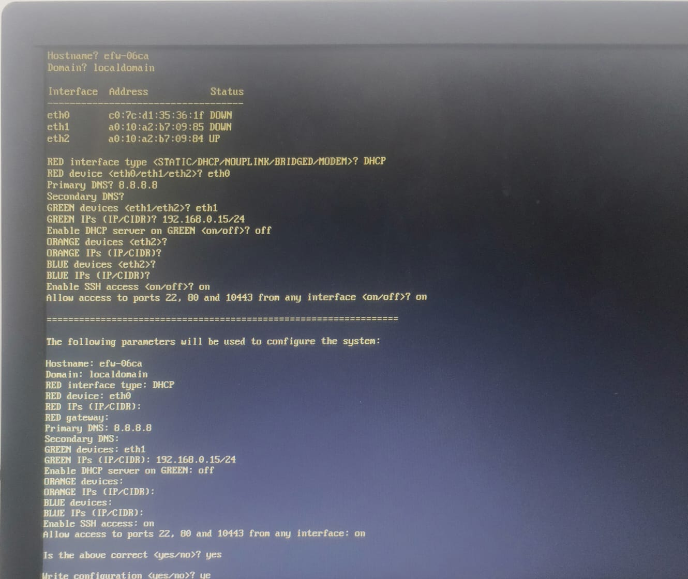

The console-based network configuration wizard was used to configure interface roles and network parameters.

The wizard shows the system evaluating the detected Ethernet interfaces and applying settings for the firewall zones.

### Learning point

A firewall must know which NIC belongs to each security zone before it can correctly enforce policies between trusted and untrusted networks.

---

## 13. Verify the Final Console Summary

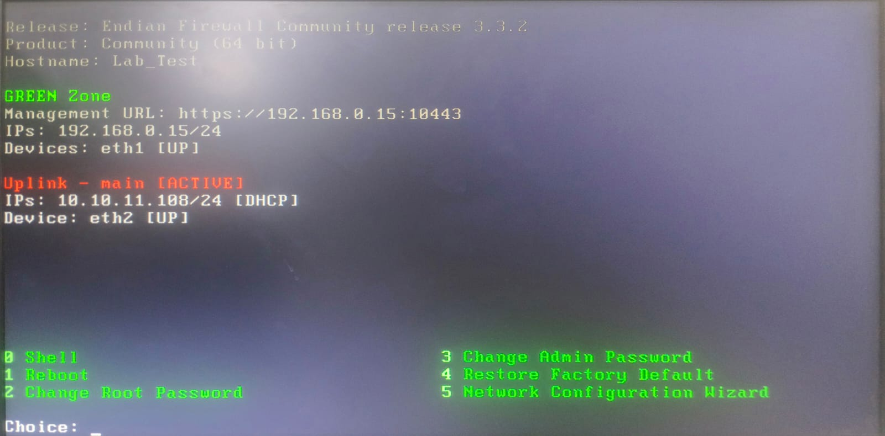

After the network wizard completed, the console showed the final operational state.

Visible values include:

```text
Hostname         : Lab_Test
GREEN IP         : 192.168.8.15/24
Uplink main      : ACTIVE
RED / uplink IP  : 10.10.11.108/24 (DHCP)
```

### What this proves

This screenshot is an important verification point because it confirms both sides of the firewall:

```text
GREEN = internal network
RED   = active upstream network
```

The appliance now has the minimum Layer-3 configuration required to route/firewall traffic between the LAN and upstream network.

---

# Part 5 — Web Network Configuration Wizard

## 14. Select Network Mode

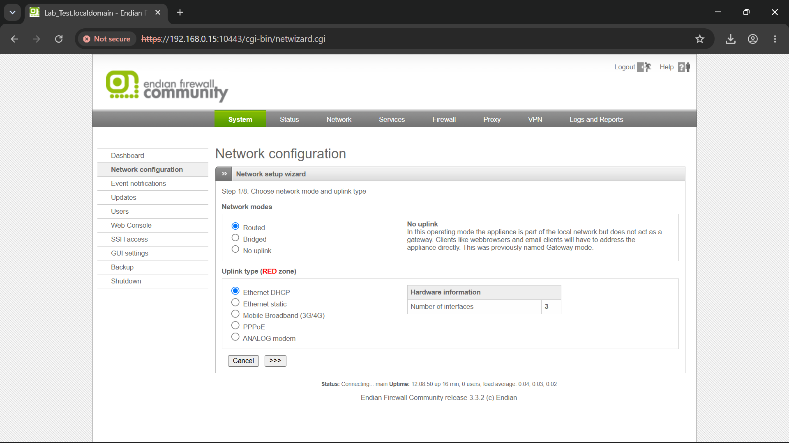

The Endian web-based Network Configuration wizard was opened.

The first stage selects how the appliance will connect to the external network.

### Learning point

The network mode determines how Endian treats the upstream connection and how the RED interface receives connectivity.

---

## 15. Configure Network Zones

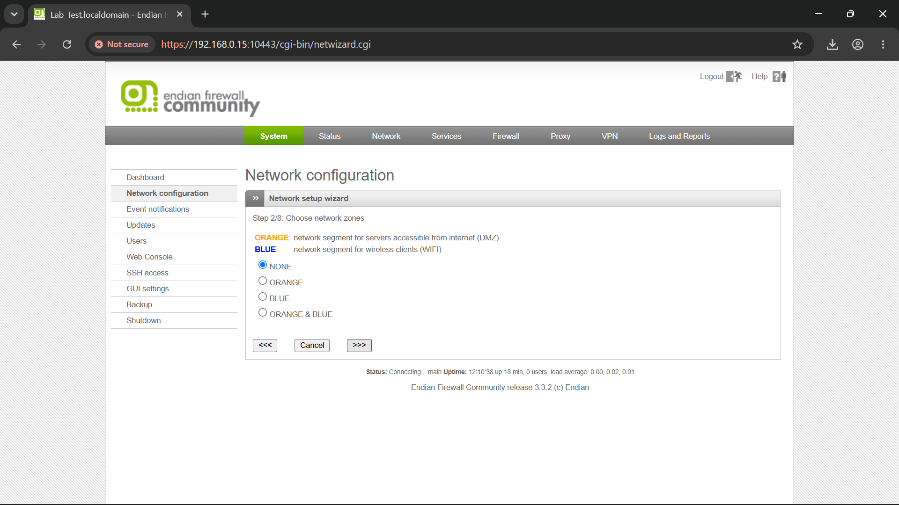

The zone configuration step shows the available Endian security zones:

- ORANGE
- BLUE

GREEN and RED are fundamental to the main network path, while the optional zones can be enabled when additional security segmentation is required.

### Example use cases

```text
GREEN  → Trusted employee LAN
RED    → Internet / ISP
ORANGE → DMZ servers
BLUE   → Wireless or less-trusted network
```

---

## 16. Configure GREEN Preferences

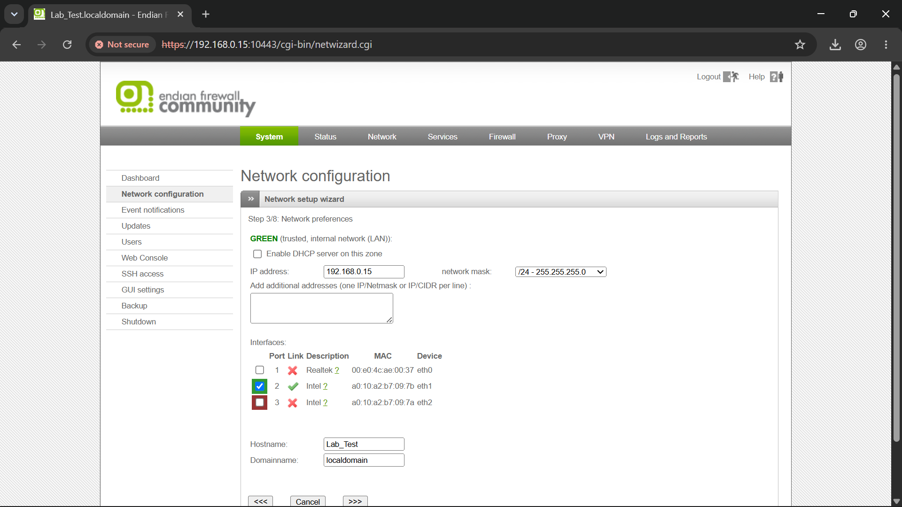

The GREEN network preferences were reviewed/configured.

This step associates the correct physical interface with the trusted LAN and defines its IP addressing.

### Why correct NIC assignment matters

If the wrong NIC is assigned to GREEN, administrators or clients may lose access to the expected LAN-side interface.

---

## 17. Configure RED / Uplink Preferences

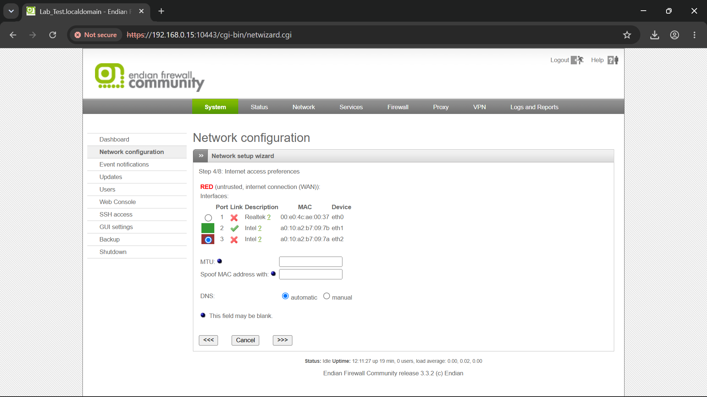

The RED side was configured as the uplink toward the external network.

The lab uses a dynamically assigned RED address.

### Role of RED

RED should be treated as the untrusted side of the firewall.

Traffic traveling from GREEN toward RED is controlled by outgoing firewall rules and other security features such as web proxy/filtering.

---

## 18. Configure DNS

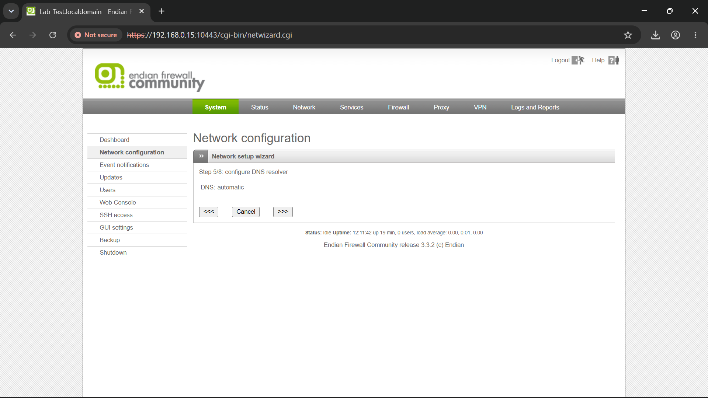

The DNS stage of the wizard was reviewed/configured.

DNS is required so LAN clients and the firewall can translate domain names into IP addresses.

### Troubleshooting concept

A client may successfully ping a public IP such as:

```text
8.8.8.8
```

but still fail to open websites by name if DNS is not working.

Therefore Internet troubleshooting should separately verify:

```text
IP connectivity
DNS resolution
```

---

# Part 6 — Verify the Endian Dashboard

## 19. Dashboard Overview

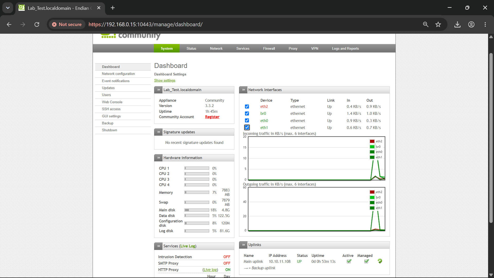

The Endian dashboard was used to verify the overall appliance state.

The dashboard provides visibility into areas such as:

- System information.
- Network interfaces.
- Uplink status.
- CPU and memory utilization.
- Traffic graphs.
- Service status.

### Why the dashboard matters

The dashboard gives a quick operational view before deeper troubleshooting.

For example, if the RED uplink is not active, changing application-level firewall policies will not solve Internet connectivity.

---

# Part 7 — Configure Outgoing Firewall Rules

## 20. Create an ICMP Firewall Rule

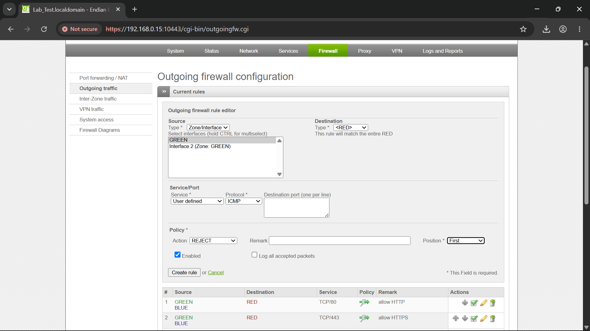

An outgoing firewall rule was created for ICMP traffic.

The rule-building page demonstrates the main policy elements:

```text
Source
Destination
Service / Protocol
Action
Position
Remark
```

### What is ICMP used for?

ICMP is used by tools such as:

```text
ping
```

It is commonly used to verify network reachability during troubleshooting.

### Firewall learning point

A firewall decision depends on multiple fields, not simply an IP address.

A rule normally evaluates:

```text
Where traffic comes from
Where traffic is going
Which protocol/service it uses
What action should be taken
```

---

## 21. Verify the Outgoing Firewall Rule List

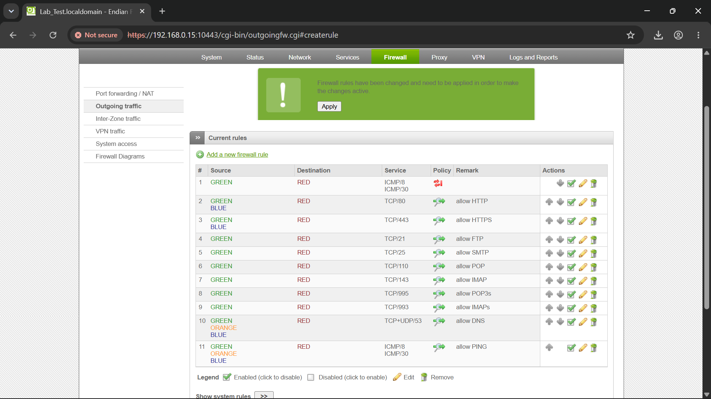

The outgoing firewall policy table shows multiple GREEN-to-RED rules.

The list demonstrates that firewall policies can be created for different services/protocols.

### Why rule order matters

Firewall policies are evaluated according to the firewall's rule-processing logic.

When troubleshooting, always check:

- Whether the correct source zone is used.
- Whether the destination is correct.
- Whether the correct service is selected.
- Whether another rule takes precedence.
- Whether the intended action is allow/reject/drop.

---

# Part 8 — Test Firewall Behavior from the Client

## 22. Client Ping Test — Before and After Policy Behavior

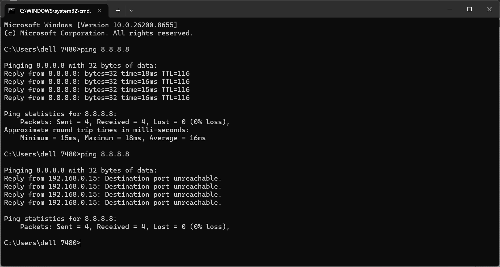

The client used:

```cmd
ping 8.8.8.8
```

The screenshot captures two different test conditions:

- A successful ICMP test.
- A later unsuccessful/blocked condition where the destination is not reachable through the firewall path.

### Why this test is useful

Testing the same destination before and after firewall-policy changes makes policy behavior visible from the client side.

This provides stronger evidence than only showing the firewall configuration page.

---

## 22B. Physical Client Test Evidence

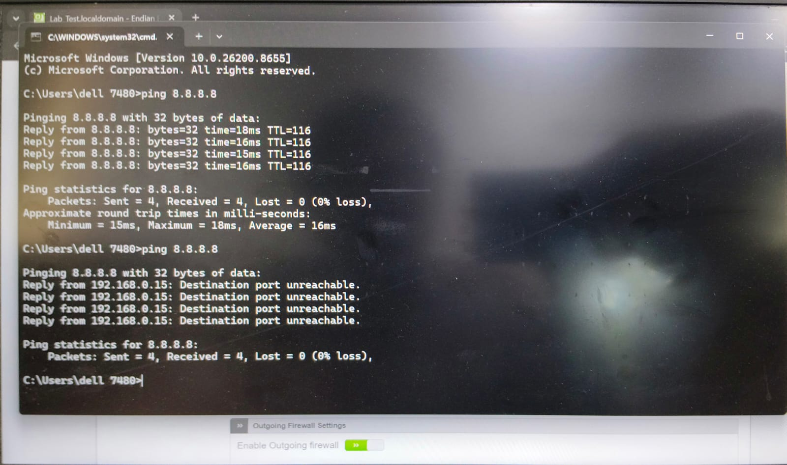

A photo of the client command prompt records the same practical ICMP testing on the real lab machine.

### What this proves

The firewall changes were validated from an endpoint, not only observed inside the Endian GUI.

---

# Part 9 — Configure HTTP Proxy

## 23. Enable and Configure the HTTP Proxy

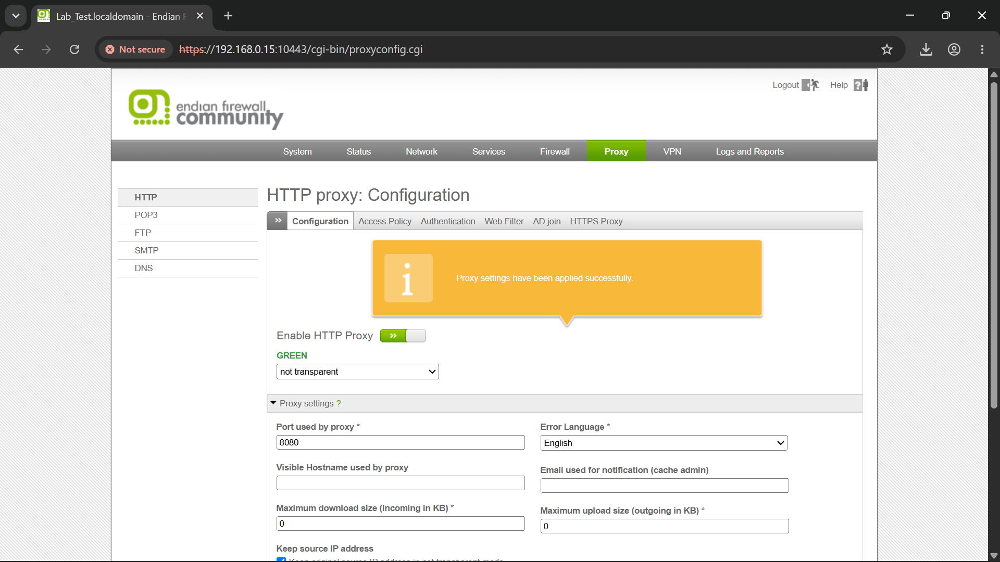

The HTTP proxy configuration page was opened and the proxy was enabled/configured for the GREEN network.

### What is a web proxy?

Instead of allowing a client to communicate directly with a web destination, a proxy can act as an intermediary.

Conceptually:

```text
Client
  ↓
Endian HTTP Proxy
  ↓
Website
```

This gives the firewall greater control and visibility over web access.

### Why the proxy is important for this lab

The later web-filter profile and access policy are applied through the HTTP proxy subsystem.

---

# Part 10 — Configure Web Filtering

## 24. Configure Web-Filter Categories

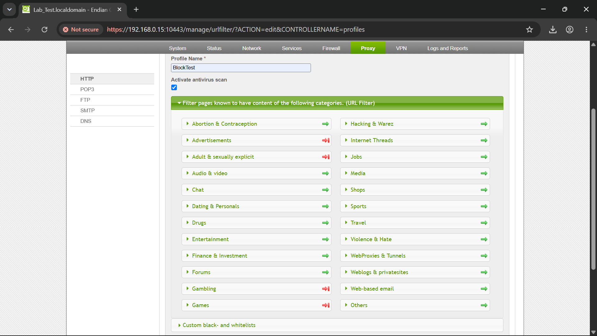

A web-filter profile was configured using category-based filtering.

The page displays multiple content categories with allow/block-style controls.

### Why category filtering is useful

Instead of manually entering every website, administrators can control groups of sites such as:

- Advertising.
- Adult content.
- Games.
- Social/communication categories.
- Other classified web content.

This is more scalable than maintaining only individual domain lists.

---

## 25. Configure a Custom Blacklist

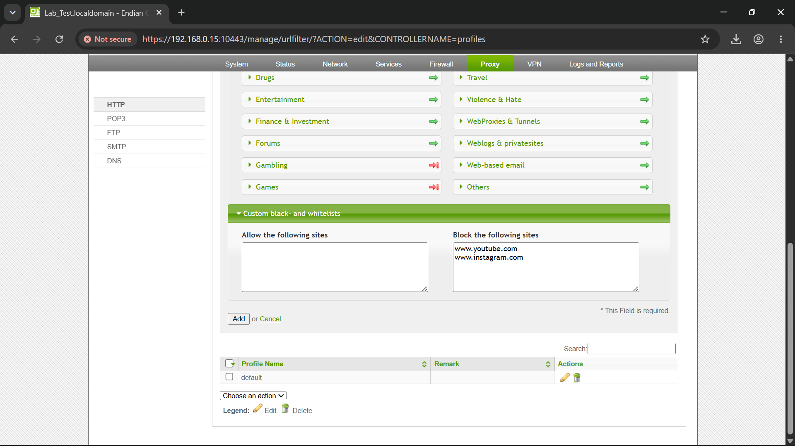

The custom blacklist section was used to specify individual websites/domains that should be blocked.

The screenshot shows manually entered site names in the blocked-sites field.

### Difference between categories and blacklist

**Category filtering** controls an entire class of websites.

**Blacklist filtering** targets explicitly selected websites.

This provides two levels of control:

```text
Broad control  → Category
Specific control → Blacklist
```

---

# Part 11 — Create the HTTP Proxy Access Policy

## 26. Create an Access Policy

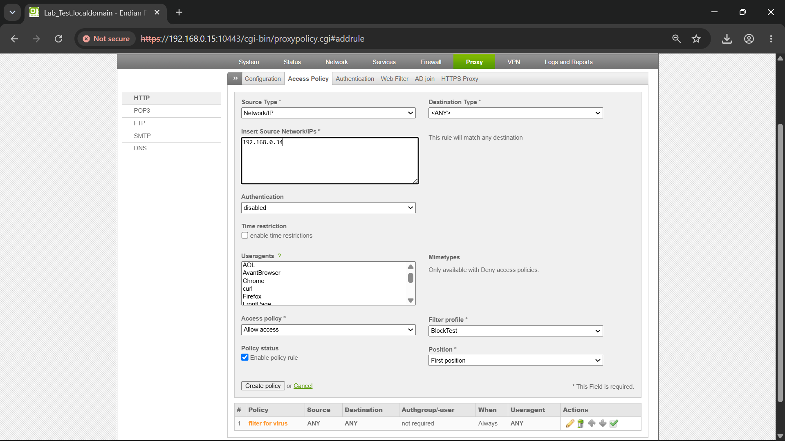

An HTTP proxy access policy was created for the internal network.

The policy page shows fields for:

- Source type.
- Source network/IP.
- Destination type.
- Authentication.
- Time restrictions.
- User/group targeting.
- Access policy.
- Filter profile.
- Policy position.

### Why the access policy is required

Creating a web-filter profile does not by itself determine which clients will use it.

The access policy connects:

```text
Who / which source
        +
When
        +
Which filtering profile
```

This is similar to how a firewall rule ties objects and services to an action.

---

## 27. Verify the Access Policy

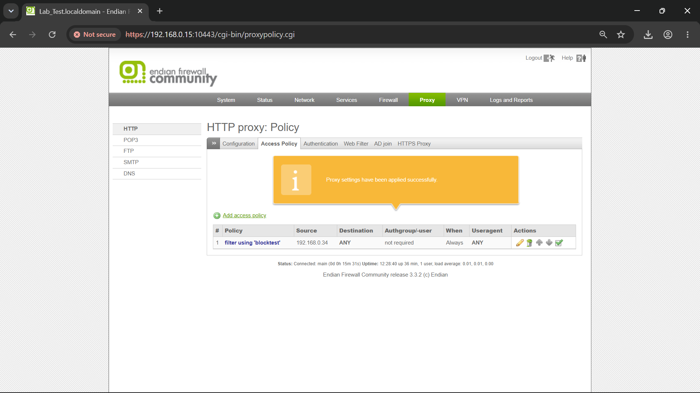

The access-policy list shows the configured filtering policy as an active entry.

### What this proves

At this stage:

- The HTTP proxy is configured.
- A web-filter profile exists.
- An access policy references the profile.
- The internal network can be targeted by the filtering policy.

---

# Part 12 — Monitor Live Logs

## 30. Live Logs Overview

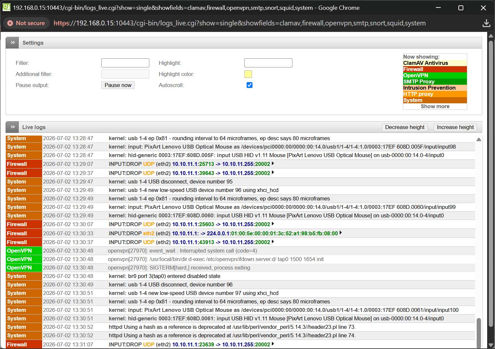

The live-log view displays real-time events generated by the firewall and its services.

The log categories shown include different system and network components.

### Why live logs matter

Live logs are useful while actively troubleshooting because they show events as they occur.

Instead of guessing whether traffic reached the firewall, the administrator can observe firewall/system events directly.

---

## 31. Filtered Live Logs

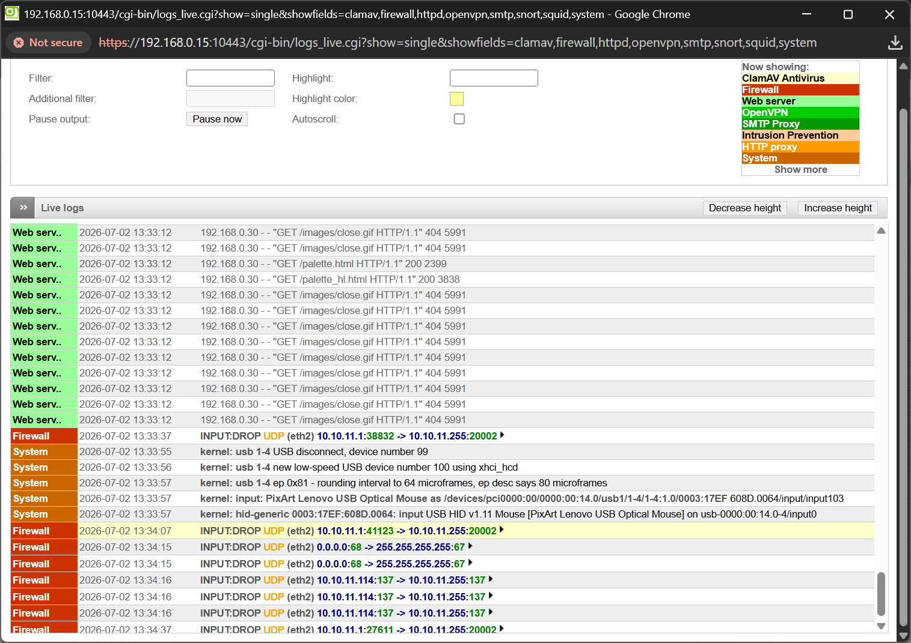

The live-log view was filtered to focus on relevant traffic/events.

### Learning point

Large firewall logs can contain many unrelated messages.

Filtering helps isolate:

```text
Specific source IP
Specific destination
Specific protocol
Specific service
Firewall-related events
```

This makes troubleshooting much faster.

---

# Part 13 — Review Firewall Logs

## 32. Firewall Log Table

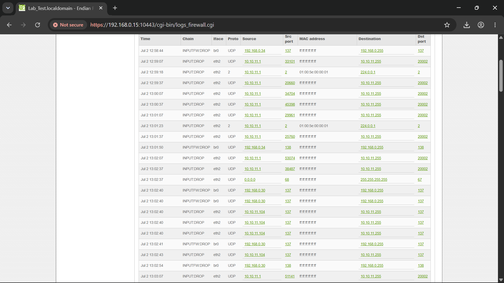

The firewall log table shows traffic records with fields such as:

- Time.
- Chain.
- Interface.
- Protocol.
- Source address.
- Source port.
- MAC address.
- Destination address.
- Destination port.

### What this proves

The firewall is not only enforcing traffic rules; it also records network activity that can be reviewed later.

Logs are critical for:

- Troubleshooting.
- Policy verification.
- Identifying blocked traffic.
- Understanding source/destination behavior.
- Security analysis.

---

# End-to-End Traffic Logic

The lab can be summarized as:

```text
Client on GREEN
      ↓
Endian GREEN Interface
192.168.8.15/24
      ↓
Firewall / Proxy Policy
      ↓
RED Uplink
DHCP address
      ↓
Upstream Network / Internet
```

For normal routed traffic, the firewall checks whether the communication is allowed.

For web traffic processed through the proxy, Endian can additionally apply the configured web-filter profile and blacklist.

---

# Firewall vs Proxy Filtering

These two functions solve different problems.

## Firewall rule

Controls traffic mainly using network/protocol information.

Example concept:

```text
GREEN
  ↓
ICMP / TCP service
  ↓
RED
  ↓
Allow / Deny
```

## HTTP proxy / web filter

Controls web access using higher-level web policy.

Example concept:

```text
GREEN client
   ↓
HTTP proxy
   ↓
Access policy
   ↓
Web-filter profile
   ↓
Category / blacklist decision
   ↓
Website
```

This lab demonstrates both network-layer firewall control and web-layer filtering.

---

# Troubleshooting Method Learned

A useful troubleshooting order for Endian Firewall is:

## 1. Check physical connectivity

- Correct Ethernet cables.
- Link LEDs.
- Correct NIC assignment.

## 2. Check zone addressing

```text
GREEN = 192.168.8.15/24
RED   = DHCP / upstream network
```

## 3. Check the dashboard

Verify:

```text
Uplink active?
Correct IP?
Interfaces up?
```

## 4. Test IP reachability

From the client:

```cmd
ping 8.8.8.8
```

If IP connectivity fails, investigate routing/firewall/uplink before DNS or web filtering.

## 5. Test DNS separately

If IP works but names fail, investigate DNS.

## 6. Check outgoing firewall rules

Confirm:

- Source zone.
- Destination zone.
- Protocol/service.
- Action.
- Rule order.

## 7. Check HTTP proxy

If only websites are affected, verify the proxy state.

## 8. Check filter profile

Confirm category and blacklist settings.

## 9. Check access policy

Verify that the client/network actually matches the policy.

## 10. Review logs

Use live and firewall logs to confirm what Endian is seeing and how it is treating the traffic.

---

# Test Summary

| Test / Configuration | Evidence | Result |
|---|---|---|
| Physical firewall hardware | Back-panel photograph | PASS |
| Endian installer started | EFW 3.3.2 installer screens | PASS |
| Disk detected and partitioned | Installer disk/partition screenshots | PASS |
| GREEN IP configured | `192.168.8.15/24` | PASS |
| Installation completed | Congratulations screen | PASS |
| First boot console available | Endian console menu | PASS |
| GREEN network operational | Console summary | PASS |
| RED uplink operational | Uplink shown ACTIVE | PASS |
| RED DHCP address | Example `10.10.11.108/24` | PASS |
| GUI management access | Endian web interface | PASS |
| Firewall dashboard accessible | Dashboard screenshot | PASS |
| ICMP rule configured | Outgoing firewall rule evidence | PASS |
| Firewall policy list | Multiple service rules visible | PASS |
| Client policy test | Before/after ping behavior captured | PASS |
| HTTP proxy configured | Proxy configuration screenshot | PASS |
| Web-filter profile configured | Category settings visible | PASS |
| Custom blacklist configured | Blocked-site entries visible | PASS |
| Access policy created | Proxy access-policy screenshot | PASS |
| Access policy active | Policy list evidence | PASS |
| Live logging | Real-time logs visible | PASS |
| Filtered logging | Focused log view visible | PASS |
| Firewall traffic logs | Source/destination traffic table | PASS |

---

# Key Learning Outcomes

### 1. Firewall installation starts with correct physical interface planning

A firewall needs clearly identified internal and external NICs. Incorrect zone-to-interface assignment can break connectivity even when the IP configuration appears correct.

### 2. GREEN and RED represent different trust levels

GREEN is the trusted LAN side, while RED represents the external/uplink side.

Traffic between zones should be controlled rather than treated as one flat network.

### 3. A static management address is important

The GREEN address `192.168.8.15/24` provides a predictable point for administration and internal gateway functions.

### 4. DHCP simplifies upstream connectivity

The RED interface can dynamically obtain addressing from an upstream DHCP network.

This allowed the Endian uplink to become active without manually assigning the shown RED address.

### 5. Firewall policy should be tested from the endpoint

The ping screenshots demonstrate that policies should be validated from a real client.

A configuration page alone does not prove the expected traffic behavior.

### 6. Firewall rules and web filtering operate at different levels

Outgoing firewall rules control network services/protocols.

The HTTP proxy and web filter provide more detailed control of web browsing.

### 7. A filter profile must be linked through an access policy

Creating blocked categories or blacklist entries is only part of the task.

The access policy determines which client/network is actually governed by the web-filter profile.

### 8. Logs are essential for troubleshooting

Live logs and firewall logs provide evidence of what traffic reaches the firewall and how it is processed.

### 9. Troubleshooting should move from lower layers to higher layers

A useful sequence is:

```text
Cable
↓
Interface
↓
IP addressing
↓
Uplink
↓
Firewall policy
↓
DNS
↓
Proxy
↓
Web filtering
↓
Logs
```

This avoids changing unrelated settings when the actual problem is at a lower layer.

---

# Evidence Map

| Screenshot | What It Demonstrates |
|---|---|
| 01 | Physical firewall/NIC cabling |
| 02 | Installer language selection |
| 03 | Endian installer start |
| 04 | Disk detection |
| 05 | Disk erase warning |
| 06 | Disk partitioning |
| 07 | GREEN IP `192.168.8.15/24` |
| 08 | Post-install procedures |
| 09 | Serial console option |
| 10 | Successful Endian installation |
| 11 | First-boot console |
| 12 | Console network wizard |
| 13 | GREEN + RED/uplink final console summary |
| 14 | Network-mode wizard |
| 15 | Zone-selection wizard |
| 16 | GREEN preferences |
| 17 | RED/uplink preferences |
| 18 | DNS wizard |
| 19 | Dashboard/system status |
| 20 | Outgoing ICMP firewall-rule creation |
| 21 | Outgoing firewall-rule list |
| 22 | Client ping before/after policy behavior |
| 22B | Physical client test evidence |
| 23 | HTTP proxy configuration |
| 24 | Web-filter categories |
| 25 | Custom blacklist |
| 26 | Proxy access-policy creation |
| 27 | Active proxy access-policy list |
| 30 | Live-log overview |
| 31 | Filtered live logs |
| 32 | Firewall traffic-log table |

---

# Conclusion

This lab successfully demonstrated the complete setup and basic administration of **Endian Firewall Community 3.3.2** on physical hardware.

The work covered:

**installation → network-zone configuration → GREEN/RED connectivity → firewall policy → client testing → HTTP proxy → web filtering → access policy → log analysis**

The lab also provided practical experience with the difference between basic network-layer firewall controls and higher-level web filtering.

The screenshots provide evidence that the firewall was not only installed, but also configured and tested through real client traffic and log verification.

Overall, this project demonstrates practical understanding of:

**firewall installation, security zones, interface addressing, DHCP uplinks, firewall rules, ICMP testing, HTTP proxying, content filtering, blacklists, access policies, traffic logs, and structured firewall troubleshooting.**
