# FortiGate Active-Passive HA Failover Lab

## Overview

This lab demonstrates a practical **FortiGate Active-Passive High Availability (HA)** deployment using two FortiGate firewalls. The objective was not only to configure the HA cluster, but also to verify synchronization, provide VLAN gateway and DHCP services, allow Internet access through firewall policies, and then perform real failover tests by disconnecting the WAN connection and powering off the active firewall.

The screenshots in this repository are included as evidence of the complete lab process—from the physical HA heartbeat connection and initial device configuration through failover, rejoin, synchronization, and final cluster recovery.

The main learning goal of this exercise was to understand how FortiGate HA protects network availability when the primary firewall or a monitored interface fails.

---

## What I Learned

By completing this lab, I practiced and verified:

- FortiGate **Active-Passive HA** operation.
- HA heartbeat communication between two firewalls.
- HA device priority and primary/secondary role selection.
- Interface monitoring for failover decisions.
- Configuration synchronization between cluster members.
- WAN addressing and default routing.
- VLAN interfaces on FortiGate.
- FortiGate as the default gateway for multiple VLANs.
- DHCP services for VLAN 10 and VLAN 20.
- LAN-to-WAN firewall policies.
- Source NAT for Internet access.
- DNS configuration.
- Client DHCP verification.
- Gateway and Internet reachability testing.
- WAN-interface failure testing.
- Primary-firewall power failure testing.
- HA rejoin and synchronization behavior after recovery.
- CLI verification using `diagnose sys ha status`.

---

# Lab Environment

## Main Components

| Device | Purpose |
|---|---|
| FortiGate FW1 | Preferred primary firewall |
| FortiGate FW2 | Secondary / standby firewall |
| Cisco Layer-2 Switch 1 | WAN-side connectivity |
| Cisco Layer-2 Switch 2 | LAN-side VLAN connectivity |
| Edge Router | Upstream/default gateway toward the Internet |
| PC1 | Client in VLAN 10 |
| PC2 | Client in VLAN 20 |
| HA heartbeat link | Dedicated communication between the FortiGate members |

---

# Logical Topology

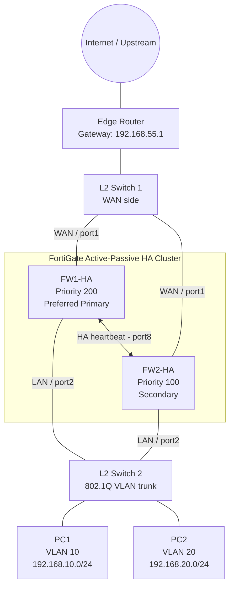
```mermaid
flowchart TD
    INTERNET((Internet / Upstream))
    RTR[Edge Router<br/>Gateway: 192.168.55.1]
    SW1[L2 Switch 1<br/>WAN side]

    subgraph HA["FortiGate Active-Passive HA Cluster"]
        FW1[FW1-HA<br/>Priority 200<br/>Preferred Primary]
        FW2[FW2-HA<br/>Priority 100<br/>Secondary]
        FW1 <-->|HA heartbeat - port8| FW2
    end

    SW2[L2 Switch 2<br/>802.1Q VLAN trunk]
    PC1[PC1<br/>VLAN 10<br/>192.168.10.0/24]
    PC2[PC2<br/>VLAN 20<br/>192.168.20.0/24]

    INTERNET --- RTR
    RTR --- SW1
    SW1 ---|WAN / port1| FW1
    SW1 ---|WAN / port1| FW2
    FW1 ---|LAN / port2| SW2
    FW2 ---|LAN / port2| SW2
    SW2 --- PC1
    SW2 --- PC2
```

---

# IP Addressing Used in the Lab

| Network / Interface | Address |
|---|---|
| FortiGate WAN `port1` | `192.168.55.2/24` |
| Upstream gateway | `192.168.55.1` |
| VLAN 10 gateway | `192.168.10.1/24` |
| VLAN 20 gateway | `192.168.20.1/24` |
| VLAN 10 DHCP range | `192.168.10.20 - 192.168.10.200` |
| VLAN 20 DHCP range | `192.168.20.20 - 192.168.20.200` |
| HA heartbeat interface | `port8` |

> The same production-facing configuration is synchronized between the two FortiGate members when HA is operating correctly.

---

# Part 1 — Physical HA Connection and Network Preparation

## 1. HA Heartbeat Connection

The two FortiGate appliances were physically connected using **port8** as the HA heartbeat interface.

The heartbeat link is one of the most important parts of a FortiGate HA cluster. It allows the members to exchange information about:

- Device health.
- Cluster membership.
- Configuration synchronization.
- Session/state information where applicable.
- Primary/secondary role information.
- Failure detection.

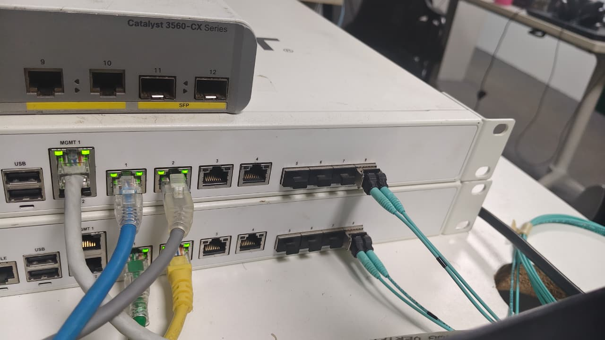

### Why the heartbeat link matters

Without heartbeat communication, one FortiGate cannot reliably determine whether the other member is healthy. In a production HA design, dedicated heartbeat interfaces are normally used so HA control traffic is isolated from user traffic.

---

## 2. Verify the Upstream Router

Before configuring the firewalls, the edge router was checked to make sure the upstream network was operational.

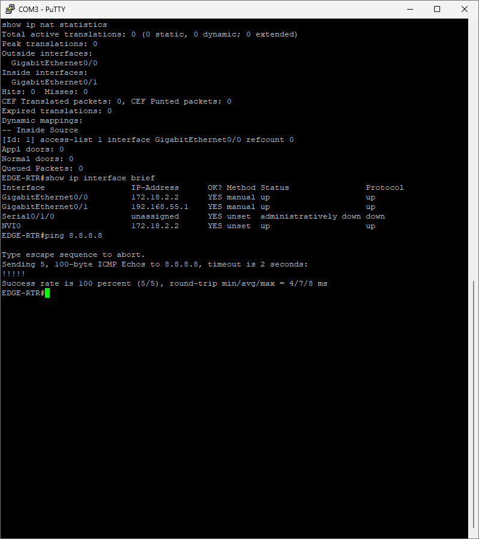

This step confirms that the HA cluster has a valid next hop available when the WAN interface is configured.

The FortiGate default route later points to:

```text
192.168.55.1
```

---

## 3. Verify WAN-Side Layer-2 Switching

The WAN-side switch was checked to verify that the required ports were operational and connected in the correct Layer-2 network.

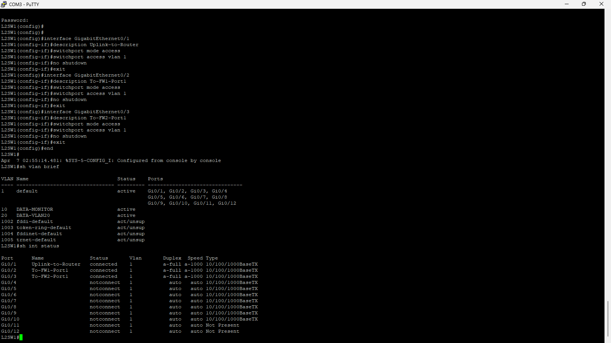

This switch provides Ethernet connectivity between the FortiGate WAN interfaces and the upstream router.

A firewall configuration can be correct but still fail if the physical switch ports, VLAN membership, cabling, or uplinks are incorrect. Verifying Layer 1 and Layer 2 first reduces troubleshooting time.

---

## 4. Verify LAN VLANs and Trunks

The second Layer-2 switch was verified for VLAN 10 and VLAN 20.

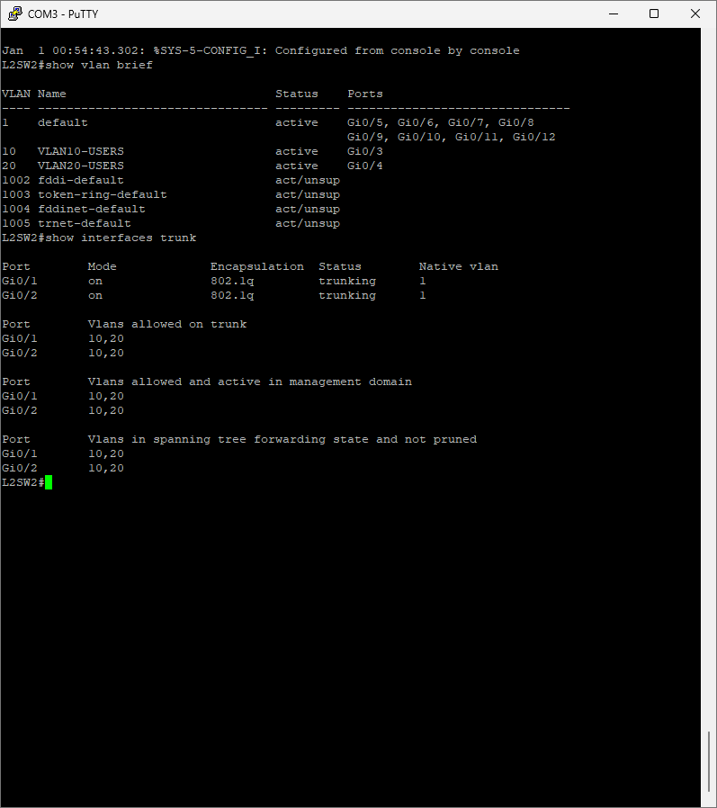

The LAN-facing FortiGate connection carries multiple VLANs, so the switch link toward the firewall must pass the required 802.1Q VLAN tags.

The FortiGate later creates VLAN interfaces on `port2` for:

```text
VLAN 10
VLAN 20
```

---

# Part 2 — Initial FortiGate Configuration

## 5. Access the FortiGate GUI

The FortiGate web interface was accessed to begin configuration.

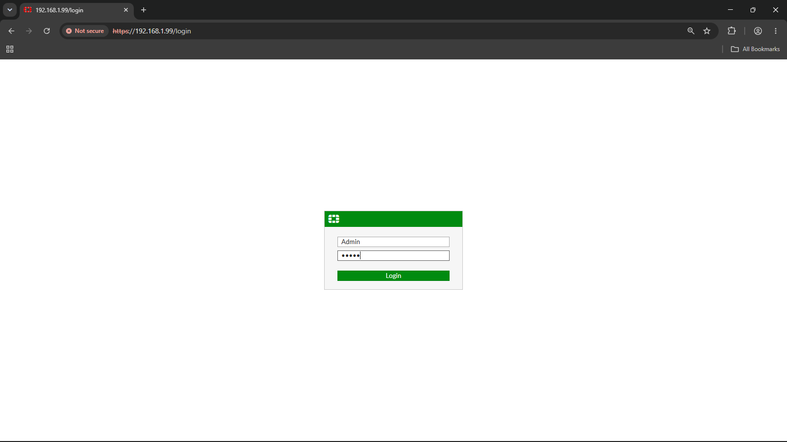

GUI access is useful for configuring and visually verifying HA, interfaces, DHCP, policies, and routing. CLI verification is also used later in the lab.

---

## 6. Configure FW1 Identity and System Settings

The first firewall was configured with the hostname:

```text
FW1-HA
```

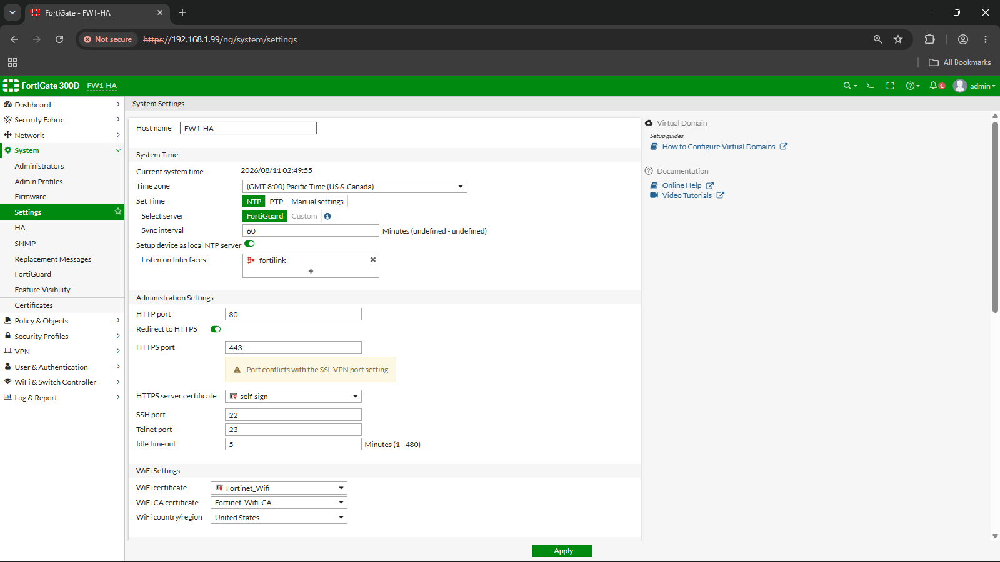

Using clear hostnames is especially important in HA environments because both firewalls may look almost identical in the GUI and CLI.

A descriptive name makes it easier to identify which physical unit is being managed or tested.

---

# Part 3 — Configure Active-Passive HA

## 7. Select Active-Passive Mode

FortiGate HA supports different operating modes. For this lab, **Active-Passive** mode was selected.

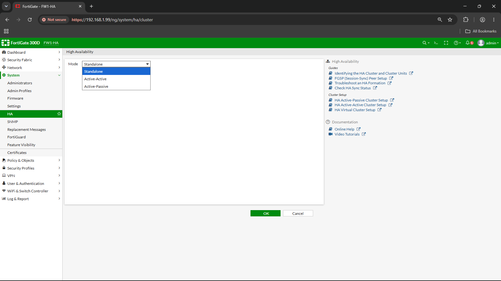

### What Active-Passive means

In an Active-Passive cluster:

- One FortiGate acts as the **primary/active** unit.
- The other member remains **secondary/standby**.
- The active unit processes normal production traffic.
- The standby unit stays synchronized and is ready to take over after a qualifying failure.

This design is commonly used when availability is more important than distributing traffic across both appliances.

---

## 8. Configure FW1 HA Parameters

FW1 was configured with:

```text
Mode: Active-Passive
Group name: FW-HA-CLUSTER
Device priority: 200
Heartbeat interface: port8
Monitored interfaces: port1, port2
```

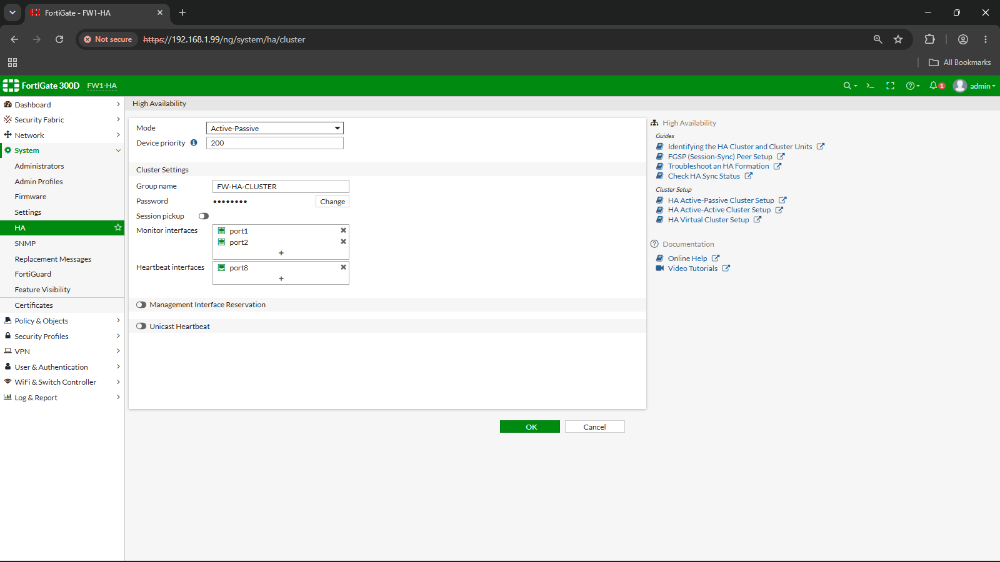

### Why priority 200 was used

The priority value influences HA election.

FW1 was given the higher priority so that it would be the preferred primary device when cluster election conditions allow it.

### Why port1 and port2 were monitored

`port1` is the WAN-facing interface and `port2` carries LAN/VLAN traffic.

Monitoring these interfaces allows the cluster to react when an important production link fails.

For example, if the primary firewall loses its monitored WAN connection while the secondary still has a healthy path, HA can move the primary role to the healthier member.

---

## 9. Verify FW1 Before Adding FW2

Before the second FortiGate joined, the HA status showed only FW1.

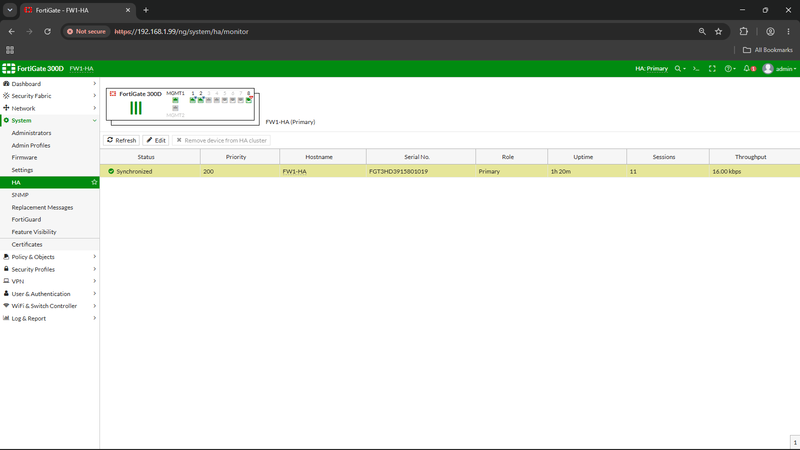

At this point, the cluster configuration existed, but there was no redundancy because only one member was participating.

---

## 10. Configure the Second Firewall Hostname

The second FortiGate was configured as:

```text
FW2-HA
```

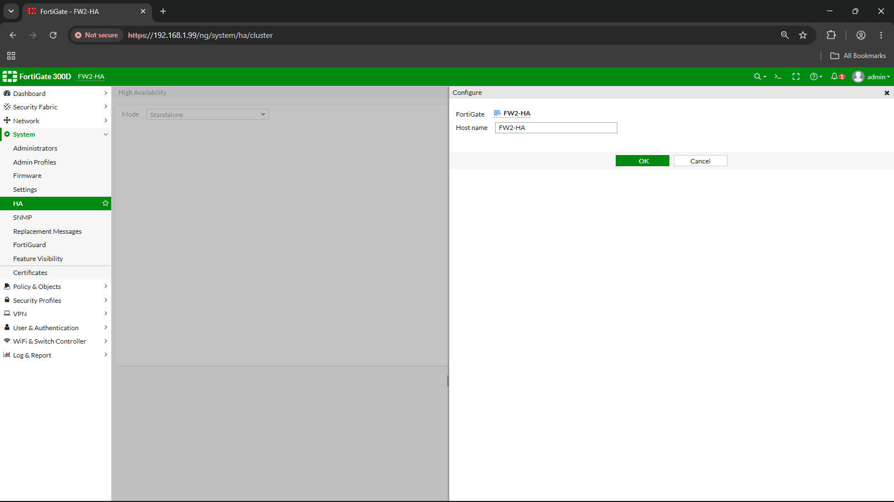

Distinct hostnames make role changes and troubleshooting easier to follow during failover tests.

---

## 11. Configure FW2 HA Settings

FW2 was configured with matching HA parameters but a lower priority:

```text
Mode: Active-Passive
Group name: FW-HA-CLUSTER
Device priority: 100
Heartbeat interface: port8
Monitored interfaces: port1, port2
```

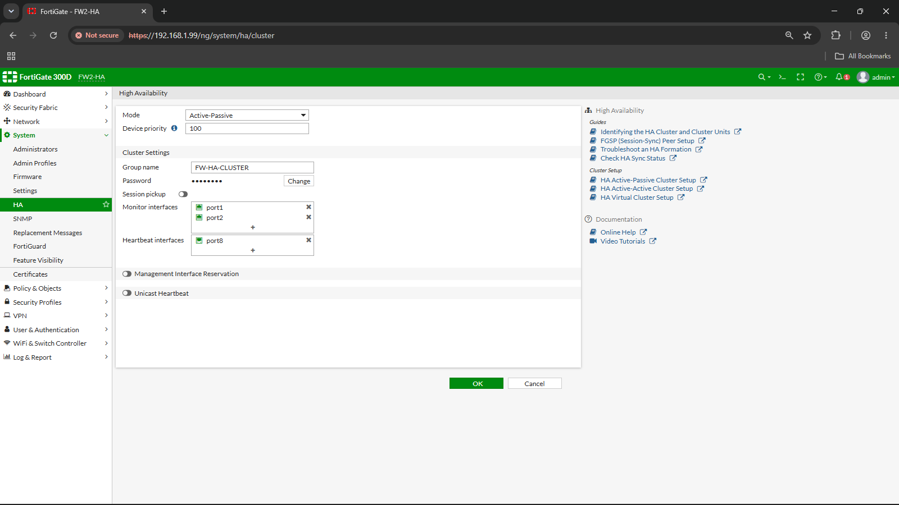

For cluster formation, important HA parameters such as mode, group information, authentication, and heartbeat connectivity must be compatible.

FW2 uses priority `100`, while FW1 uses priority `200`.

Therefore the intended role preference is:

| Firewall | Priority | Intended Role |
|---|---:|---|
| FW1-HA | 200 | Preferred Primary |
| FW2-HA | 100 | Secondary / Standby |

---

## 12. Verify Both HA Members Are Synchronized

After FW2 joined, both devices appeared in the cluster.

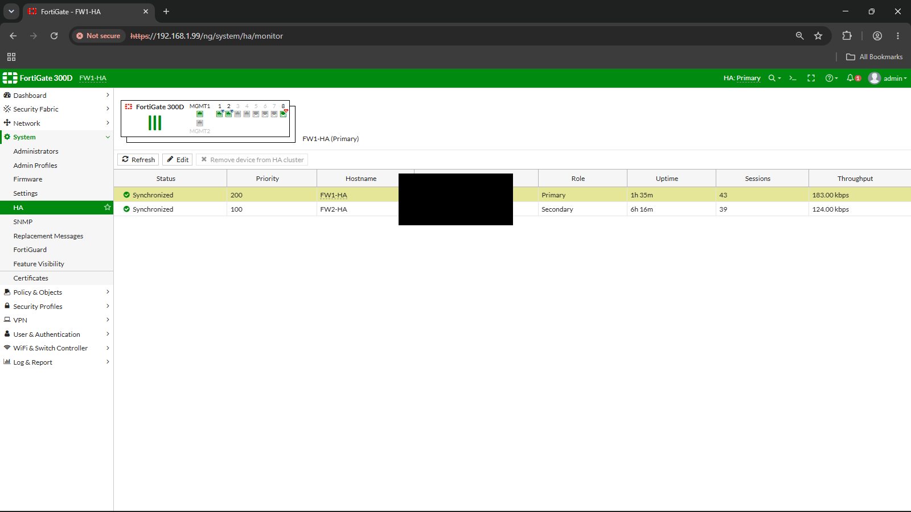

This is an important milestone in the lab.

A healthy HA cluster should not only show two members; the members must also be synchronized so the standby firewall has the configuration required to take over.

---

## 13. Baseline HA Status Before Failover Testing

The HA dashboard was checked again before failure testing.


This screenshot acts as the **baseline state**.

Before testing a failure, it is important to establish that:

- Both members are present.
- The intended primary is active.
- The secondary is available.
- Synchronization is healthy.

Without a clean baseline, a later failover result is difficult to interpret.

---

# Part 4 — WAN and Routing Configuration

## 14. Configure the WAN Interface

FortiGate `port1` was configured manually with:

```text
IP address: 192.168.55.2/24
```

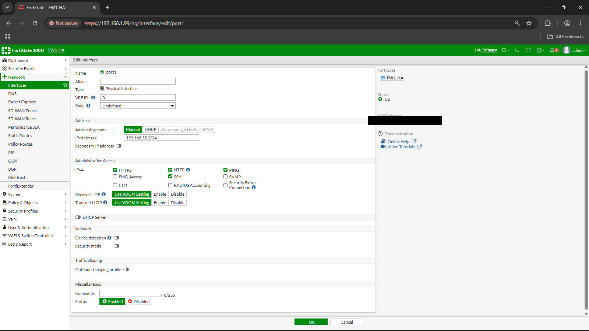

The interface was also enabled for selected administrative access including ping.

### Why the WAN IP is required

This address places the FortiGate in the same upstream subnet as the router:

```text
FortiGate: 192.168.55.2
Gateway:   192.168.55.1
```

The FortiGate can therefore forward traffic to the upstream router.

---

## 15. Verify the Default Route

The static-route table was checked.

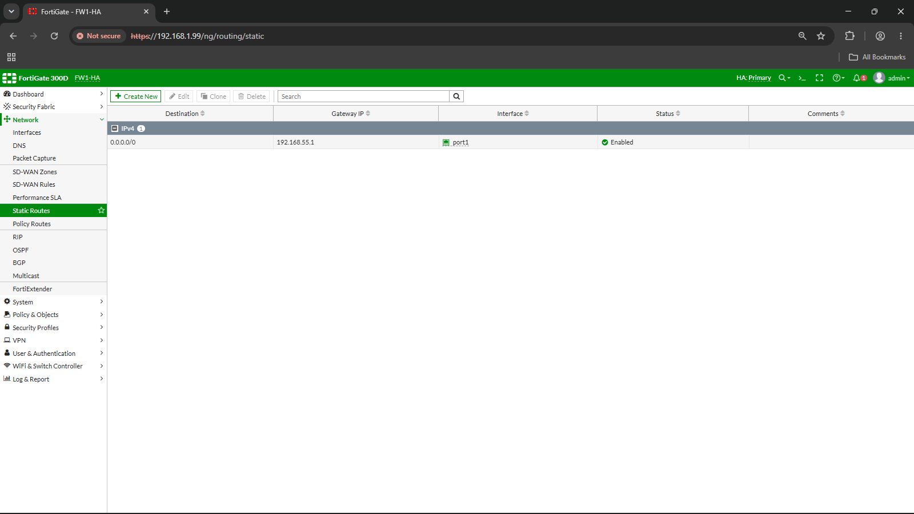

A default route is used when the FortiGate does not have a more specific route for a destination.

---

## 16. Configure the Default Route

The default route was configured as:

```text
Destination: 0.0.0.0/0
Gateway: 192.168.55.1
Interface: port1
Administrative distance: 10
```

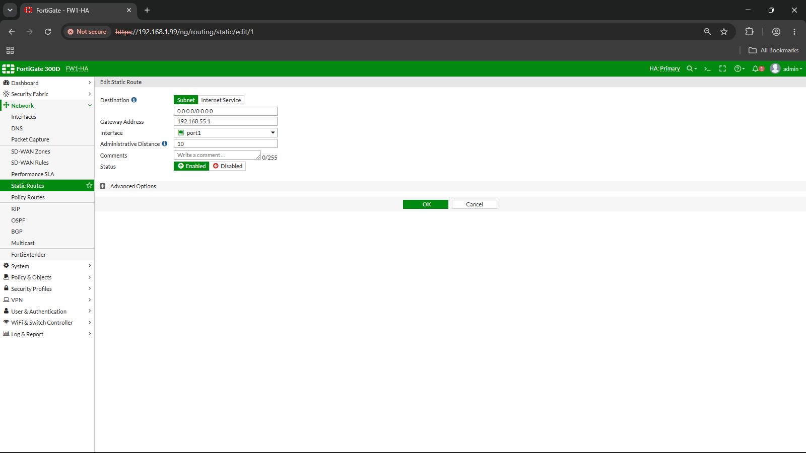

### Why `0.0.0.0/0` is used

`0.0.0.0/0` matches any IPv4 destination that is not already covered by a more specific route.

For client Internet traffic, the forwarding logic is therefore approximately:

```text
Client
  ↓
FortiGate VLAN gateway
  ↓
Firewall policy
  ↓
Default route
  ↓
192.168.55.1
  ↓
Upstream network / Internet
```

---

# Part 5 — VLAN Interface and DHCP Configuration

## 17. Interface Overview

The FortiGate interface page was checked after the VLAN interfaces were created.

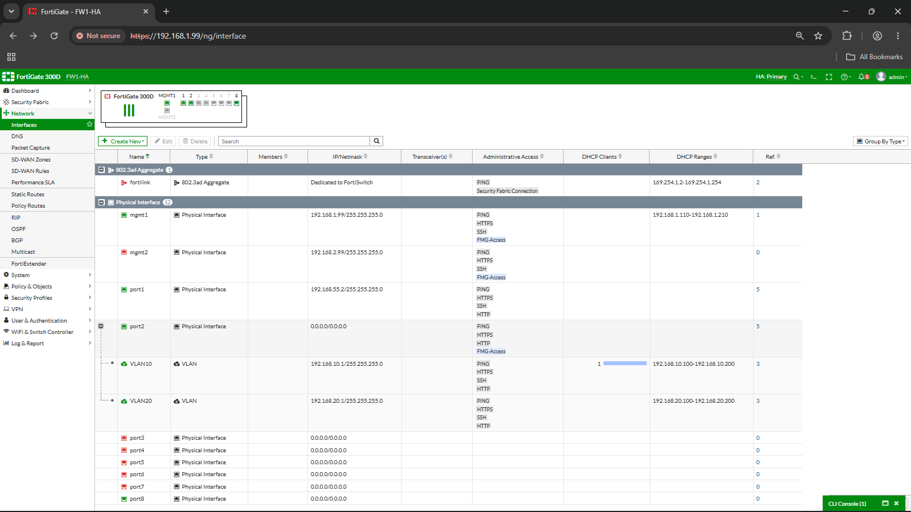

FortiGate is acting as the Layer-3 gateway for the VLAN networks.

This means inter-network forwarding and security decisions occur at the firewall rather than on the Layer-2 access switch.

---

## 18. Configure VLAN 10

VLAN 10 was created on `port2` with:

```text
Interface name: VLAN10
Parent interface: port2
VLAN ID: 10
Gateway IP: 192.168.10.1/24
DHCP range: 192.168.10.20 - 192.168.10.200
```

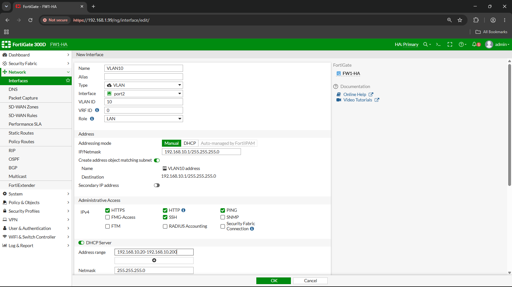

### What this configuration does

The FortiGate performs two roles for VLAN 10:

1. **Default gateway**
   - Clients use `192.168.10.1` when reaching other networks.

2. **DHCP server**
   - Clients can automatically obtain IPv4 settings instead of requiring static addresses.

---

## 19. Configure VLAN 20

VLAN 20 was configured similarly:

```text
Interface name: VLAN20
Parent interface: port2
VLAN ID: 20
Gateway IP: 192.168.20.1/24
DHCP range: 192.168.20.20 - 192.168.20.200
```

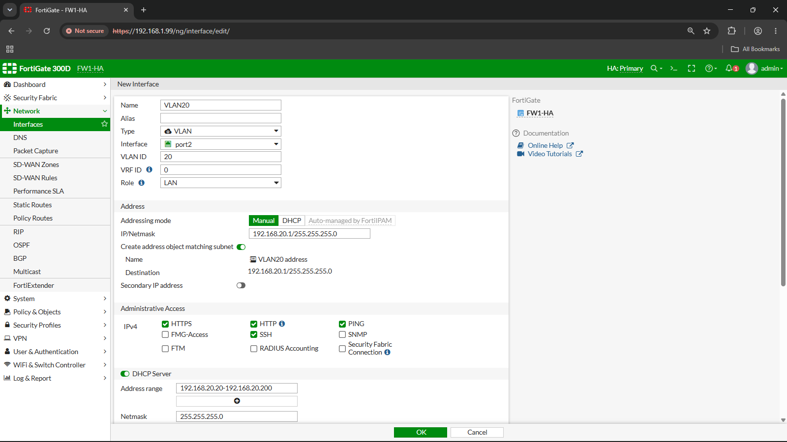

VLAN 10 and VLAN 20 are logically separate Layer-2 broadcast domains even though they travel through the same physical `port2` trunk.

---

# Part 6 — DNS and Firewall Policies

## 20. Configure DNS

DNS settings were configured on FortiGate.

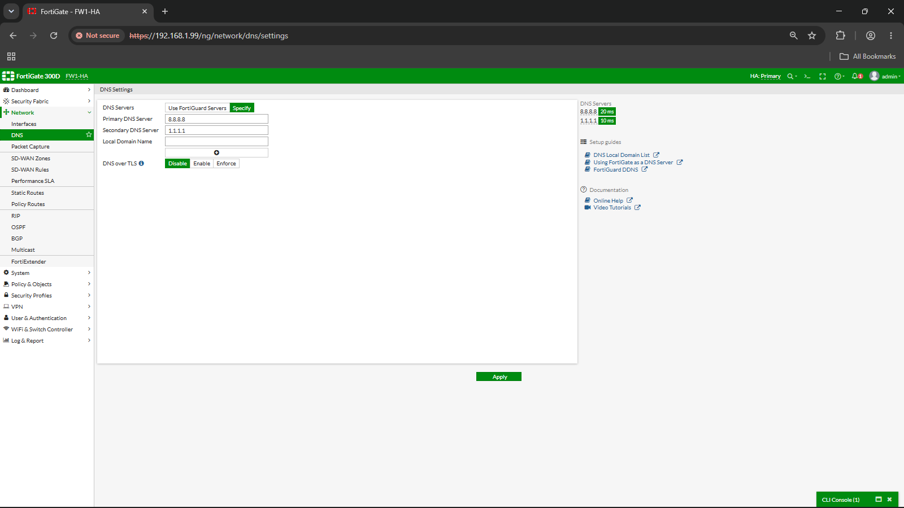

DNS is required for clients to translate domain names into IP addresses.

A client may successfully ping an Internet IP address but still be unable to open websites by name if DNS is not working.

Therefore Internet verification should ideally check both:

```text
IP reachability
DNS name resolution
```

---

## 21. Verify Firewall Policy List

The IPv4 firewall policy list was checked.

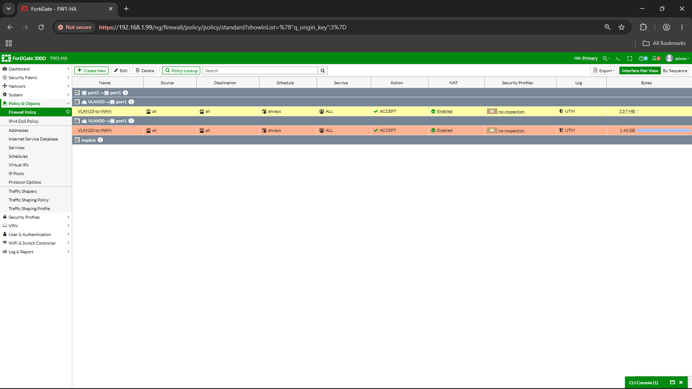

A route alone does not permit user traffic through FortiGate. The traffic must also match an allowed firewall policy.

This is a key FortiGate concept:

```text
Routing decides WHERE traffic should go.
Firewall policy decides WHETHER traffic is allowed to go there.
```

---

## 22. VLAN 10 to WAN Policy

A policy was configured to permit VLAN 10 clients to access the WAN.


The policy identifies the source interface/network and the WAN destination path.

For Internet-bound private addresses, source NAT is normally enabled so client addresses such as:

```text
192.168.10.x
```

can be translated to the FortiGate's WAN-side address.

---

## 23. VLAN 20 to WAN Policy

A separate policy was configured for VLAN 20.

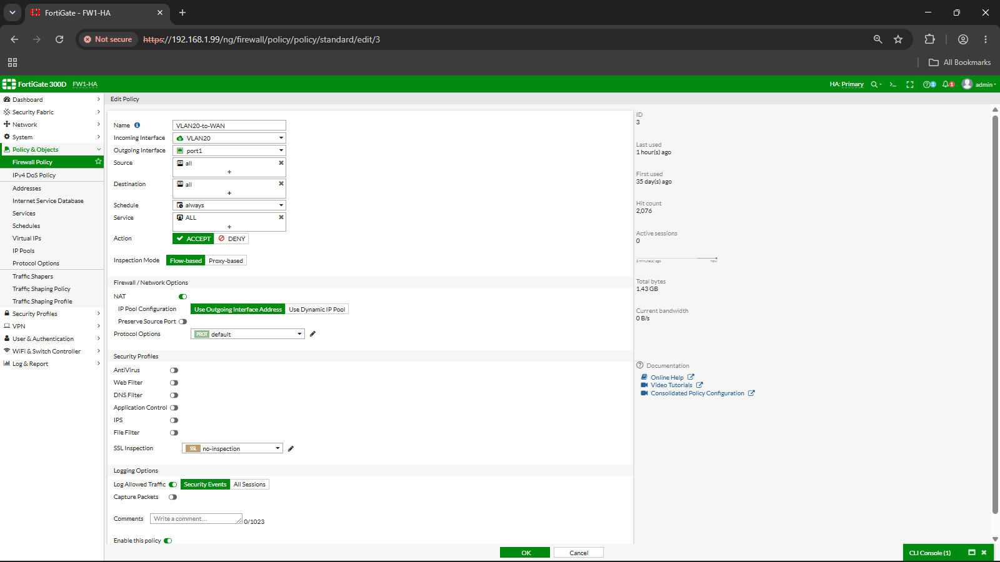

Keeping VLAN policies separate is useful because security rules can later be customized independently.

For example, an administrator could apply different:

- Web filtering.
- Application control.
- Logging.
- Schedules.
- Bandwidth restrictions.
- Destination restrictions.

to different VLANs.

---

# Part 7 — Connectivity Verification

## 24. Test WAN Reachability from FortiGate

A ping test was performed from FortiGate through the WAN side.

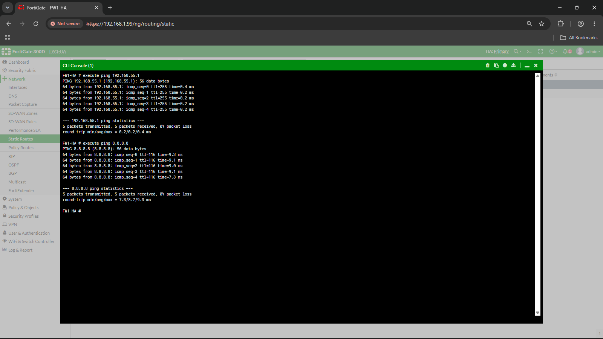

This verifies that the firewall itself can reach the upstream network.

This is an important troubleshooting step before testing client Internet access.

---

## 25. Test VLAN Gateway Reachability

The VLAN gateways were also tested.

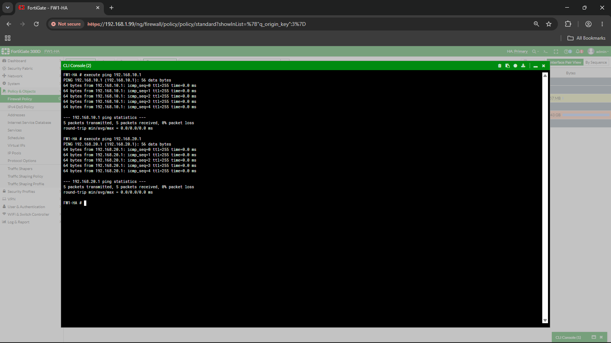

This helps verify that the configured Layer-3 interfaces are active.

---

## 26. Verify PC1 DHCP Lease in VLAN 10

PC1 successfully received addressing from the VLAN 10 DHCP scope.

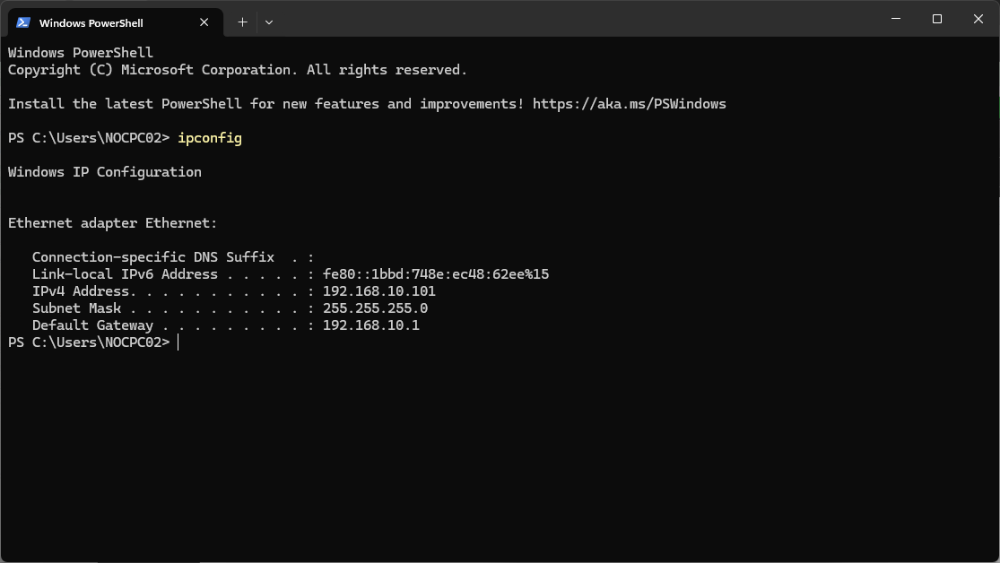

The screenshot demonstrates that the end host received the expected network configuration automatically.

The expected default gateway is:

```text
192.168.10.1
```

This confirms communication between the client, switch VLAN, trunk, and FortiGate DHCP service.

---

## 27. Verify PC2 DHCP Lease in VLAN 20

PC2 received a DHCP lease from the VLAN 20 scope.

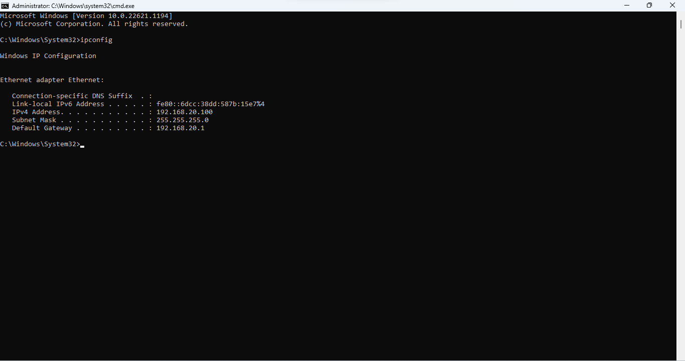

The expected default gateway is:

```text
192.168.20.1
```

This provides evidence that VLAN 20 tagging and DHCP forwarding/service are working correctly.

---

## 28. Trace the Path from PC2 Toward the Internet

`tracert` was used from PC2.

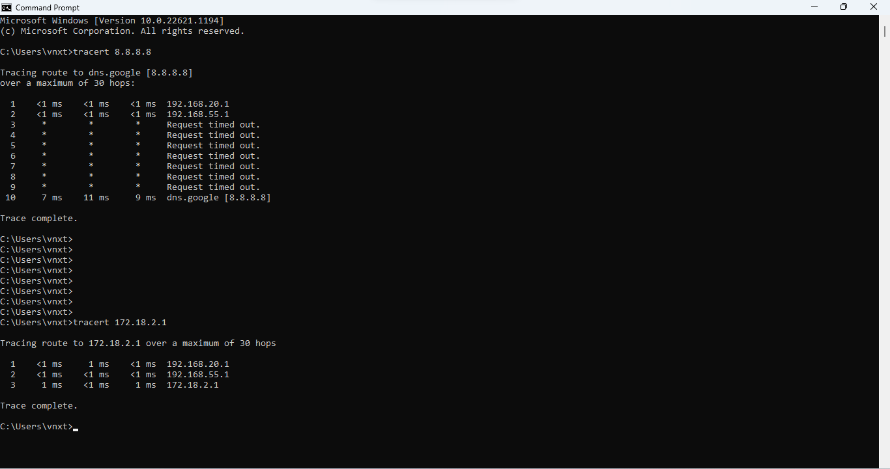

Traceroute is useful because it shows the Layer-3 path hop by hop.

The first hop from a VLAN 20 client should be its FortiGate gateway:

```text
192.168.20.1
```

The next routed hop should be toward the upstream network.

This confirms that traffic is not only reaching the local gateway but is being forwarded beyond the firewall.

---

# Part 8 — WAN Failure / Interface Monitoring Test

## 29. Disconnect the WAN Cable

A continuous ping was running while the WAN path was physically disconnected.

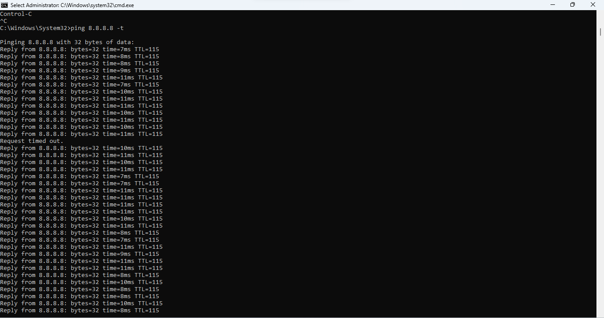

### Purpose of this test

The WAN interface is monitored by HA.

Therefore a WAN-side failure is more than a simple link problem—it is also an HA health event.

The lab checks whether the cluster detects the loss and whether service can recover through the surviving healthy firewall/path.

### Why continuous ping is useful

Continuous ping provides a simple real-time indication of:

- Packet loss.
- Failover interruption.
- Recovery time.
- Restoration of connectivity.

Some packet loss during a physical topology change can occur while interfaces, ARP entries, sessions, and HA roles converge.

---

## 30. Reconnect the WAN Cable

The WAN connection was restored while the ping test continued.

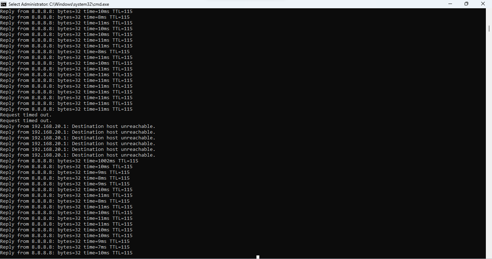

The return of successful replies demonstrates that upstream connectivity was restored.

This also allows observation of how the HA cluster behaves when the previously failed monitored interface becomes healthy again.

---

## 31. Verify HA Status After WAN Recovery

HA status was checked after reconnecting the WAN link.

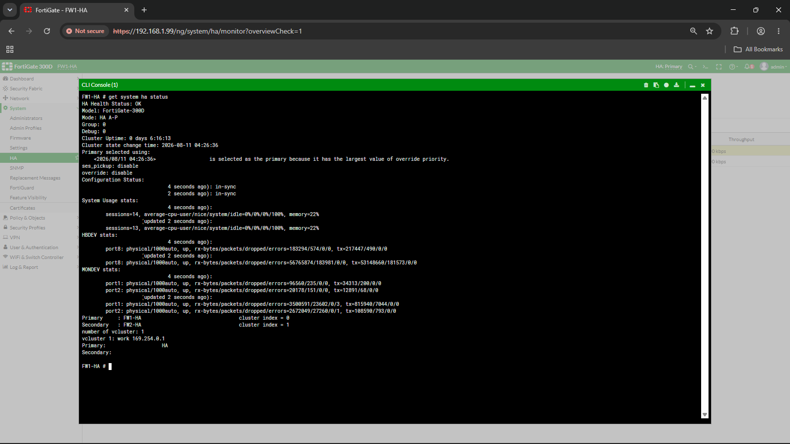

This confirms that the test was not evaluated only from the client side. The firewall cluster itself was also checked to validate member state and HA role information.

---

# Part 9 — Primary Firewall Power-Failure Test

## 32. Establish a Baseline Before Powering Off FW1

A continuous gateway ping was started before shutting down the preferred primary firewall.

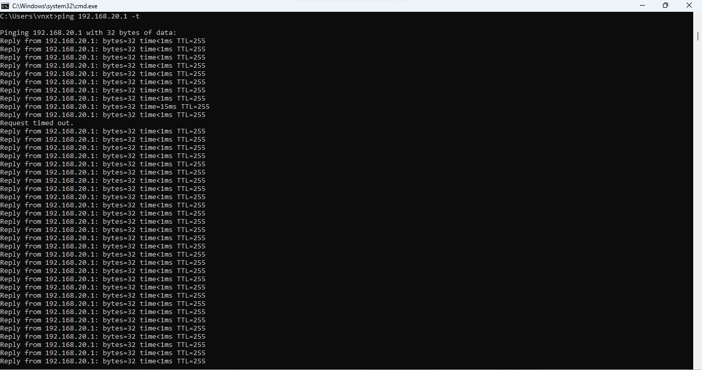

The baseline confirms that the client has stable connectivity immediately before the failure.

---

## 33. Observe Connectivity During/After FW1 Failure

FW1 was powered off and connectivity was monitored.

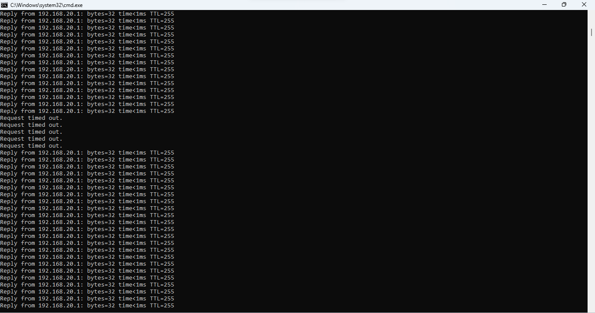

### What should happen in Active-Passive HA

When the active firewall becomes unavailable:

1. Heartbeat communication with that member is lost.
2. The surviving FortiGate recognizes the failure.
3. The standby unit transitions to primary.
4. The new primary begins forwarding production traffic.
5. Client traffic resumes through the surviving firewall.

A brief interruption may be visible depending on the type of failure and network convergence.

---

## 34. Verify FW2 Became Primary

During the FW1 power failure, FW2 was checked from the CLI.

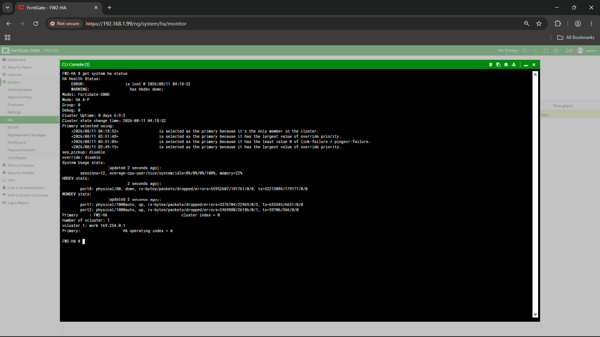

This is one of the most important screenshots in the project because it proves the actual HA role transition.

The standby firewall was not merely synchronized; it successfully assumed the active role when the original primary was unavailable.

**Failover result: PASS**

---

# Part 10 — FW1 Recovery, Rejoin, and Synchronization

## 35. FW1 Returns but Is Initially Out of Sync

After restoring power to FW1, the cluster showed that it had reappeared but was not yet fully synchronized.

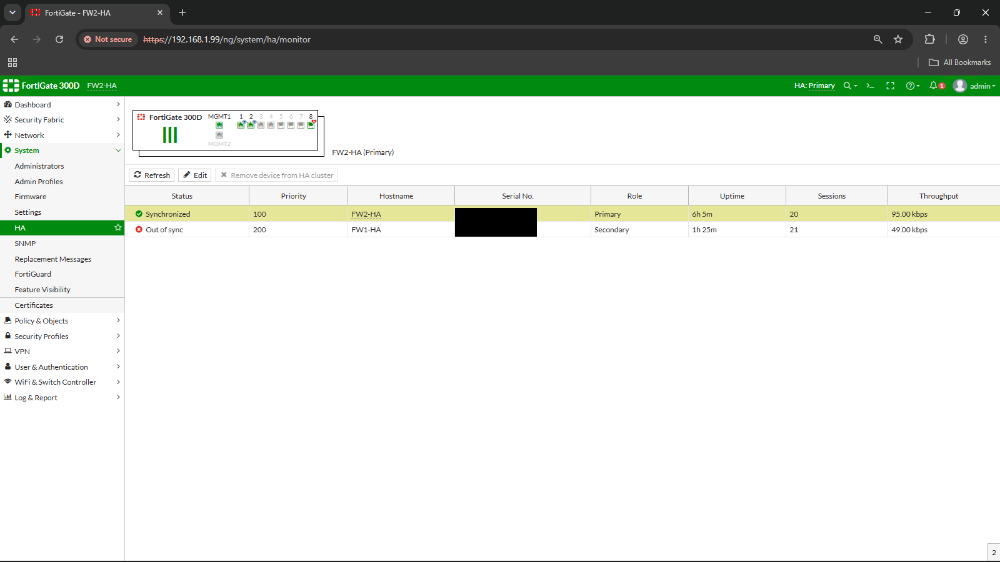

### Why this is normal during rejoin

A returning firewall does not instantly become a fully ready HA member.

It must:

- Re-establish heartbeat communication.
- Rejoin the cluster.
- Compare HA/configuration state.
- Synchronize required configuration/state.
- Become an eligible healthy member again.

Therefore an intermediate **out-of-sync** condition is important evidence of the recovery process rather than necessarily a permanent fault.

---

## 36. FW2 Remains Primary While FW1 Rejoins

The next screenshot shows FW2 continuing as primary while FW1 rejoins as the secondary member.

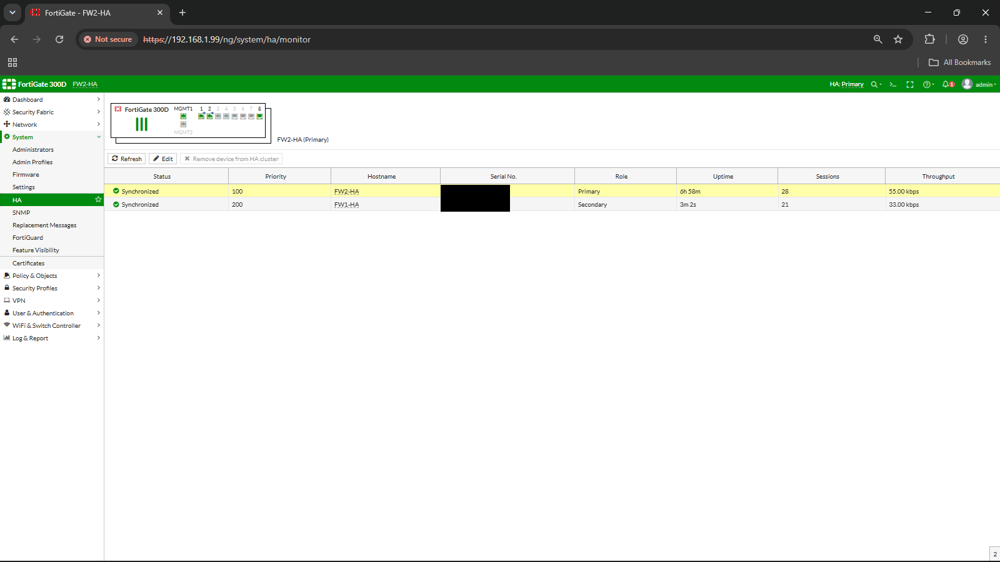

This protects service stability during the synchronization period.

The cluster does not need to immediately move production traffic back to a firewall that has only just returned.

---

## 37. Verify FW1 Rejoin and Uptime Reset

FW1's status was checked after it returned.

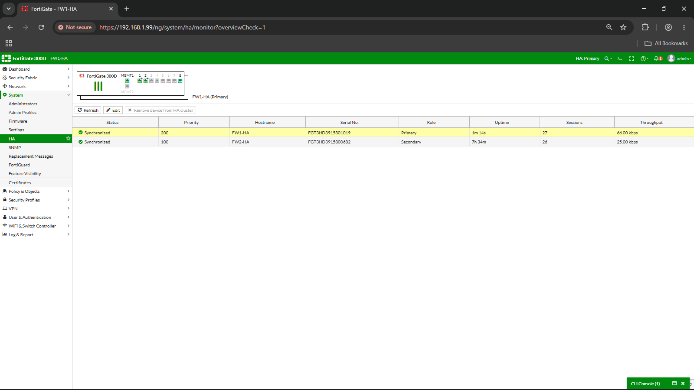

The reset/reduced uptime is useful evidence that the physical firewall was genuinely restarted rather than only administratively switching roles.

---

## 38. FW1 Resynchronizes and Regains Primary Role

After synchronization completed, FW1 again became primary.

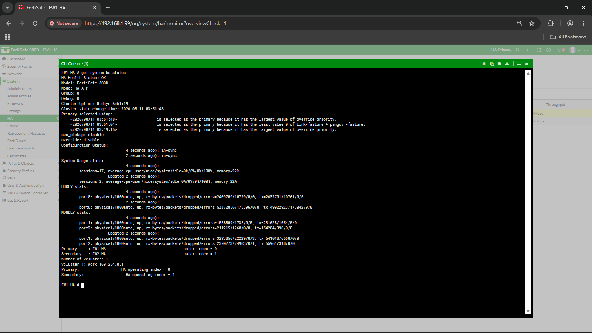

Because FW1 was configured with the higher HA priority, it is the preferred primary according to the lab design, subject to FortiGate's HA election behavior and configured override/election conditions.

The important point demonstrated here is that the cluster returned to the intended healthy operating state after the failed device came back.

---

## 39. Verify HA from the CLI

The cluster was verified using:

```bash
diagnose sys ha status
```

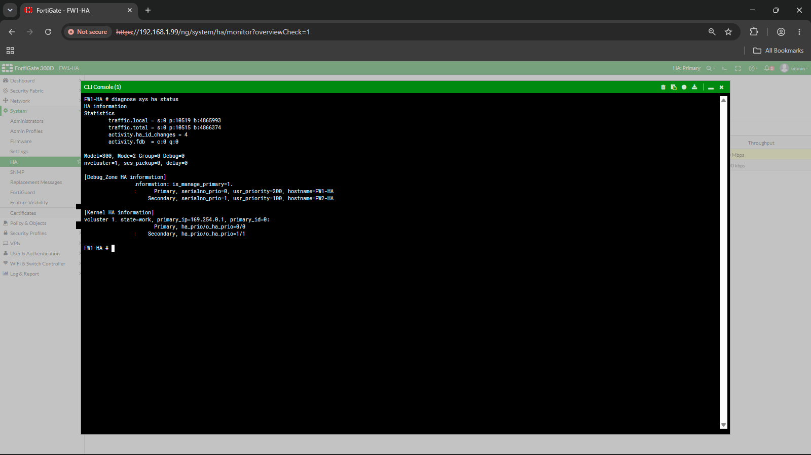

### Why CLI verification is valuable

The GUI is convenient, but CLI output is extremely useful during real troubleshooting.

`diagnose sys ha status` can help verify information such as:

- Cluster state.
- Member information.
- Primary/secondary roles.
- HA health.
- Synchronization.
- Election-related information.

This command is one of the key verification commands learned during this lab.

---

## 40. Final Healthy HA State

The final HA dashboard shows both members available and synchronized.

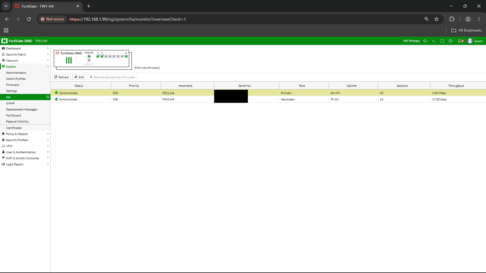

This is the final proof that the cluster successfully recovered after the failover tests.

**Final result: PASS**

---

# HA Failover Sequence Observed

The practical sequence of events in this lab can be summarized as:

```text
Normal State
FW1 = Primary
FW2 = Secondary
        ↓
FW1 or monitored path fails
        ↓
Heartbeat/health failure detected
        ↓
FW2 becomes Primary
        ↓
Traffic continues/recoveries through FW2
        ↓
FW1 is restored
        ↓
FW1 rejoins cluster
        ↓
FW1 initially synchronizes as returning member
        ↓
Cluster synchronization completes
        ↓
Preferred HA state is restored
```

---

# Important FortiGate HA Concepts Demonstrated

## Heartbeat

The heartbeat connection allows members to detect one another and exchange HA control information.

In this lab:

```text
Heartbeat interface = port8
```

A dedicated heartbeat is critical because HA decisions depend on reliable communication between cluster members.

---

## Device Priority

The configured priorities were:

```text
FW1 = 200
FW2 = 100
```

Priority is an HA election factor that helps control which member is preferred during role selection.

A higher number represents a stronger preference, although actual election behavior also depends on other HA settings and health conditions.

---

## Monitored Interfaces

The cluster monitored:

```text
port1
port2
```

Monitoring production interfaces allows HA to recognize that a firewall can be alive internally but unusable for traffic because an important network link has failed.

This is why HA design should consider **service health**, not only appliance power status.

---

## Configuration Synchronization

A secondary firewall must have a configuration compatible with the active member so it can take over.

The lab captured both:

```text
Synchronized state
Out-of-sync state during rejoin
Synchronized state after recovery
```

This made it possible to observe the full HA lifecycle rather than only the final result.

---

## Failover vs Failback

**Failover** occurs when the active unit or a monitored critical path fails and another member takes over.

**Failback** describes returning operation to the preferred member after the original problem has been corrected, depending on election/override behavior.

This lab demonstrated both a role transition during failure and restoration of the preferred final state.

---

# Verification Commands

Useful FortiGate CLI commands for this type of HA lab include:

```bash
get system status
get system ha status
diagnose sys ha status
diagnose sys ha checksum cluster
get router info routing-table all
get system interface
```

For connectivity testing:

```bash
execute ping 192.168.55.1
execute ping 8.8.8.8
```

On Windows clients:

```powershell
ipconfig /all
ping 192.168.10.1
ping 192.168.20.1
ping 8.8.8.8
ping <destination> -t
tracert 8.8.8.8
nslookup google.com
```

---

# Troubleshooting Method Learned

One of the most useful lessons from this lab is to troubleshoot in layers.

A good order is:

1. **Physical**
   - Power.
   - Ethernet/fiber cables.
   - Link LEDs.
   - HA heartbeat cable.

2. **Layer 2**
   - VLAN membership.
   - Trunk configuration.
   - Switch-port state.

3. **FortiGate interfaces**
   - WAN IP.
   - VLAN ID.
   - Interface status.
   - Administrative access when needed.

4. **Layer 3**
   - Default gateway.
   - Static route.
   - Client DHCP lease.
   - Ping gateway.

5. **Security policy**
   - Correct incoming interface.
   - Correct outgoing interface.
   - Source/destination objects.
   - Services.
   - NAT.

6. **HA**
   - Both members visible.
   - Correct primary/secondary role.
   - Synchronization status.
   - Heartbeat connectivity.
   - Monitored-interface state.

7. **End-to-end testing**
   - Client gateway ping.
   - Internet IP ping.
   - DNS lookup.
   - Traceroute.
   - Continuous ping during failure.

This approach prevents random configuration changes and helps isolate the actual failure domain.

---

# Test Results

| Test | Expected Result | Observed Result |
|---|---|---|
| HA heartbeat connection | Members communicate through port8 | PASS |
| FW1 HA configuration | Active-Passive with priority 200 | PASS |
| FW2 HA configuration | Active-Passive with priority 100 | PASS |
| Cluster formation | Both members join same HA cluster | PASS |
| Configuration synchronization | Both members show synchronized state | PASS |
| WAN configuration | FortiGate reaches upstream network | PASS |
| Default route | Internet-bound traffic uses `192.168.55.1` | PASS |
| VLAN 10 gateway | `192.168.10.1/24` operational | PASS |
| VLAN 20 gateway | `192.168.20.1/24` operational | PASS |
| VLAN 10 DHCP | PC receives VLAN 10 address | PASS |
| VLAN 20 DHCP | PC receives VLAN 20 address | PASS |
| VLAN 10 WAN policy | VLAN 10 traffic permitted to WAN | PASS |
| VLAN 20 WAN policy | VLAN 20 traffic permitted to WAN | PASS |
| Client routed path | Traceroute reaches upstream path | PASS |
| WAN cable failure | HA detects monitored-link problem/recovery | PASS |
| FW1 power failure | FW2 becomes primary | PASS |
| FW1 restoration | FW1 rejoins cluster | PASS |
| Synchronization after restore | Returning unit resynchronizes | PASS |
| Final cluster state | Both members healthy and synchronized | PASS |

---

# Key Learning Outcomes

### 1. HA is more than having two firewalls

Two appliances alone do not provide high availability. HA requires correct heartbeat connectivity, compatible configuration, health monitoring, synchronization, and failover testing.

### 2. A standby device must be tested

The purpose of the secondary firewall is to take over during a fault. This lab proved that FW2 could actually become primary when FW1 was powered off.

### 3. Interface monitoring improves availability

A firewall may still be powered on even when its WAN or LAN path is broken. Monitoring important interfaces helps HA make decisions based on network usability.

### 4. Synchronization must be verified

Seeing two members in an HA dashboard is not enough. Both devices should reach a synchronized state before the cluster is considered healthy.

### 5. Recovery is a process

When FW1 was restored, it did not instantly return to a fully synchronized state. The screenshots show the real sequence of rejoin, out-of-sync status, synchronization, and restoration of the preferred role.

### 6. Routing and firewall policy are separate

The default route provides a forwarding path, while firewall policies decide whether traffic is permitted. Both are required for successful Internet access.

### 7. VLAN gateways can be hosted directly on FortiGate

The FortiGate served as the Layer-3 gateway and DHCP server for VLAN 10 and VLAN 20 while enforcing security policies between LAN and WAN.

### 8. Continuous ping is a simple but effective HA test

Continuous ICMP testing makes packet loss and recovery visible during physical failover tests and provides practical evidence of service continuity.

### 9. GUI and CLI should both be used

The GUI gives an easy visual representation of HA state, while CLI commands such as `diagnose sys ha status` provide deeper operational verification.

### 10. High availability must be validated under failure

The most important lesson is that an HA configuration should not be considered complete until actual failures are introduced and recovery is observed.

---

# Conclusion

This lab successfully demonstrated a complete **FortiGate Active-Passive HA deployment** using two physical FortiGate firewalls.

The configuration included a dedicated heartbeat link, HA priorities, monitored WAN/LAN interfaces, WAN addressing, default routing, VLAN 10 and VLAN 20 gateways, DHCP, DNS, firewall policies, NAT, client connectivity testing, and multiple HA failure scenarios.

The strongest evidence from the lab is the physical failover test. When the preferred primary firewall was powered off, FW2 assumed the primary role. After FW1 was restored, it rejoined the cluster, passed through a temporary synchronization phase, returned to a healthy state, and the cluster ultimately returned to its intended synchronized configuration.

This project therefore demonstrates practical understanding of:

**FortiGate administration, HA clustering, redundancy, VLAN routing, DHCP, firewall policy, NAT, routing, switch connectivity, failover validation, synchronization, and structured network troubleshooting.**
