# Windows Server Infrastructure Lab Portfolio

## Overview

This repository documents a complete Windows Server learning path built across six practical labs. The work begins at the infrastructure layer with a physical HPE server and VMware ESXi, then moves into Windows Server 2019, Active Directory Domain Services, DNS, DHCP, Group Policy, and finally Organisational Unit (OU), user, group, and computer-account administration.

The purpose of this repository is to provide **evidence of practical learning**. Each section explains not only what was configured, but also what the screenshots prove, why the configuration is important, how it was verified, and what was learned from the activity.

---

## Lab Index

| Lab | Topic | Evidence Available |
|---|---|---|
| 01 | ESXi Server Setup | Physical server, internal hardware, POST/boot, ESXi login, ESXi dashboard, datastore/storage, architecture |
| 02 | Active Directory Domain Setup | Server Manager, domain controller properties, Windows client domain join |
| 03 | DNS Configuration | DNS Manager, forward lookup zone, reverse lookup zone/PTR records, `nslookup` verification |
| 04 | DHCP Configuration | Detailed configuration and verification notes |
| 05 | Group Policy Objects | GPO link/scope and policy settings |
| 06 | OU, Users & Groups Management | Detailed OU/user/group design notes and domain-join verification |

---

# 01. ESXi Server Setup

## Objective

Build the virtualization foundation for the Windows Server lab by preparing the physical server, verifying the hardware and boot process, accessing VMware ESXi, and confirming that the hypervisor and local storage are available for virtual-machine deployment.

This lab demonstrates that the Windows Server environment was not treated only as a software exercise. The physical server, server internals, hypervisor boot, management interface, and datastore were also examined.

---

## Physical Server

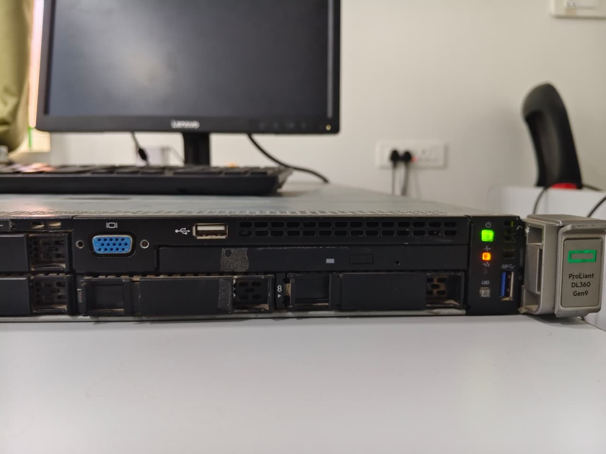

The physical server was used as the hardware platform for the virtualization lab. Checking the front of the server is useful for confirming power state, drive bays, status indicators, and physical access before beginning hypervisor work.

### Learning point

Enterprise virtualization depends on the health of the physical hardware underneath it. A VM may appear to be a software-only system, but CPU, memory, storage, power, and network failures at the host level directly affect every VM running on that host.

---

## Server Internal Hardware

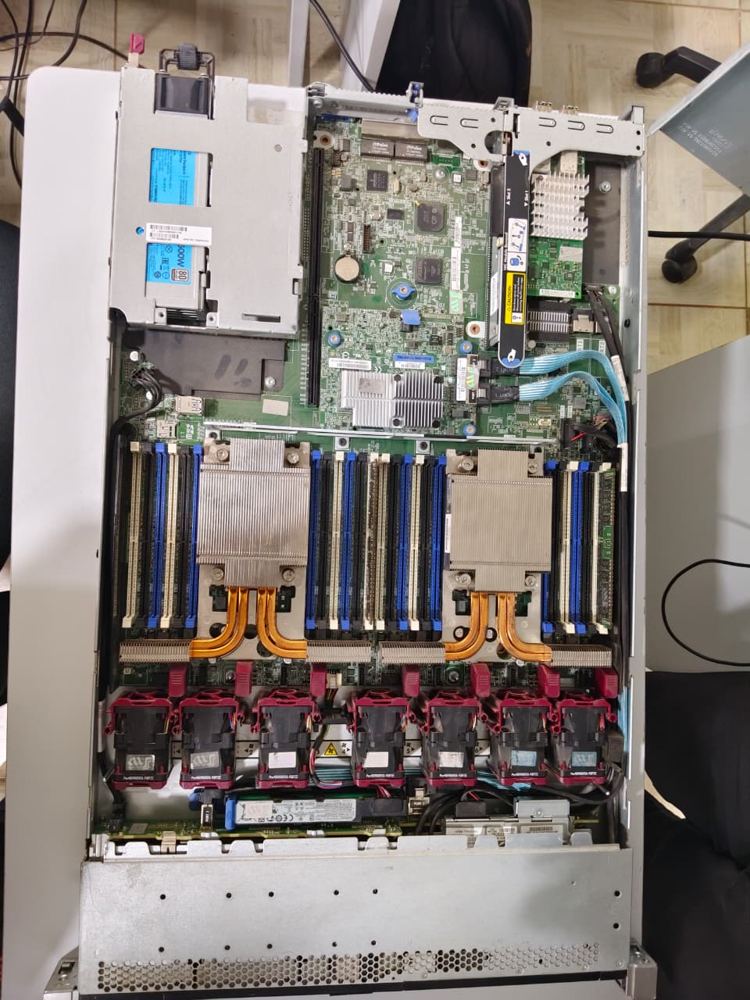

The server was opened and the internal hardware layout was inspected. This provides practical familiarity with components such as memory banks, processors/heat sinks, cooling fans, system board, storage backplane connections, and internal cabling.

### What this proves

This screenshot shows hands-on exposure to real server hardware rather than only virtualized lab software.

---

## POST / Hardware Health Check

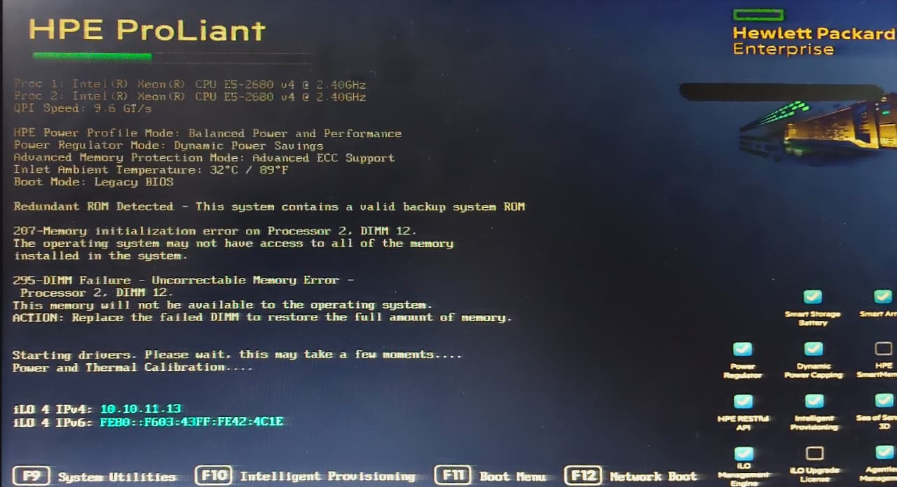

The server POST/management screen was observed during startup. The screenshot records the hardware initialization stage and a DIMM-related warning visible during the boot process.

### Why this matters

Before troubleshooting ESXi or Windows Server, hardware warnings should be checked first. A memory or hardware problem can cause instability at the hypervisor and virtual-machine layers.

A useful troubleshooting order is:

```text
Physical hardware
      ↓
Server POST / hardware health
      ↓
Hypervisor
      ↓
Virtual machine
      ↓
Guest operating system and services
```

---

## ESXi Boot

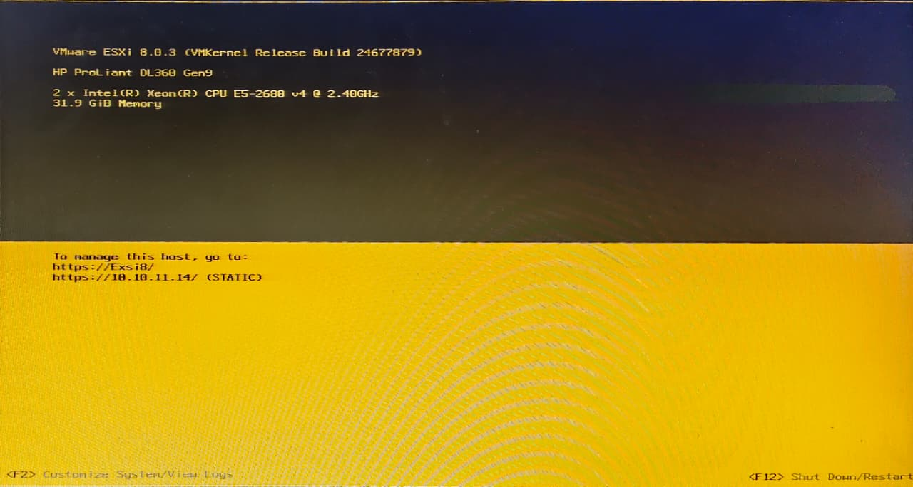

The ESXi boot screen confirms that the server was loading the VMware hypervisor from the installed boot device.

This stage is important because it verifies that the server successfully moved beyond POST and reached the hypervisor boot process.

---

## ESXi Host Client Login

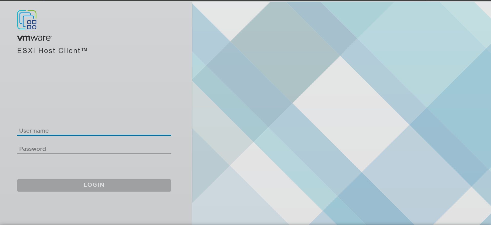

The VMware ESXi Host Client login page was reached successfully.

This confirms:

- The ESXi management service was available.
- The host was reachable over the network.
- Browser-based administration could be used for host and VM management.

---

## ESXi Dashboard Verification

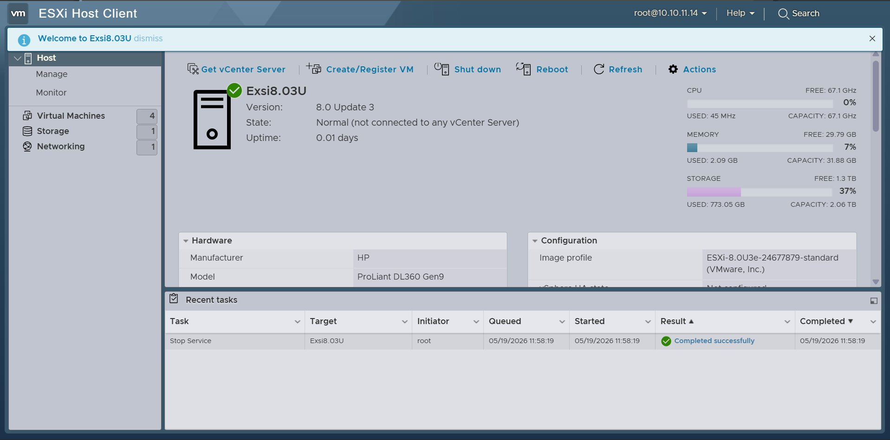

The ESXi Host Client dashboard was accessed after login.

The dashboard provides a central view of the host, including system status, virtual machines, resource usage, networking, and storage.

### What I learned

The ESXi host is the virtualization layer between the physical server and Windows Server VMs. The hypervisor controls how CPU, memory, storage, and network resources are presented to each virtual machine.

---

## Storage / Datastore Verification

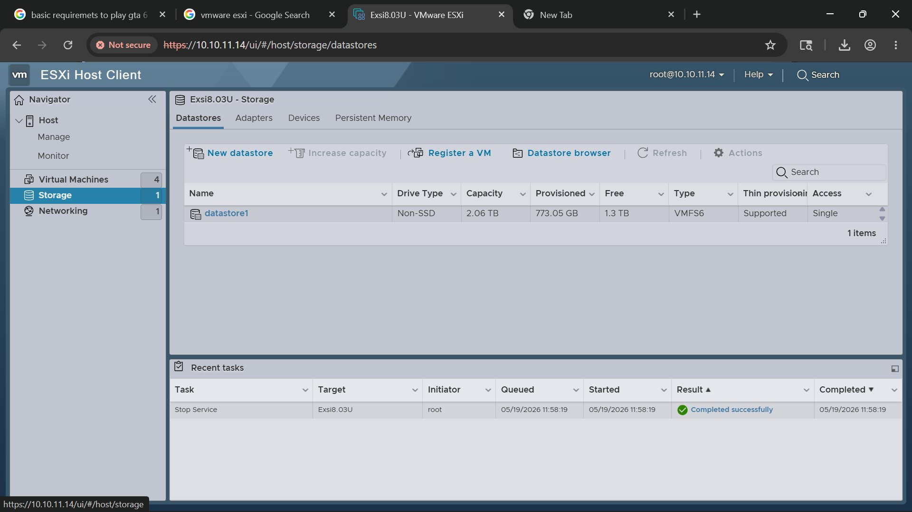

The ESXi storage view was checked to confirm that a datastore was available.

A datastore is required because virtual-machine files such as virtual disks, configuration files, snapshots, and supporting VM files must be stored somewhere accessible to the ESXi host.

### Verification goal

Before creating a Windows Server VM, confirm:

```text
ESXi host reachable       → Yes
Management GUI accessible → Yes
Datastore visible         → Yes
Host ready for VM work    → Yes
```

---

## Lab Architecture

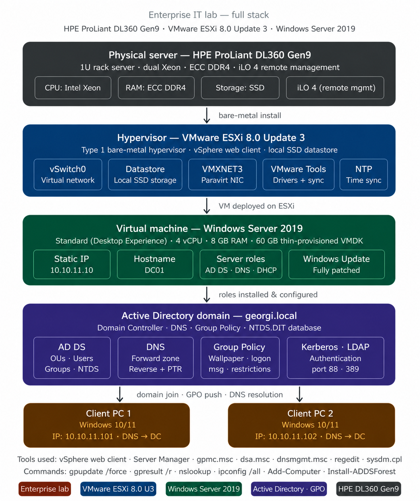

The architecture diagram documents the overall learning stack:

```text
Physical Enterprise Server
          ↓
VMware ESXi Hypervisor
          ↓
Windows Server Virtual Machine
          ↓
Active Directory / DNS / DHCP / Group Policy
          ↓
Windows Client Systems
```

This architecture is useful because every later Windows Server lab depends on the infrastructure created at this layer.

---

## Lab 01 Learning Outcomes

- Identified the relationship between physical server hardware and virtualization.
- Observed a real server POST/boot process.
- Recognized the importance of checking hardware warnings before software troubleshooting.
- Accessed the VMware ESXi Host Client.
- Verified the ESXi host dashboard.
- Verified datastore/storage availability.
- Understood that ESXi provides the platform on which the Windows Server lab can run.

---

# 02. Active Directory Domain Setup

## Objective

Prepare Windows Server 2019 as the central domain server, verify the Active Directory Domain Services and DNS roles, confirm the server's domain identity and IP configuration, and join a Windows client to the `mylab.local` domain.

---

## Windows Server Manager

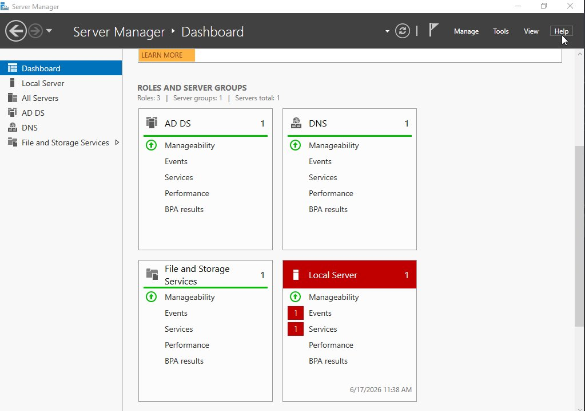

The Server Manager dashboard shows the Windows Server administration environment with roles including:

- **AD DS**
- **DNS**
- File and Storage Services
- Local Server

### What this proves

The screenshot confirms that the server had the Active Directory Domain Services and DNS roles available in Server Manager.

Active Directory and DNS are closely connected in a Windows domain because domain clients must be able to locate services such as domain controllers through DNS.

---

## Domain Controller Properties

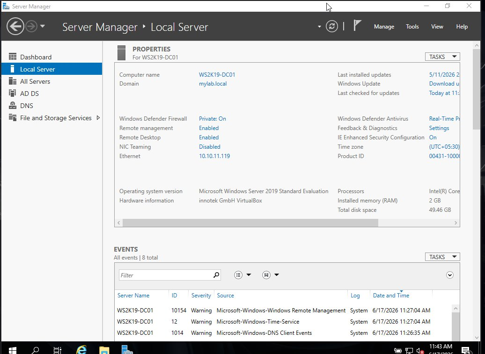

The Local Server view shows the domain controller identity and networking information.

Observed values include:

```text
Computer name : WS2K19-DC01
Domain        : mylab.local
Ethernet IP   : 10.10.11.119
```

### Why a static server IP matters

A domain controller and DNS server should use predictable addressing. Clients depend on the server's address for DNS and domain-related services, so changing the server IP unexpectedly can break authentication and name resolution.

---

## Windows Client Joined to the Domain

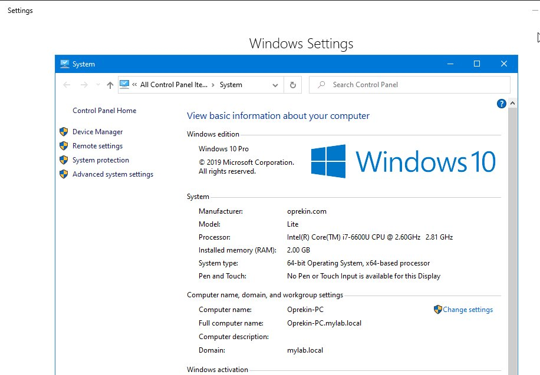

The Windows client System Properties page shows:

```text
Computer name      : Oprekin-PC
Full computer name : Oprekin-PC.mylab.local
Domain             : mylab.local
```

### What this proves

This is direct evidence that the Windows client became a member of the Active Directory domain.

Once a client is domain joined, it can participate in centralized functions such as:

- Domain authentication.
- Group Policy processing.
- Domain DNS registration.
- Centralized user and computer administration.
- Security-group based access control.

---

## Domain Join Logic

A simplified domain-join dependency is:

```text
Client has network connectivity
          ↓
Client uses the domain DNS server
          ↓
DNS can resolve mylab.local / DC records
          ↓
Client contacts the domain controller
          ↓
Computer account is created/recognized
          ↓
Client becomes a domain member
```

This is why DNS verification in Lab 03 is important for reliable Active Directory operation.

---

## Lab 02 Learning Outcomes

- Verified AD DS and DNS roles from Server Manager.
- Confirmed the domain controller hostname `WS2K19-DC01`.
- Confirmed the domain `mylab.local`.
- Confirmed the server address `10.10.11.119`.
- Joined `Oprekin-PC` to the domain.
- Verified the client's fully qualified domain name.
- Understood that domain join depends on correct DNS and network connectivity.

---

# 03. DNS Configuration

## Objective

Verify the DNS service used by the `mylab.local` Active Directory environment, inspect forward and reverse lookup zones, confirm PTR records, and test the DNS server from PowerShell using `nslookup`.

---

## DNS Manager Overview

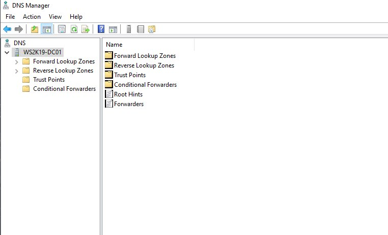

The DNS Manager console shows the DNS server:

```text
WS2K19-DC01
```

The console provides access to:

- Forward Lookup Zones
- Reverse Lookup Zones
- Trust Points
- Conditional Forwarders
- Root Hints
- Forwarders

This screenshot establishes that DNS administration was performed from the Windows DNS Manager console.

---

## Forward Lookup Zone

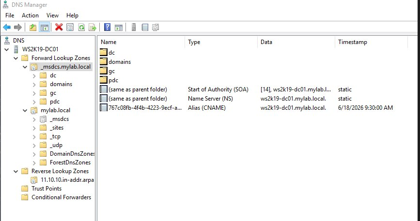

The forward lookup configuration includes Active Directory-related DNS zones such as:

```text
_msdcs.mylab.local
mylab.local
```

### What a forward lookup does

A forward lookup resolves a hostname into an IP address.

Example:

```text
WS2K19-DC01.mylab.local
             ↓
         IP address
```

For Active Directory, DNS is especially important because clients use DNS records to locate domain services and domain controllers.

### What the screenshot proves

The screenshot shows the AD-integrated DNS namespace and its associated records/subfolders.

---

## Reverse Lookup Zone and PTR Records

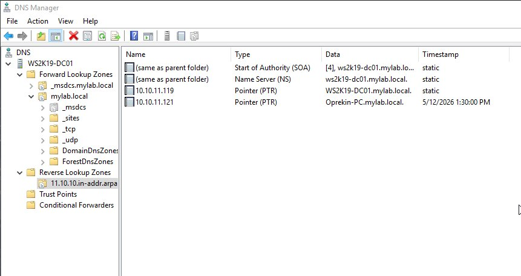

The reverse lookup zone shown is:

```text
11.10.10.in-addr.arpa
```

The screenshot contains PTR entries including mappings for the server and client.

Visible examples include addresses corresponding to:

```text
10.10.11.119 → WS2K19-DC01.mylab.local
10.10.11.121 → Oprekin-PC.mylab.local
```

### What a reverse lookup does

Reverse DNS performs the opposite operation of a forward lookup:

```text
IP address
    ↓
Hostname
```

PTR records are useful during troubleshooting, logging, administration, and services that expect reverse name resolution.

---

## DNS Verification with `nslookup`

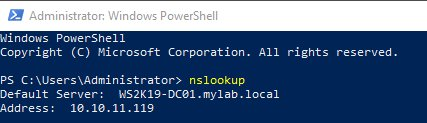

PowerShell `nslookup` shows:

```text
Default Server : WS2K19-DC01.mylab.local
Address        : 10.10.11.119
```

### What this proves

The system is using the Windows Server domain controller as its DNS server.

This verifies an important Active Directory requirement: domain clients should use the internal AD DNS service for domain name resolution rather than depending only on an external public DNS server.

---

## Useful DNS Verification Commands

```powershell
nslookup
nslookup WS2K19-DC01.mylab.local
nslookup Oprekin-PC.mylab.local
ipconfig /flushdns
ipconfig /displaydns
Resolve-DnsName WS2K19-DC01.mylab.local
```

These commands are useful for checking the DNS server being queried, validating hostname resolution, and clearing cached records during testing.

---

## Lab 03 Learning Outcomes

- Opened and navigated DNS Manager.
- Identified the AD DNS forward lookup zones.
- Verified the `mylab.local` namespace.
- Identified the reverse lookup zone.
- Understood the purpose of PTR records.
- Verified the DNS server using `nslookup`.
- Confirmed `WS2K19-DC01.mylab.local` at `10.10.11.119` as the DNS server shown in the test.
- Understood why DNS is a dependency for Active Directory domain operation.

---

# 04. DHCP Configuration

## Objective

Install and configure the DHCP Server role on Windows Server 2019, create an IPv4 scope for automatic client IP assignment, and verify that domain-joined clients receive network configuration correctly.

This lab was documented in the supplied Lab 04 notes.

---

## Environment

| Component | Configuration |
|---|---|
| Domain | `mylab.local` |
| Domain Controller | `WS2K19-DC01` |
| DHCP Scope | `10.10.11.50 - 10.10.11.100` |
| Subnet Mask | `255.255.255.0` |
| Default Gateway | `10.10.11.1` |
| DNS Server | `10.10.11.119` |
| DNS Domain | `mylab.local` |
| Lease Duration | 8 days |

---

## DHCP Concepts Learned

### DHCP

DHCP automatically supplies clients with network parameters such as:

```text
IPv4 address
Subnet mask
Default gateway
DNS server
DNS suffix
```

This avoids manually configuring every endpoint.

### DHCP Scope

The scope defines the address pool the server can lease to clients.

Configured scope:

```text
10.10.11.50 - 10.10.11.100
```

### Authorization

In this Active Directory environment, the DHCP server is authorized before serving domain clients.

This is an important administrative control because an unauthorized DHCP server can provide incorrect network settings to clients.

### Lease Duration

The configured lease duration is:

```text
8 days
```

A lease gives a client temporary permission to use an address and then renew it according to DHCP behavior.

---

## Step 1 — Install the DHCP Server Role

```text
Server Manager
→ Add Roles and Features
→ DHCP Server
→ Install
```

After installation, the post-deployment DHCP configuration must be completed.

---

## Step 2 — Complete DHCP Post-Deployment Configuration

```text
Server Manager
→ Notifications
→ Complete DHCP configuration
→ Use domain administrator credentials
→ Commit
```

This completes the AD-related DHCP setup described in the lab notes.

---

## Step 3 — Create the IPv4 Scope

```text
Scope Name      : Corporate-LAN
Start Address   : 10.10.11.50
End Address     : 10.10.11.100
Subnet Mask     : 255.255.255.0
Lease Duration  : 8 days
```

### Why exclusions/reservations matter

Infrastructure devices such as servers, printers, network appliances, or other systems that require fixed addresses should not accidentally receive a dynamic address from the normal client pool.

---

## Step 4 — Configure DHCP Scope Options

Important options configured in the lab:

```text
003 Router          : 10.10.11.1
006 DNS Servers     : 10.10.11.119
015 DNS Domain Name : mylab.local
```

### Why these options are important

**003 Router** gives the client its default gateway.

**006 DNS Server** tells the client to use the domain DNS server.

**015 DNS Domain Name** provides the DNS domain suffix.

A client receiving only an IPv4 address is not enough. It also needs the correct gateway and DNS information to communicate properly with the domain and other networks.

---

## Step 5 — Activate the Scope

```text
DHCP Console
→ IPv4
→ Scope
→ Activate
```

An inactive scope will not provide leases.

---

## Step 6 — Verify the DHCP Service

```powershell
Get-Service DHCPServer
Get-DhcpServerv4Scope
Get-DhcpServerv4ScopeStatistics
```

Expected checks include:

```text
DHCP service = Running
Scope        = Active
```

---

## Step 7 — Force a Client to Request a New Lease

On the client:

```cmd
ipconfig /release
ipconfig /renew
ipconfig /all
```

The expected client configuration should include:

```text
IPv4 Address    : within 10.10.11.50 - 10.10.11.100
Subnet Mask     : 255.255.255.0
Default Gateway : 10.10.11.1
DHCP Server     : 10.10.11.119
```

---

## Step 8 — View Active Leases

PowerShell:

```powershell
Get-DhcpServerv4Lease -ScopeId 10.10.11.0
```

GUI:

```text
DHCP Console
→ IPv4
→ Scope
→ Address Leases
```

The lease table is useful for identifying which client received an address, its MAC address, and its lease period.

---

## DHCP Troubleshooting Notes

| Problem | Likely Area to Check |
|---|---|
| Client receives `169.254.x.x` | DHCP reachability, server authorization, scope activation |
| Client gets IP but cannot resolve domain names | DHCP option 006 / DNS configuration |
| Client has old address | Release and renew the DHCP lease |
| Address conflicts | Scope exclusions, reservations, or static addressing design |

---

## Lab 04 Learning Outcomes

- Installed and configured the DHCP Server role.
- Understood DHCP authorization in an AD environment.
- Created an IPv4 scope.
- Configured gateway, DNS, and domain-name scope options.
- Activated the scope.
- Used PowerShell to verify DHCP.
- Used `ipconfig /release` and `/renew` for testing.
- Understood the relationship between DHCP and DNS.

> Dedicated Lab 04 screenshots were not included in the uploaded screenshot archives; this section is based on the supplied Lab 04 README documentation.

---

# 05. Group Policy Objects

## Objective

Apply centralized Windows policy settings through Group Policy, link a GPO to the required OU, and verify the configured password and interactive-logon settings from Group Policy Management.

---

## GPO Link and Scope

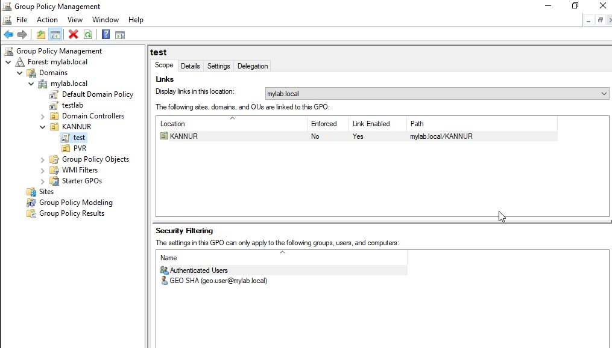

The Group Policy Management screenshot shows a GPO named:

```text
test
```

linked to the:

```text
KANNUR
```

OU.

The screenshot also shows the GPO scope and security filtering information.

### Why linking matters

Creating a GPO by itself does not automatically apply it to every user or computer.

The GPO must be linked to the domain, site, or OU that contains the target objects.

The visible link demonstrates that this policy was associated with the `KANNUR` OU.

---

## Security Filtering

The GPO scope screenshot includes security-filtering entries.

Security filtering is important because it provides another level of control over which authenticated users, groups, or computers are permitted to apply a GPO.

This means Group Policy targeting depends on more than simply creating settings; the administrator must also understand **where the policy is linked** and **who is allowed to apply it**.

---

## Password Policy and Logon Banner

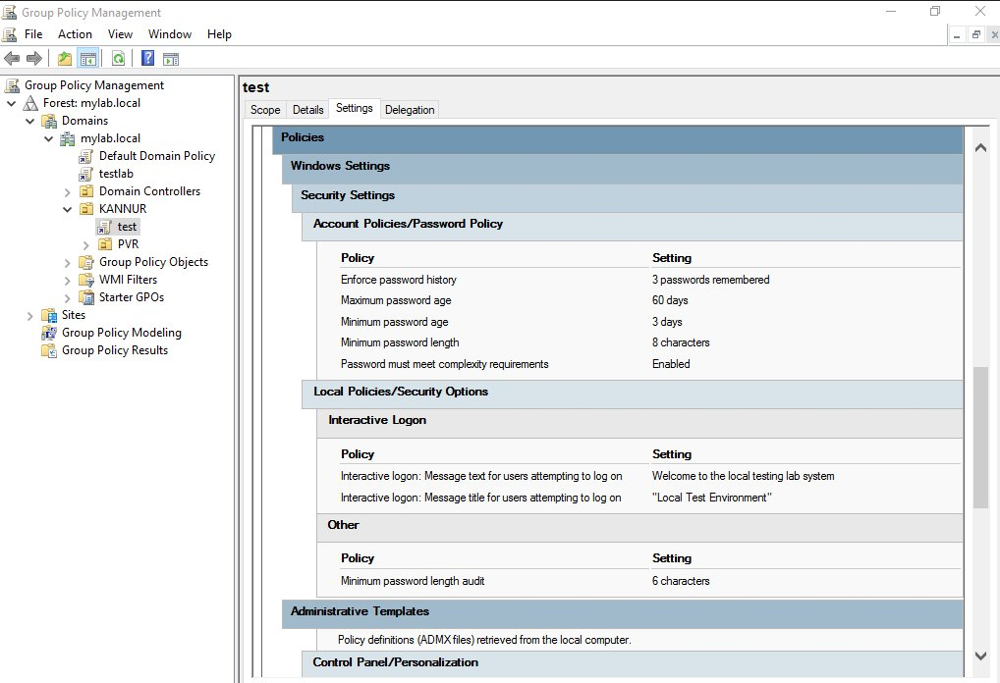

The Settings view provides visible evidence of the configured policy values.

Observed password settings include:

```text
Enforce password history     : 3 passwords remembered
Maximum password age         : 60 days
Minimum password age         : 3 days
Minimum password length      : 8 characters
Password complexity          : Enabled
```

Interactive-logon settings include a legal/logon notice with text similar to:

```text
Message title : Local Test Environment
Message text  : Welcome to the local testing lab system
```

### What this proves

The screenshot demonstrates that the GPO contains both:

- Account/password security settings.
- Interactive logon/message settings.

This provides practical evidence of centralized policy management through Group Policy.

---

## Why Group Policy Is Important

Group Policy allows administrators to configure many systems consistently rather than making the same setting manually on each client.

The general management flow is:

```text
Create / edit GPO
       ↓
Configure settings
       ↓
Link GPO to target OU
       ↓
Apply security filtering if required
       ↓
Client/user processes Group Policy
       ↓
Verify effective configuration
```

---

## Useful Group Policy Verification Commands

On a domain client:

```cmd
gpupdate /force
gpresult /r
```

For a more detailed report:

```cmd
gpresult /h C:\gpresult.html
```

These commands help confirm whether the expected GPO reached the target system/user.

---

## Lab 05 Learning Outcomes

- Opened and used Group Policy Management.
- Understood that GPO settings must be linked to a target scope.
- Linked a GPO to an OU.
- Observed security filtering.
- Configured password-policy settings.
- Configured an interactive-logon message.
- Learned to distinguish policy configuration from policy application.
- Learned that GPO troubleshooting should include both the link location and the target/security scope.

---

# 06. OU, Users & Groups Management

## Objective

Design an Organisational Unit structure in the `mylab.local` domain, create department-based user and security-group organization, and place client computer accounts in the appropriate OU so that administration and Group Policy can be targeted logically.

This section is based on the supplied Lab 06 documentation.

---

## Environment

| Component | Value |
|---|---|
| Domain | `mylab.local` |
| Domain Controller | `WS2K19-DC01` |
| Client | `Oprekin-PC.mylab.local` |

---

## OU Structure

The documented OU design is:

```text
mylab.local
└── _MYLAB
    ├── Departments
    │   ├── Sales
    │   │   ├── Users
    │   │   └── Computers
    │   ├── IT
    │   │   ├── Users
    │   │   └── Computers
    │   └── HR
    │       ├── Users
    │       └── Computers
    └── Groups
        └── Security Groups
```

### Why this structure is useful

The hierarchy separates users and computers by business department.

This makes administration easier because:

- Department users can be managed together.
- Computer accounts can be placed in department-specific OUs.
- GPOs can be linked to the correct organizational level.
- Permissions can be assigned through security groups instead of directly to every user.

---

## Step 1 — Create the OU Structure

```text
Active Directory Users and Computers
→ Right-click mylab.local
→ New
→ Organizational Unit
→ Name: _MYLAB
```

Then create:

```text
_MYLAB
├── Departments
│   ├── Sales
│   ├── IT
│   └── HR
└── Groups
    └── Security Groups
```

Each department can contain separate `Users` and `Computers` OUs.

---

## Step 2 — Create User Accounts

Example documented user:

```text
First name : John
Last name  : Sales
Logon      : j.sales@mylab.local
```

The lab documentation specifies placing the account under:

```text
_MYLAB
→ Departments
→ Sales
→ Users
```

### Learning point

Placing a user in the correct OU is important because Group Policy targeting is based on Active Directory location and scope.

---

## Step 3 — Create Security Groups

The documented department security groups include:

```text
GRP_Sales
GRP_IT
GRP_HR
```

The documented configuration uses:

```text
Group scope : Global
Group type  : Security
```

### Why groups are useful

Instead of assigning resource permissions separately to every user, permissions can be granted to the appropriate security group.

Then administrators manage access by changing group membership.

---

## Step 4 — Add Users to Groups

Example:

```text
GRP_Sales
     ↓
Members
     ↓
j.sales
```

The documented verification method is:

```text
Right-click group
→ Properties
→ Members
```

This confirms that the user was added to the intended security group.

---

## Step 5 — Move the Computer Account

The documented client is:

```text
Oprekin-PC
```

After a machine joins the domain, its computer object may initially be found in the default Computers container.

The documented lab process moves it to:

```text
_MYLAB
→ Departments
→ IT
→ Computers
```

### Why this matters

Computer Configuration policies linked to the IT OU are targeted to computer objects located within that OU structure.

---

## Step 6 — Verify the Client Domain Join

The Lab 06 documentation uses the domain-join evidence captured earlier in Lab 02.


Visible values include:

```text
Full computer name : Oprekin-PC.mylab.local
Domain             : mylab.local
```

This confirms that the client is a member of the domain before OU/GPO administration is applied to it.

---

## Group Scope Concepts Recorded in the Lab

### Global Group

Used in the lab for department role groups.

### Domain Local Group

Documented as a scope commonly used when assigning access to resources in the same domain.

### Universal Group

Documented for scenarios involving multiple domains within a forest.

---

## OU / User / Group Verification Checklist

| Check | Verification |
|---|---|
| Company OU exists | `_MYLAB` visible in ADUC |
| Department OUs exist | Sales, IT, HR visible |
| User is in correct OU | User appears below department `Users` OU |
| Security groups exist | `GRP_Sales`, `GRP_IT`, `GRP_HR` |
| User is group member | Group Properties → Members |
| Client joined to domain | System Properties shows `mylab.local` |
| Computer in intended OU | Computer object visible under department `Computers` OU |

---

## Troubleshooting Lessons

### GPO does not apply

Check whether the user or computer object is located in the OU where the GPO is linked.

### New group membership is not effective

A new sign-in session may be required so the user's security token reflects the updated membership.

### Computer account is in the wrong location

Move the computer object from the default container into the intended departmental Computers OU.

---

## Lab 06 Learning Outcomes

- Designed a business-oriented OU structure.
- Separated users and computers into department OUs.
- Created user accounts.
- Created Global Security groups.
- Added users to the correct groups.
- Moved a computer object into the correct OU.
- Connected OU placement with Group Policy targeting.
- Understood why group-based permissions are easier to administer than per-user permissions.

> No separate Lab 06 screenshot archive was supplied. The client domain-join screenshot from Lab 02 is reused because the supplied Lab 06 documentation explicitly uses that evidence for domain-join verification.

---

# Overall Windows Server Learning Flow

These six labs connect together rather than operating as isolated topics:

```text
01. Physical Server + ESXi
             ↓
02. Windows Server + Active Directory
             ↓
03. DNS for domain name resolution
             ↓
04. DHCP for automatic client addressing
             ↓
05. Group Policy for centralized configuration
             ↓
06. OU / Users / Groups for structured administration
```

The later labs depend on concepts established in the earlier labs.

For example:

- Active Directory depends heavily on DNS.
- DHCP can distribute the domain DNS server to clients.
- Group Policy depends on domain membership and correct OU placement.
- Users and groups provide identity and authorization structure.
- ESXi provides the virtualization platform underneath the Windows Server services.

---

# Overall Verification Checklist

| Area | Practical Evidence |
|---|---|
| Physical infrastructure | HPE server and internal hardware inspected |
| Hypervisor | ESXi boot and Host Client verified |
| Storage | ESXi datastore verified |
| Windows Server | Server Manager and local-server properties verified |
| Domain Controller | `WS2K19-DC01` in `mylab.local` |
| Client domain membership | `Oprekin-PC.mylab.local` |
| DNS | Forward/reverse zones and `nslookup` verified |
| DHCP | Scope, options, lease workflow documented |
| Group Policy | OU link, password policy and logon message captured |
| AD organization | OU, users and security-group structure documented |

---

# Useful Commands Learned Across the Labs

## Windows Networking

```cmd
ipconfig /all
ipconfig /release
ipconfig /renew
ipconfig /flushdns
nslookup
ping <destination>
```

## DNS

```powershell
Resolve-DnsName <hostname>
```

## DHCP

```powershell
Get-Service DHCPServer
Get-DhcpServerv4Scope
Get-DhcpServerv4ScopeStatistics
Get-DhcpServerv4Lease -ScopeId 10.10.11.0
```

## Group Policy

```cmd
gpupdate /force
gpresult /r
gpresult /h C:\gpresult.html
```

---

# Key Skills Demonstrated

This portfolio provides evidence of practical exposure to:

- Enterprise server hardware.
- VMware ESXi administration.
- Hypervisor storage/datastore verification.
- Windows Server 2019.
- Active Directory Domain Services.
- Windows domain join.
- DNS forward and reverse lookup configuration.
- PTR records.
- DHCP server configuration.
- DHCP authorization, scopes and leases.
- Group Policy Management.
- Password and interactive-logon policies.
- Organisational Unit design.
- User and computer administration.
- Security groups and group membership.
- Structured troubleshooting and verification.

---

# Conclusion

This Windows Server lab series demonstrates a complete infrastructure learning path from physical hardware and virtualization through core Windows enterprise services.

The practical work shows how the individual technologies connect:

**ESXi hosts the server environment, Active Directory provides centralized identity, DNS allows domain services to be located, DHCP automates client addressing, Group Policy applies centralized configuration, and OU/user/group design provides structured administration.**

The screenshots and configuration notes in this repository are retained as practical proof of the setup, verification process, and concepts learned during each lab.
