# Wireshark Traffic Analysis Lab — ARP, ICMP, TCP, UDP, DNS & MAC Learning

## Overview

This practical lab uses **Wireshark, Windows Command Prompt, a Cisco switch, and two client systems** to observe how common network protocols operate in real traffic.

The lab focuses on:

- ARP address resolution
- ICMP echo request/reply traffic
- TCP three-way handshake
- DNS resolution over UDP
- HTTPS/TCP traffic
- TCP vs UDP behavior
- Cisco switch MAC address learning

The screenshots in this repository were captured during the actual lab and are used below as verification evidence.

---

## Lab Environment

| Component | Purpose |
|---|---|
| Wireshark | Packet capture and protocol analysis |
| Windows PC / Laptop | Ping, DNS lookup, browser and packet-generation tests |
| Cisco Switch | Layer-2 forwarding and MAC address learning |
| PC1 | `192.168.10.10/24` |
| PC2 | `192.168.10.20/24` |
| Web Browser | HTTPS traffic generation |
| Command Prompt / PowerShell | `ping`, `arp`, `ipconfig`, and `nslookup` testing |

---

## Basic Topology

```text
+--------------------+        +-------------------+        +--------------------+
|       PC1          |        |   Cisco Switch    |        |        PC2         |
| 192.168.10.10/24   |--------|   Layer 2 LAN     |--------| 192.168.10.20/24   |
+--------------------+        +-------------------+        +--------------------+
          |
          |
          +---- Wireshark capture / Internet tests
```

---

# Lab 1 — ARP Resolution Analysis

## Objective

Understand how a host discovers the destination MAC address before sending IP traffic on the local network.

Before the test, the ARP cache was cleared and PC1 pinged PC2.

```powershell
arp -d *
ping 192.168.10.20
```

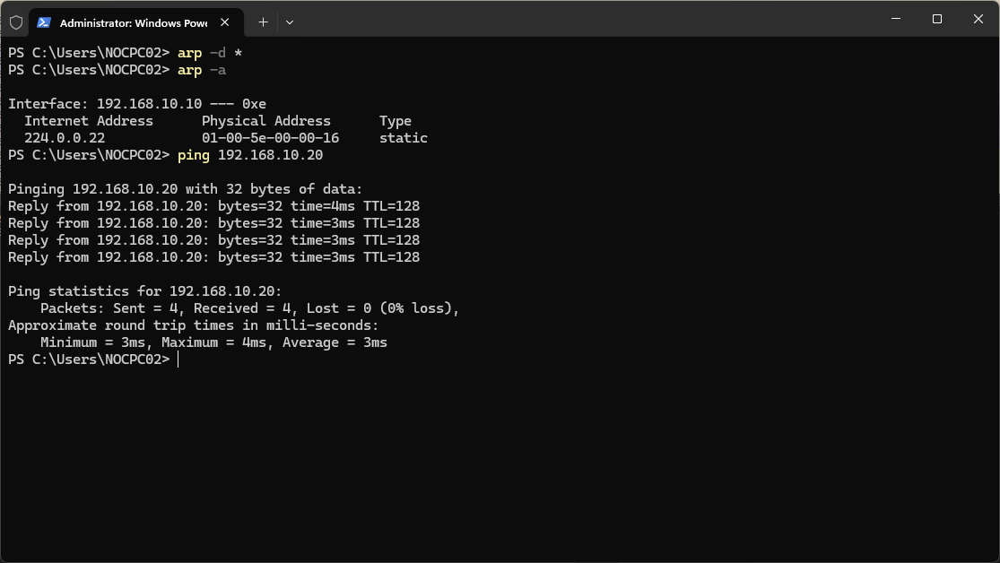

### ARP Request

The first ARP frame is a **broadcast** asking which device owns the target IP address.

Typical behavior:

```text
Who has 192.168.10.20? Tell 192.168.10.10
Destination MAC: ff:ff:ff:ff:ff:ff
```

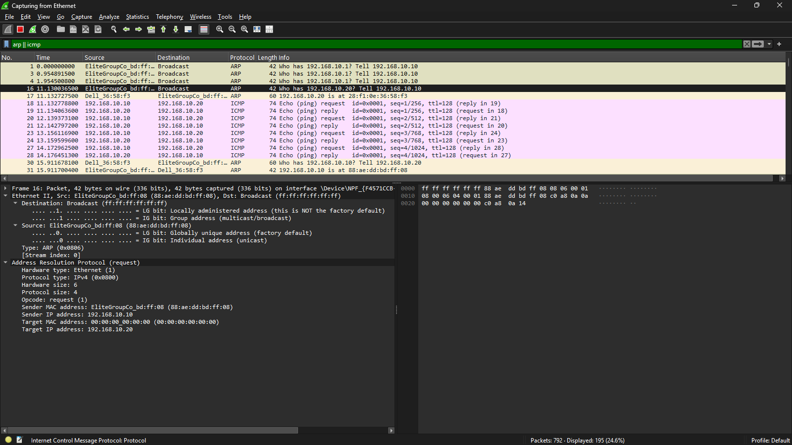

### ARP Reply

PC2 responds directly to PC1 with its MAC address. Unlike the ARP Request, the reply is normally **unicast**.

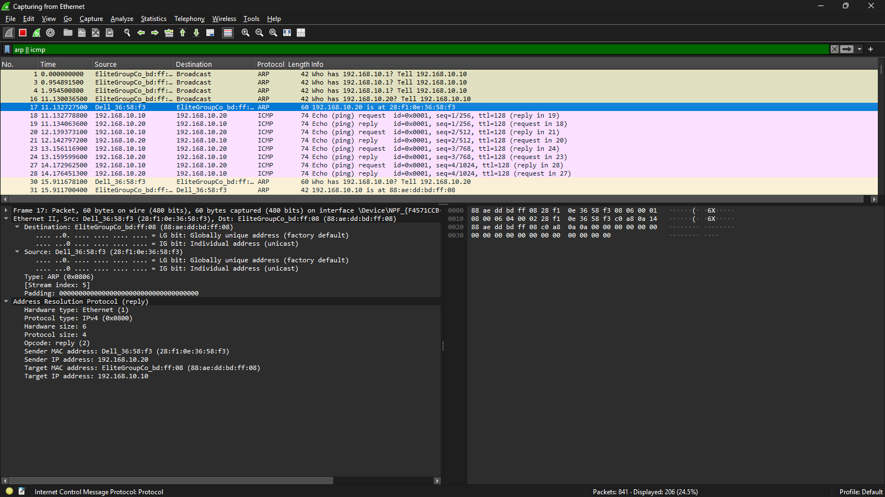

### ICMP After ARP Resolution

After ARP resolution completes, PC1 can send the ICMP Echo Request to PC2 using the learned destination MAC address.

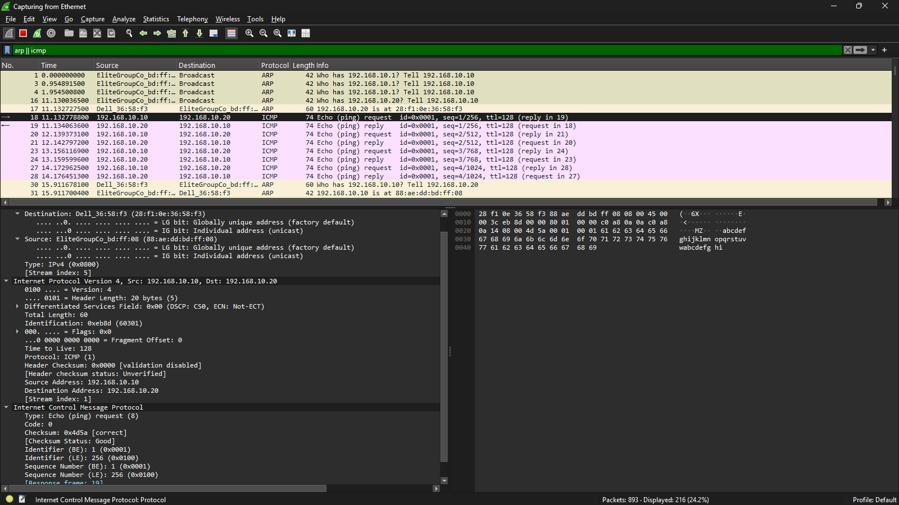

PC2 then returns an ICMP Echo Reply.

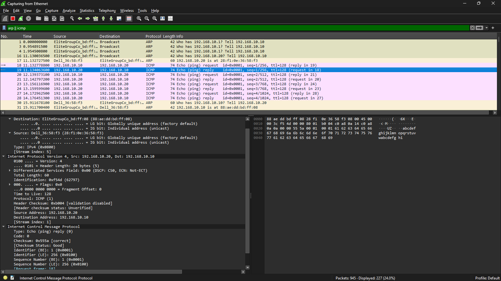

### Key Observation

ARP normally occurs before the first local-IP communication when the destination MAC is not already known. Once the mapping is stored in the ARP cache, later packets can be sent without repeating ARP immediately.

---

# Lab 2 — ICMP Packet Analysis

## Objective

Analyze ICMP Echo Request and Echo Reply packets and observe fields such as TTL, sequence number, packet length, and response time.

Connectivity tests were generated using public destinations and DNS services.

```powershell
ping google.com
ping 8.8.8.8
```

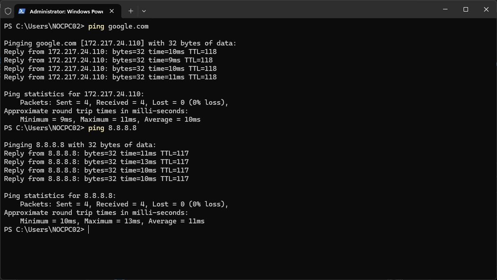

Wireshark display filter:

```text
icmp
```

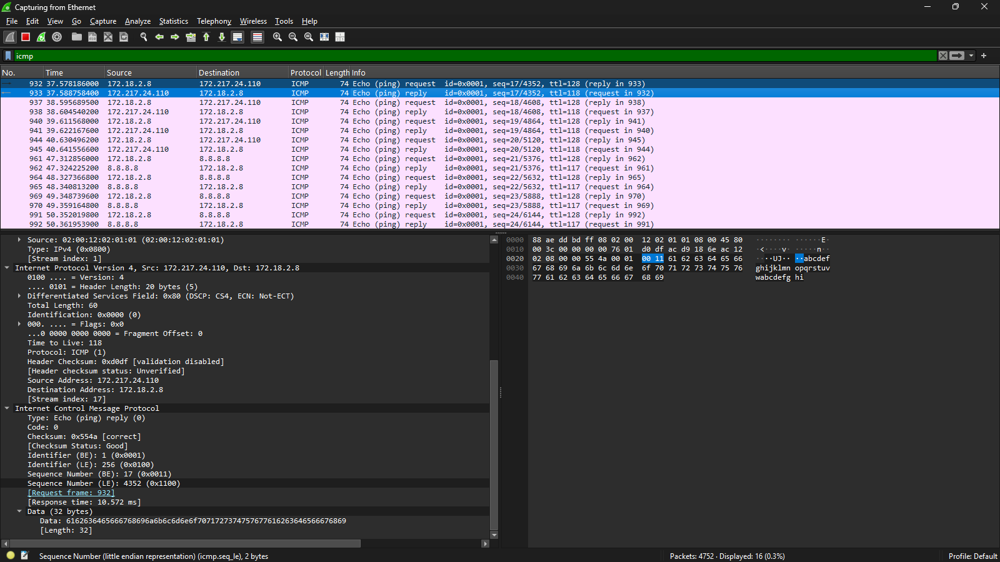

### ICMP Types

| ICMP Message | Type |
|---|---:|
| Echo Reply | 0 |
| Echo Request | 8 |

### Key Observation

ICMP is commonly used for reachability and troubleshooting. The **TTL (Time To Live)** value is reduced by routers as a packet travels across Layer-3 hops, preventing packets from circulating indefinitely.

---

# Lab 3 — TCP Three-Way Handshake & HTTPS Traffic

## Objective

Observe how TCP creates a reliable session before application data is exchanged.

A browser was used to generate web traffic.


A DNS lookup was also used as supporting verification for the destination.

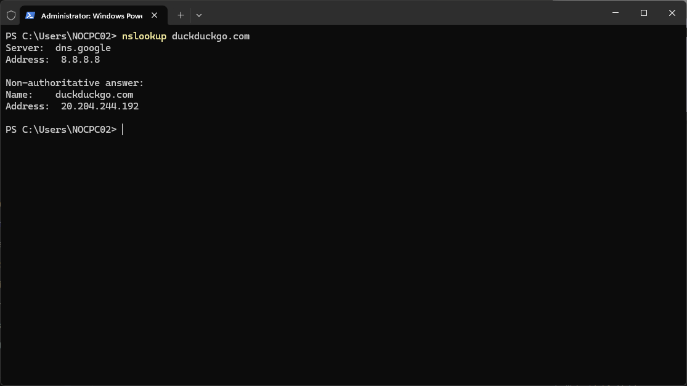

Wireshark filter examples:

```text
tcp
```

or, to focus on the initial TCP handshake:

```text
tcp.flags.syn == 1
```

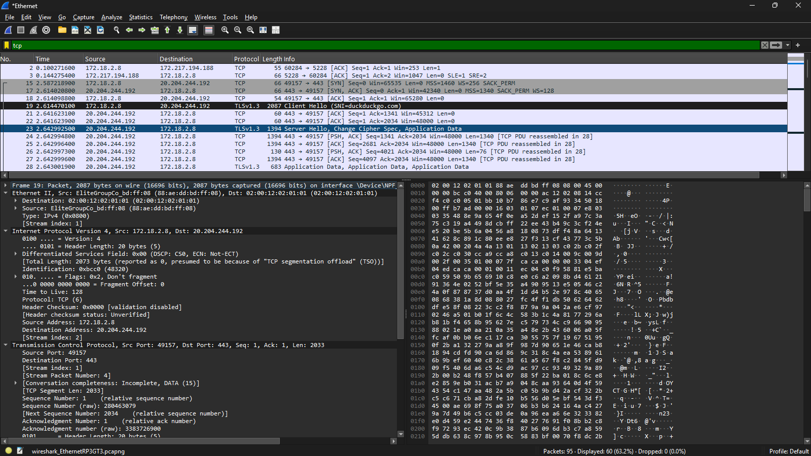

## TCP Three-Way Handshake

```text
Client                              Server
   |                                   |
   | -------- SYN -------------------> |
   | <------- SYN, ACK --------------- |
   | -------- ACK -------------------> |
   |                                   |
   |      TCP session established      |
```

| Step | Flag | Purpose |
|---|---|---|
| 1 | SYN | Client requests a TCP session |
| 2 | SYN, ACK | Server acknowledges and synchronizes |
| 3 | ACK | Client confirms; connection is established |

For HTTPS, the normal TCP destination port is:

```text
TCP 443
```

### Key Observation

TCP is connection-oriented and uses sequence numbers, acknowledgements, and retransmissions to provide reliable delivery.

---

# Lab 4 — DNS over UDP Analysis

## Objective

Capture a DNS query and response and identify source/destination ports, transaction ID, query name, and returned IP addresses.

The local DNS cache was cleared before generating a new query.

```powershell
ipconfig /flushdns
nslookup google.com
```

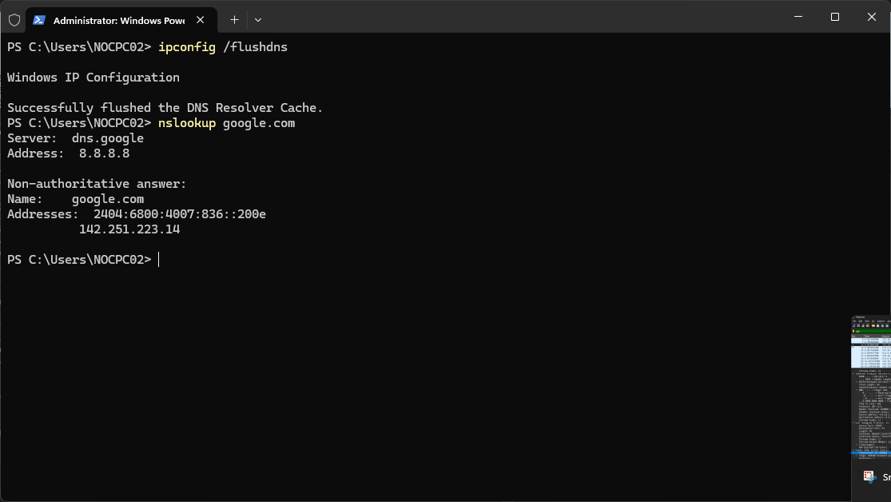

Wireshark filter:

```text
dns
```

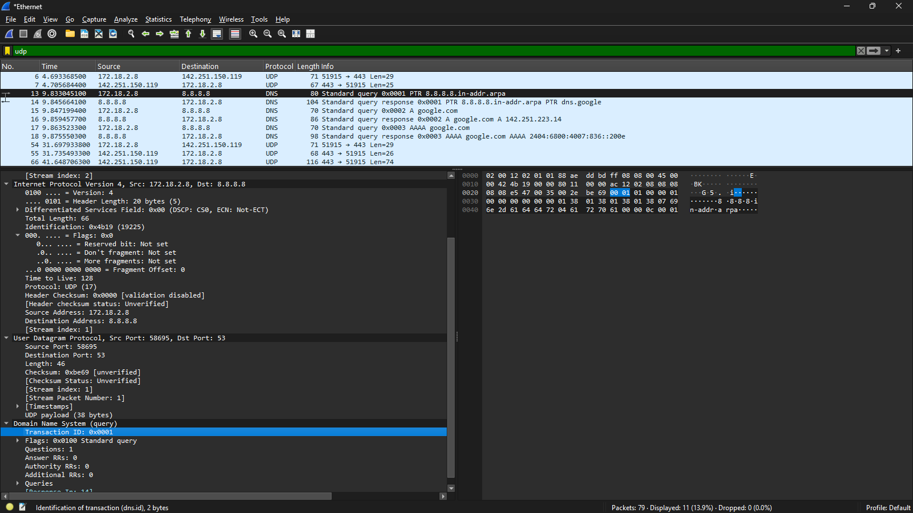

Another lookup was performed for `torproject.org`.

```powershell
nslookup torproject.org
```

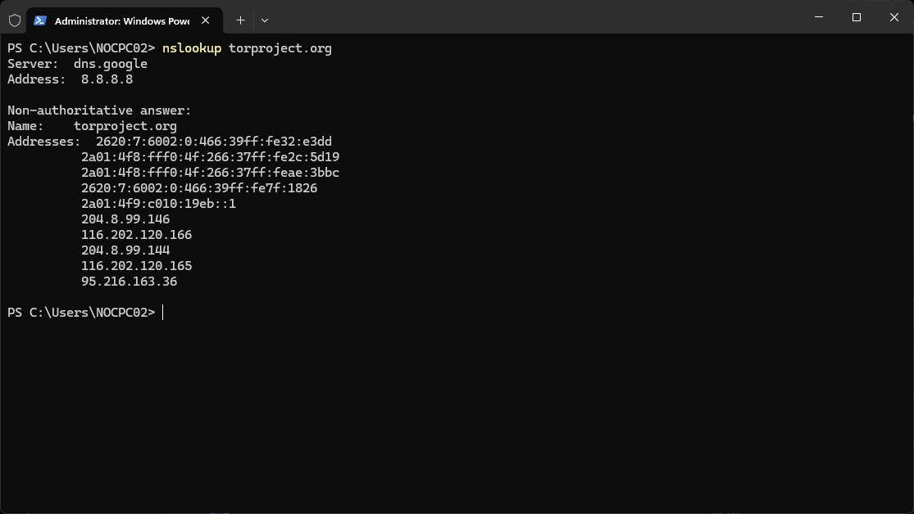

The resolved site was then opened in the browser.


The corresponding DNS packets were inspected in Wireshark.

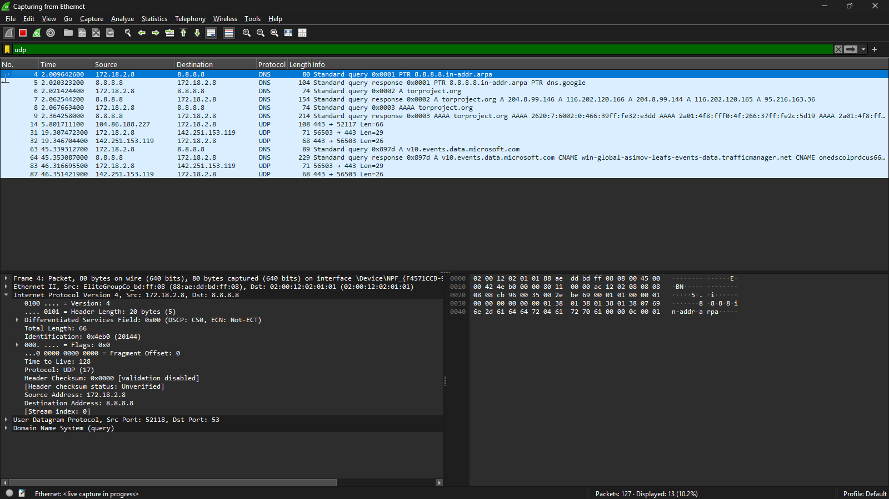

### DNS Port

```text
UDP 53
```

DNS usually uses UDP because most queries and responses are small and do not need a connection setup. TCP can also be used when required, such as for larger responses or specific DNS operations.

---

# Lab 5 — TCP vs UDP Traffic Comparison

## Objective

Compare connection-oriented TCP traffic with connectionless UDP traffic using real DNS and HTTPS captures.

HTTPS/TCP traffic for the Tor Project website was inspected in Wireshark.

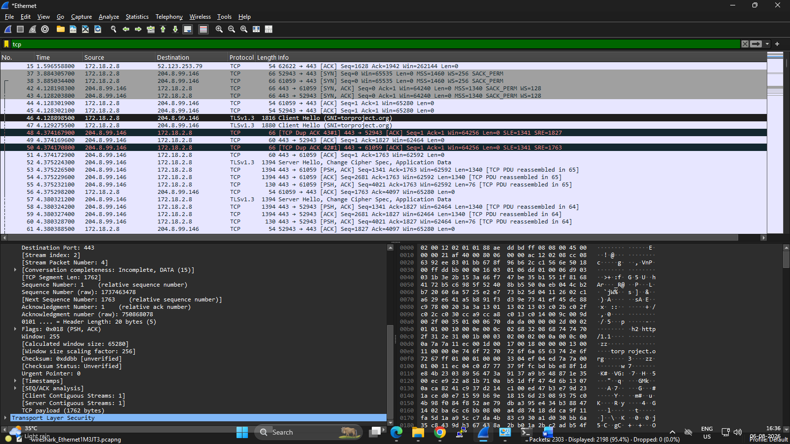

## Comparison

| Feature | TCP | UDP |
|---|---|---|
| Connection setup | Yes | No |
| Three-way handshake | Yes | No |
| Reliable delivery | Yes | No built-in guarantee |
| Sequence numbers | Yes | No TCP-style sequencing |
| Acknowledgements | Yes | No |
| Retransmission | Yes | No built-in retransmission |
| Overhead | Higher | Lower |
| Typical examples | HTTPS, SSH, FTP | DNS, DHCP, VoIP, streaming |

### Traffic Seen in This Lab

```text
DNS      → mostly UDP/53
HTTPS    → TCP/443
Ping     → ICMP
ARP      → Layer-2 address resolution
```

---

# Lab 6 — Cisco Switch MAC Address Learning

## Objective

Verify how a Layer-2 switch dynamically learns source MAC addresses from incoming Ethernet frames.

Before traffic was generated, the MAC address table was checked.

```cisco
show mac address-table dynamic
```

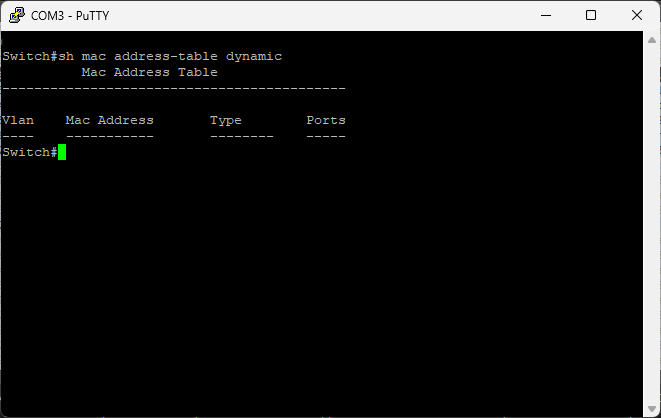

PC1 then generated traffic to PC2.

```powershell
ping 192.168.10.20
```

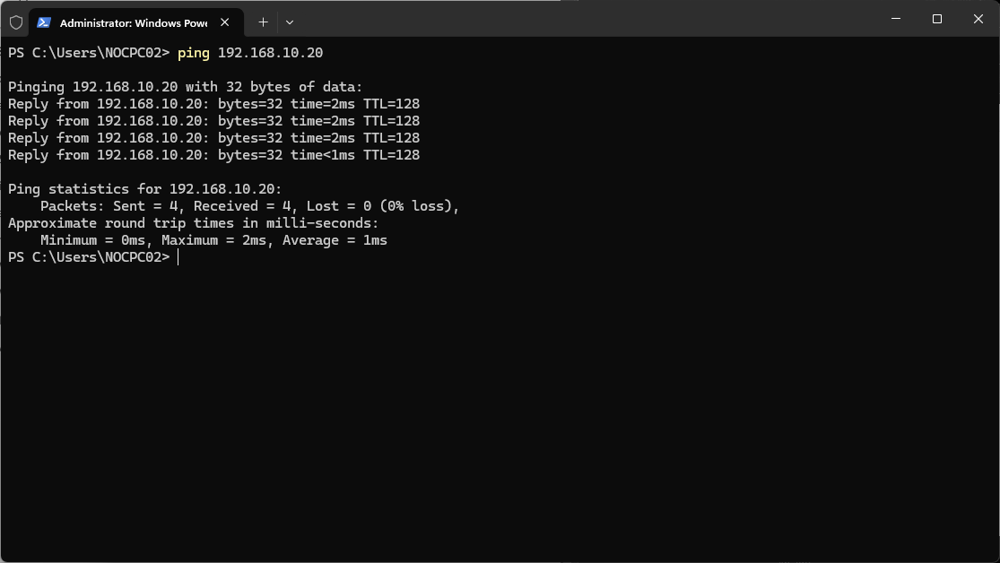

The MAC address table was checked again.

```cisco
show mac address-table dynamic
```

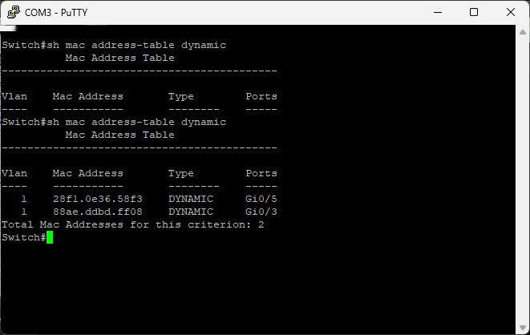

### How MAC Learning Works

When a frame enters a switch port, the switch reads the **source MAC address** and records it against the incoming interface in its MAC/CAM table.

Example concept:

```text
Source MAC              Learned Port
PC1 MAC       --------> Interface connected to PC1
PC2 MAC       --------> Interface connected to PC2
```

If the destination MAC is already known, the switch forwards the frame only through the correct port. If it is unknown, the switch floods the frame within the VLAN except out the port on which it arrived.

---

# Useful Wireshark Filters

| Purpose | Display Filter |
|---|---|
| ARP only | `arp` |
| ICMP only | `icmp` |
| TCP only | `tcp` |
| UDP only | `udp` |
| DNS only | `dns` |
| HTTPS TCP traffic | `tcp.port == 443` |
| TCP SYN packets | `tcp.flags.syn == 1` |
| TCP SYN without ACK | `tcp.flags.syn == 1 && tcp.flags.ack == 0` |
| Traffic to/from one host | `ip.addr == 192.168.10.20` |

---

# Useful Commands

### Windows

```powershell
arp -a
arp -d *
ping 192.168.10.20
ping 8.8.8.8
ipconfig /flushdns
nslookup google.com
nslookup torproject.org
```

### Cisco Switch

```cisco
show mac address-table
show mac address-table dynamic
show interfaces status
show interfaces counters errors
```

---

# Test Summary

| Test | Expected Result | Status |
|---|---|---|
| Clear ARP cache and ping PC2 | New ARP exchange occurs | PASS |
| ARP Request | Broadcast frame visible | PASS |
| ARP Reply | Reply from target host visible | PASS |
| ICMP Echo Request | Request packet captured | PASS |
| ICMP Echo Reply | Reply packet captured | PASS |
| Public ping test | ICMP traffic visible | PASS |
| TCP web session | TCP handshake visible | PASS |
| DNS lookup | DNS query/response visible | PASS |
| Tor Project lookup | DNS resolution verified | PASS |
| HTTPS browsing | TCP/443 traffic captured | PASS |
| MAC table before traffic | Initial table inspected | PASS |
| PC1 to PC2 traffic | Successful LAN communication | PASS |
| MAC table after traffic | Dynamic MAC entries learned | PASS |

---

# Key Learning Outcomes

1. **ARP maps an IPv4 address to a MAC address** for communication on the local Layer-2 network.
2. **An ARP Request is broadcast**, while the corresponding ARP Reply is normally unicast.
3. **ICMP provides reachability and diagnostic information** through Echo Request and Echo Reply messages.
4. **TCP establishes a session using SYN → SYN/ACK → ACK** before normal data transfer.
5. **HTTPS commonly uses TCP port 443.**
6. **DNS commonly uses UDP port 53** for ordinary name-resolution queries.
7. **TCP prioritizes reliability**, while UDP reduces protocol overhead and does not establish a session first.
8. **Cisco switches learn MAC addresses dynamically** by examining the source MAC address of received Ethernet frames.
9. **Wireshark makes protocol behavior visible**, allowing troubleshooting from Layer 2 through the application traffic carried over TCP/UDP.

---

# Conclusion

This lab successfully demonstrated how **ARP, ICMP, TCP, UDP, DNS, HTTPS, and Ethernet MAC learning** work in a practical network environment.

By capturing real traffic in Wireshark and comparing it with Windows and Cisco CLI output, the lab connects theoretical OSI/TCP-IP concepts with actual packet-level behavior. It also demonstrates essential troubleshooting skills used in **IT support, network administration, NOC, and network engineering** roles.

---

## Screenshot Files

```text
01_arp_cache_cleared_ping.png
02_arp_request_frame16.png
03_arp_reply_frame17.png
04_icmp_echo_request_frame18.png
05_icmp_echo_reply_frame19.png
06_ping_results_google_and_dns.png
07_wireshark_icmp_filter.png
08_duckduckgo_browser_loaded.png
09_cli_supporting_view.png
10_wireshark_tcp_handshake_filter.png
11_dns_flush_nslookup.png
12_wireshark_dns_udp_capture.png
13_nslookup_torproject.png
14_torproject_browser_loaded.png
15_wireshark_udp_dns_torproject.png
16_wireshark_tcp_https_torproject.png
17_mac_table_before_ping.png
18_ping_pc1_to_pc2.png
19_mac_table_after_ping.png
```
